# Impala Platform Architecture

## Introduction

Impala is a payment bridge that connects the offline Payala payment network with the Stellar blockchain. The core challenge it addresses is straightforward: transactions happen offline through Payala's existing infrastructure, but those funds need to move on-chain when users want to interact with the broader Stellar ecosystem. Impala makes that crossing seamless, whether a user is wrapping tokens into a Soroban smart contract, transferring value between Payala and Stellar accounts, or simply checking their balance from a phone.

What distinguishes this system from a typical blockchain bridge is its hardware root of trust. Every Impala-issued smartcard carries a JavaCard applet with its own elliptic curve key pair, PIN management, and on-card balance ledger. When a cardholder taps their phone to authorize a transfer, the card signs the transaction with a private key that has never left the secure element. The bridge server can verify that signature, register the card's public key, and tie the cardholder's identity to both their Payala account and their Stellar address. This means authentication doesn't rely solely on passwords or tokens stored in software; the physical card is a factor that an attacker would need to possess.

The platform is composed of six components that span from on-chain smart contracts through a REST API server down to the NFC interface on a mobile device. At the top, **impala-soroban** deploys a multisig asset wrapper contract on Stellar's Soroban runtime, enforcing time-locked operations and multi-party authorization for wraps, unwraps, and transfers. In the middle, **impala-bridge** is a Rust/Axum API server that manages accounts, authenticates users (via passwords, Okta SSO, or smartcard signatures), issues JWT tokens, dispatches notifications, streams blockchain events, and reconciles cross-ledger transactions. On the device side, **impala-card** provides both the JavaCard applet (23 APDU commands for authentication, transactions, and provisioning) and a Kotlin Multiplatform SDK that abstracts the smartcard interface across Android, iOS, and JVM. **impala-lib** wraps the SDK in Android-specific NFC and geolocation services, **impala-android-demo** is a full MVVM reference application with five authentication methods, and **impala-ui** is a vanilla JavaScript admin dashboard for operations and account management.

The infrastructure layer, defined in Terraform, deploys the bridge and its background worker as ECS Fargate tasks behind an ALB with WAF protection, backed by RDS PostgreSQL and ElastiCache Redis (with TLS in transit), with SNS/SQS for asynchronous job dispatch, VPC endpoints for private AWS API access, WAF logging for forensic analysis, and optional cross-region disaster recovery.

---

## Narrative Use Cases

Before diving into technical details, here are the core scenarios the platform supports and how the components interact to fulfill them.

### Use Case 1: Offline-to-Online Payment Bridge

Maria uses a Payala account for daily purchases at local shops. She wants to send money to a friend who only has a Stellar wallet. She opens the Impala Android app, taps her smartcard, and initiates a transfer.

**What happens behind the scenes:**

1. The Android app discovers the card via NFC (ISO 14443-4) and sends `GET_USER_DATA` to retrieve Maria's account ID
2. The app sends `SIGN_AUTH` with the current timestamp — the card signs it with its secp256r1 private key (which has never left the secure element)
3. The app authenticates with the bridge using the card signature, receives JWT tokens, and stores them in EncryptedSharedPreferences
4. The app calls `POST /transaction` with both the Payala transaction ID (from the local payment) and the Stellar destination
5. The bridge records the dual-chain transaction, linking the offline Payala payment to the on-chain Stellar transfer
6. Maria's friend receives a push notification (via FCM) that the funds have arrived

This flow demonstrates the core value proposition: offline Payala payments become visible and actionable on the Stellar network, with hardware-backed authentication at every step.

### Use Case 2: Custodial Token Management with Timelocks

A treasury team manages a pool of wrapped tokens in the Soroban smart contract. They need to process a large withdrawal, but company policy requires multi-party approval and a 24-hour cooling period.

1. Two of three authorized signers call `schedule_unwrap(signers, recipient, amount, 86400)` on the contract
2. The contract verifies the multisig threshold (2-of-3) and creates a timelock with `unlock_time = now + 24h`
3. The bridge's Stellar reconciliation job detects the scheduled operation and logs it
4. Operations receives a webhook notification about the pending withdrawal
5. After 24 hours, a routine process calls `execute_unwrap(timelock_id)` — tokens transfer to the recipient
6. If compliance flags the withdrawal during the 24-hour window, a signer calls `cancel_timelock` to abort

### Use Case 3: Enterprise SSO Onboarding

A company deploys Impala for its employees. IT configures Okta as the identity provider. When an employee logs in for the first time:

1. The admin dashboard redirects to Okta's authorization endpoint (PKCE flow)
2. Employee authenticates with their corporate credentials
3. Okta returns an access token; the bridge validates it against Okta's JWKS endpoint
4. The bridge auto-creates an Impala account (email → account ID derivation)
5. The employee receives JWT tokens and can immediately manage cards, view transactions, and configure notifications
6. The admin assigns the employee's role (view-only, device, token, or admin) via the dashboard

### Use Case 4: Operations Monitoring and Alerting

A platform operator wants real-time visibility into the system. They configure:

- **Stellar event streaming** (`POST /subscribe {network: "stellar"}`) — the bridge opens an SSE connection to Horizon and caches ledger events in Redis
- **Notification subscriptions** — `login_failure` events trigger SMS to the security team; `transfer_outgoing` events above a threshold trigger a webhook to a Slack channel
- **Health monitoring** — Kubernetes probes hit `/healthz` (liveness) and `/readyz` (readiness, checks DB + Redis); CloudWatch alarms fire on 5xx spikes or DLQ depth
- **WAF forensics** — blocked requests and rate-limit hits are logged to CloudWatch with authorization headers redacted
- **Slow query analysis** — PostgreSQL queries exceeding 1 second are logged to CloudWatch for performance investigation

---

## System Overview

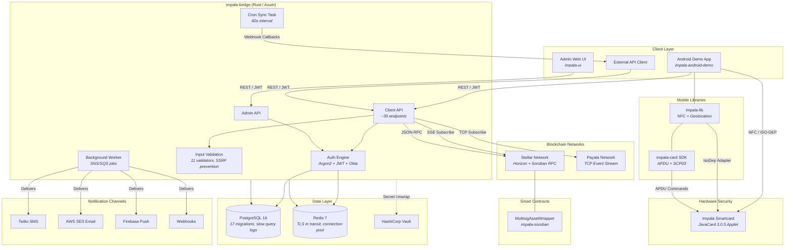
```mermaid
graph TB
    subgraph Clients["Client Layer"]
        AndroidApp["Android Demo App<br/><i>impala-android-demo</i>"]
        AdminUI["Admin Web UI<br/><i>impala-ui</i>"]
        ExtClient["External API Client"]
    end

    subgraph Bridge["impala-bridge &lpar;Rust / Axum&rpar;"]
        direction TB
        ClientAPI["Client API<br/><i>~30 endpoints</i>"]
        AdminAPI["Admin API"]
        AuthEngine["Auth Engine<br/><i>Argon2 + JWT + Okta</i>"]
        Validation["Input Validation<br/><i>11 validators, SSRF prevention</i>"]
        Worker["Background Worker<br/><i>SNS/SQS jobs</i>"]
        CronSync["Cron Sync Task<br/><i>60s interval</i>"]
    end

    subgraph Storage["Data Layer"]
        Postgres[("PostgreSQL 16<br/><i>17 migrations, slow query logs</i>")]
        Redis[("Redis 7<br/><i>TLS in transit, connection pool</i>")]
        Vault["HashiCorp Vault"]
    end

    subgraph Networks["Blockchain Networks"]
        Stellar["Stellar Network<br/><i>Horizon + Soroban RPC</i>"]
        Payala["Payala Network<br/><i>TCP Event Stream</i>"]
    end

    subgraph Hardware["Hardware Security"]
        Card["Impala Smartcard<br/><i>JavaCard 3.0.5 Applet</i>"]
    end

    subgraph MobileLibs["Mobile Libraries"]
        ImpalaLib["impala-lib<br/><i>NFC + Geolocation</i>"]
        ImpalaSDK["impala-card SDK<br/><i>APDU + SCP03</i>"]
    end

    subgraph Contracts["Smart Contracts"]
        Soroban["MultisigAssetWrapper<br/><i>impala-soroban</i>"]
    end

    subgraph Notifications["Notification Channels"]
        Twilio["Twilio SMS"]
        SES["AWS SES Email"]
        FCM["Firebase Push"]
        Webhooks["Webhooks"]
    end

    AndroidApp -->|"REST / JWT"| ClientAPI
    AdminUI -->|"REST / JWT"| AdminAPI
    ExtClient -->|"REST / JWT"| ClientAPI

    ClientAPI --> Validation
    ClientAPI --> AuthEngine
    AdminAPI --> AuthEngine
    AuthEngine --> Postgres
    AuthEngine --> Redis

    Bridge --> Postgres
    Bridge --> Redis
    Bridge -.->|"Secret Unwrap"| Vault

    ClientAPI -->|"SSE Subscribe"| Stellar
    ClientAPI -->|"JSON-RPC"| Stellar
    ClientAPI -->|"TCP Subscribe"| Payala
    CronSync -->|"Webhook Callbacks"| ExtClient

    Worker -->|"Delivers"| Twilio
    Worker -->|"Delivers"| SES
    Worker -->|"Delivers"| FCM
    Worker -->|"Delivers"| Webhooks

    Stellar --- Soroban

    AndroidApp -->|"NFC / ISO-DEP"| Card
    ImpalaLib -->|"IsoDep Adapter"| Card
    ImpalaSDK -->|"APDU Commands"| Card
    AndroidApp --- ImpalaLib
    ImpalaLib --- ImpalaSDK
```

---

## impala-bridge — REST API Server

The bridge is a Rust server built on Axum 0.4 that serves as the central coordination point for all Impala operations. It runs in three modes: `server` (HTTP API with background tasks), `worker` (SQS message consumer for async jobs), and `migrate` (database schema application). State is shared through Axum extension layers: a PostgreSQL connection pool, a Redis connection pool, JWT signing material, Stellar endpoint URLs, and an OpenTelemetry metrics handle.

### API Endpoints

```mermaid
graph LR
    subgraph Public["Public &lpar;No Auth&rpar;"]
        Auth["/authenticate POST"]
        Token["/token POST"]
        OktaExch["/auth/okta POST"]
        OktaCfg["/auth/okta/config GET"]
        Ver["/version GET"]
        Health["/ GET"]
        HealthFull["/health GET"]
        Liveness["/healthz GET"]
        Readiness["/readyz GET"]
    end

    subgraph ClientAPI["Client API &lpar;JWT Protected&rpar;"]
        AccR["/account GET"]
        AccC["/account POST"]
        AccU["/account PUT"]
        CardC["/card POST"]
        CardD["/card DELETE"]
        TxC["/transaction POST"]
        MfaR["/mfa GET"]
        MfaE["/mfa POST"]
        MfaV["/mfa/verify POST"]
        NotifyL["/notify GET"]
        NotifyC["/notify POST"]
        NotifyU["/notify PUT"]
        SubsL["/notification/subscriptions GET"]
        SubsC["/notification/subscriptions POST"]
        SubsU["/notification/subscriptions/:id PUT"]
        SubsD["/notification/subscriptions/:id DELETE"]
        DevTokC["/device-token POST"]
        DevTokD["/device-token DELETE"]
        Logout["/logout POST"]
    end

    subgraph AdminAPI["Admin API &lpar;JWT Protected&rpar;"]
        Sub["/subscribe POST"]
        Sync["/sync POST"]
    end
```

#### Public Endpoints (No Authentication)

| Endpoint | Method | Purpose |
|----------|--------|---------|
| `/` | GET | Default health check greeting |
| `/health` | GET | Full health check — verifies PostgreSQL `SELECT 1` and Redis `PING`, returns `healthy` or `degraded` |
| `/healthz` | GET | Kubernetes liveness probe — always returns 200 if the process is running |
| `/readyz` | GET | Kubernetes readiness probe — returns 200 if both DB and Redis are reachable, 503 otherwise |
| `/version` | GET | Build metadata: package name, version, build date, rustc version, database schema version |
| `/authenticate` | POST | Register or authenticate a user with account ID and password (Argon2 hash). Rate-limited to 10 requests per 60 seconds per account, with lockout after 5 failed attempts for 15 minutes |
| `/token` | POST | JWT token issuance. Accepts either `{username, password}` to obtain a 14-day refresh token, or `{refresh_token}` to obtain a 1-hour temporal token. Checks Redis revocation blacklist before issuing |
| `/auth/okta` | POST | Exchange a validated Okta access token for Impala JWT tokens. Auto-creates account on first login |
| `/auth/okta/config` | GET | Returns the Okta OIDC configuration (issuer, client ID, endpoints, scopes) for client-side flow setup |

#### Client API (JWT Protected)

| Endpoint | Method | Purpose |
|----------|--------|---------|
| `/account` | GET | Fetch the authenticated user's account (Stellar ID, Payala ID, name fields, affiliation) |
| `/account` | POST | Create a new account linking Stellar and Payala identifiers with profile data |
| `/account` | PUT | Update account profile fields. Validates Stellar account ID format (56 chars, Base32) |
| `/card` | POST | Register a smartcard by storing its card ID, EC public key (secp256r1), and RSA public key. Validates key formats before INSERT |
| `/card` | DELETE | Soft-delete a card registration (sets `is_delete = TRUE` and `deleted_at` timestamp) |
| `/transaction` | POST | Create a dual-chain transaction record with Stellar and Payala transaction IDs, hashes, fees, memo, and signatures |
| `/mfa` | GET | List all MFA enrollments (TOTP and/or SMS) for the authenticated user |
| `/mfa` | POST | Enroll a new MFA method. TOTP: generates a secret and returns a provisioning URI for QR code display. SMS: requires and validates a phone number (E.164 format) |
| `/mfa/verify` | POST | Verify an MFA code. TOTP: validates against stored secret using `totp-rs`. SMS: validates against code stored in Redis with constant-time comparison (`subtle::ConstantTimeEq`). Brute force protected: 5 attempts per account/type, then 15-minute lockout |
| `/notify` | GET | List notification preferences for the user. Paginated: `?page=1&per_page=20` (clamped to max 100) |
| `/notify` | POST | Create a notification endpoint (mobile, WhatsApp, Signal, SMS, email, webhook, or in-app) |
| `/notify` | PUT | Update an existing notification record by ID. Validates email format and webhook URL (SSRF prevention) |
| `/notification/subscriptions` | GET | List event subscriptions. Paginated: `?page=1&per_page=20` |
| `/notification/subscriptions` | POST | Subscribe to an event type via a delivery medium. Events: `login_success`, `login_failure`, `password_change`, `transfer_incoming`, `transfer_outgoing`, `profile_updated`. Mediums: `webhook`, `sms`, `mobile_push`, `to_app`, `email` |
| `/notification/subscriptions/:id` | PUT | Enable or disable a subscription |
| `/notification/subscriptions/:id` | DELETE | Remove a subscription |
| `/device-token` | POST | Register an FCM push token for the authenticated user (token + platform) |
| `/device-token` | DELETE | Deregister an FCM token |
| `/logout` | POST | Revoke the current JWT by adding its JTI to the Redis blacklist (TTL matches token expiry) |

#### Admin API (JWT Protected)

| Endpoint | Method | Purpose |
|----------|--------|---------|
| `/subscribe` | POST | Initiate a network event stream — Stellar SSE from Horizon `/ledgers` or Payala TCP listener |
| `/sync` | POST | Trigger cross-ledger transaction reconciliation against Soroban RPC `getTransactions` |

### Authentication and Authorization

The bridge implements a two-token JWT strategy. A **refresh token** (14-day TTL, HS256) is obtained by presenting a username and password to `/token`. A **temporal token** (1-hour TTL, HS256) is obtained by presenting a valid refresh token. All protected endpoints require a temporal token in the `Authorization: Bearer` header. Both token types carry claims including subject, token type, issued-at, expiry, a unique JTI (UUID v4), and issuer (`impala-bridge`). The JWT signing secret must be at least 32 characters (enforced at startup).

Token revocation is immediate: `POST /logout` writes the token's JTI to Redis with a TTL matching the token's remaining lifetime. Every authenticated request checks the JTI against the Redis blacklist. This check is **fail-closed** — if Redis is unavailable, the request is rejected rather than allowed through.

Account ownership is enforced by `require_owner()`, which verifies that `user.account_id` from the JWT matches the resource's `account_id` before any data modification. This runs in every handler that touches user-scoped data.

Five authentication methods are supported across the platform:
1. **Username/password** — direct registration and login with Argon2 password hashing
2. **Okta SSO** — OIDC token exchange with JWKS validation and background key refresh
3. **NFC smartcard** — card signs a timestamp with ECDSA; password derived from `SHA-256(cardId)`
4. **Google Sign-In** — Credential Manager flow; password derived from `SHA-256(idToken)`
5. **GitHub OAuth** — Custom Chrome Tabs flow; password derived from `SHA-256(access_token)`

### Notification System

When a notable event occurs (login, transfer, profile update), the bridge queries the `notification_subscription` and `notify` tables to determine which users have subscribed to that event type and through which delivery channels. It then publishes a `send_notification` job to an SNS topic. The worker process, running as a separate ECS task, polls the corresponding SQS queue and delivers notifications through the appropriate channel:

- **SMS** via Twilio API
- **Email** via AWS SES
- **Push notifications** via Firebase Cloud Messaging (FCM HTTP v1 API)
- **Webhooks** via HTTP POST to user-configured URLs (SSRF-validated)
- **In-app** storage for client polling

The worker also handles `batch_sync` (bulk transaction synchronization across accounts) and `stellar_reconcile` (cross-ledger transaction matching with summary storage in Redis). Jobs use a semaphore-based concurrency model (default 10 workers) with per-job timeout matching the SQS visibility timeout, SNS envelope unwrapping, and automatic retry via SQS redelivery with DLQ after max receive count.

### Event Streaming

The bridge maintains two long-running event consumers:

- **Stellar stream**: SSE connection to Horizon's `/ledgers?cursor=now` endpoint. Parses ledger sequence numbers and stores them in Redis (`stellar:latest_ledger`, `stellar:ledger:{seq}`) with a 1 MB buffer limit to prevent unbounded memory growth.
- **Payala stream**: TCP listener on a configurable endpoint. Accepts connections, parses JSON events, and stores them in Redis (`payala:latest_event`, `payala:event:{timestamp}:{uuid}`).

A **cron sync task** runs every 60 seconds in the server process, querying the `cron_sync` table for webhook callback URIs, fetching each one (with SSRF validation), and storing the JSON response. Both the cron task and JWKS refresh task support graceful shutdown via `CancellationToken`.

### Connection Management

- **PostgreSQL**: `sqlx::PgPool` with 20 max connections, 5-second acquire timeout, 10-minute idle timeout, 30-minute max connection lifetime
- **Redis**: `deadpool_redis` connection pool with TLS via `tokio-rustls` (`rediss://` protocol in production). Fail-closed policy on all security-critical operations (rate limiting, lockout, token revocation, MFA brute force). Standardized key format: `impala:{type}:{scope}:{id}`
- **HTTP clients**: All outbound `reqwest` clients configured with 30-second timeout
- **Response compression**: gzip via `tower-http::CompressionLayer`
- **Request IDs**: auto-generated UUID in `x-request-id` header, propagated through the request lifecycle

### Observability

When `OTEL_EXPORTER_OTLP_ENDPOINT` is configured, the bridge initializes OpenTelemetry OTLP exporters for traces and metrics. A `MetricsLayer` in the HTTP middleware stack records request duration, active request count, and response status codes with method/route/status labels. Application-level counters and histograms track authentication attempts, MFA verifications, transactions, notification dispatch and delivery, worker job processing, Stellar reconciliation, and batch sync operations. When OpenTelemetry is not configured, metrics are no-ops, and logging falls back to syslog (`LOG_DAEMON` facility).

### LDAP Directory Sync

If LDAP environment variables are configured (`LDAP_URL`, `LDAP_BIND_DN`, `LDAP_BIND_PASSWORD`, `LDAP_BASE_DN`), the bridge performs a one-time directory sync at startup, reconciling local accounts against the LDAP directory. Inputs are escaped per RFC 4515 to prevent LDAP injection.

---

## impala-card — JavaCard Applet and Kotlin SDK

The smartcard system is the hardware root of trust for the Impala platform. It consists of two modules: a JavaCard applet that runs on the card's secure element, and a Kotlin Multiplatform SDK that provides a typed API for communicating with the applet from any platform.

### JavaCard Applet

The applet (AID `0102030405060708`) implements 23 APDU commands across four categories. It manages an on-card identity (account ID, card ID, cardholder name), an elliptic curve key pair (secp256r1/NIST P-256) for authentication and transaction signing, an RSA key pair, a balance ledger, and two PINs (master and user) with retry-limited lockout.

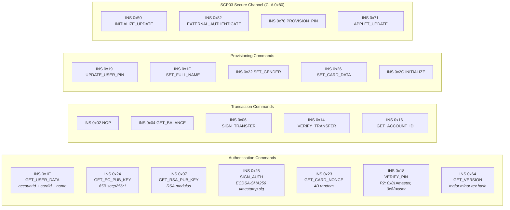
```mermaid
graph LR
    subgraph AuthCommands["Authentication Commands"]
        direction TB
        C1["INS 0x1E<br/>GET_USER_DATA<br/><i>accountId + cardId + name</i>"]
        C2["INS 0x24<br/>GET_EC_PUB_KEY<br/><i>65B secp256r1</i>"]
        C3["INS 0x07<br/>GET_RSA_PUB_KEY<br/><i>RSA modulus</i>"]
        C4["INS 0x25<br/>SIGN_AUTH<br/><i>ECDSA-SHA256 timestamp sig</i>"]
        C5["INS 0x23<br/>GET_CARD_NONCE<br/><i>4B random</i>"]
        C6["INS 0x18<br/>VERIFY_PIN<br/><i>P2: 0x81=master, 0x82=user</i>"]
        C7["INS 0x64<br/>GET_VERSION<br/><i>major.minor.rev.hash</i>"]
    end

    subgraph TransactionCommands["Transaction Commands"]
        direction TB
        A1["INS 0x02 NOP"]
        A2["INS 0x04 GET_BALANCE"]
        A3["INS 0x06 SIGN_TRANSFER"]
        A4["INS 0x14 VERIFY_TRANSFER"]
        A5["INS 0x16 GET_ACCOUNT_ID"]
    end

    subgraph ProvisioningCommands["Provisioning Commands"]
        direction TB
        A6["INS 0x19 UPDATE_USER_PIN"]
        A7["INS 0x1F SET_FULL_NAME"]
        A8["INS 0x22 SET_GENDER"]
        A9["INS 0x26 SET_CARD_DATA"]
        A10["INS 0x2C INITIALIZE"]
    end

    subgraph SCP03["SCP03 Secure Channel &lpar;CLA 0x80&rpar;"]
        S1["INS 0x50 INITIALIZE_UPDATE"]
        S2["INS 0x82 EXTERNAL_AUTHENTICATE"]
        S3["INS 0x70 PROVISION_PIN"]
        S4["INS 0x71 APPLET_UPDATE"]
    end
```

#### Card State

The applet maintains the following state in persistent card memory:

| Field | Size | Description |
|-------|------|-------------|
| `accountId` | 16 bytes | Payala account identifier (UUID) |
| `cardId` | 16 bytes | Unique card identifier (randomly generated on INITIALIZE) |
| `currency` | 4 bytes | Currency code |
| `myBalance` | 8 bytes (int64) | On-card balance in lowest denomination |
| `fullName` | up to 128 bytes | Cardholder name |
| `gender` | up to 16 bytes | Gender field |
| `initialized` | boolean | Set to true after first INITIALIZE command |
| `terminated` | boolean | Set to true if card is permanently disabled (irreversible) |

#### PIN Management

Two PINs protect card operations:

- **Master PIN**: 8 digits, 10 retries. Used for administrative operations and provisioning.
- **User PIN**: 4 digits, 5 retries. Required for `SIGN_TRANSFER`, with a convenience exception: up to 4 consecutive transfers under 200 units (in lowest denomination) may proceed without PIN entry.

When retry counts are exhausted, the card returns status word `0x69C0` (PIN blocked) and the corresponding function becomes permanently unavailable until the PIN is reset through the SCP03 secure channel.

#### SCP03 Secure Channel

The applet implements GlobalPlatform 2.3 Amendment D Secure Channel Protocol 03 for protected provisioning and updates. Channel establishment follows a two-step handshake: `INITIALIZE_UPDATE` (INS 0x50) exchanges host and card challenges and derives session keys; `EXTERNAL_AUTHENTICATE` (INS 0x82) completes mutual authentication with a cryptographic MAC. Once established, the channel protects `PROVISION_PIN` (INS 0x70) and `APPLET_UPDATE` (INS 0x71) commands. Default static keys are `0x40..0x4F` for DEK, MAC, and KEK.

#### Cryptographic Primitives

- **Elliptic Curve**: secp256r1 (NIST P-256), 256-bit private key, 65-byte uncompressed public key
- **Signature**: ECDSA with SHA-256 (used for `SIGN_AUTH` and `SIGN_TRANSFER`)
- **Hash**: SHA-256 (32-byte output)
- **Random**: Hardware RNG for card ID generation (16 bytes) and nonce generation (4 bytes)

### Kotlin Multiplatform SDK

The SDK (`ImpalaSDK`) provides a typed, cross-platform API that runs on JVM, iOS (x64, ARM64, simulator), and Android. It communicates with the applet through a `BIBO` (Byte-In, Byte-Out) interface — a single-method abstraction (`transceive(ByteArray): ByteArray`) that each platform implements:

- **Android**: `IsoDepBibo` wraps `android.nfc.tech.IsoDep` (ISO 14443-4)
- **JVM tests**: `jcardsim` simulator provides a BIBO-compatible interface
- **iOS**: Platform adaptor via CoreNFC

The APDU layer (`com.impala.sdk.apdu4j`) handles ISO 7816-4 command encoding and response parsing. `CommandAPDU` constructs the binary command from class, instruction, parameters, and data fields. `ResponseAPDU` parses the response and extracts the status word (`SW1`, `SW2`). The SDK auto-throws `ImpalaException` on any non-`0x9000` status.

The SCP03 implementation in the SDK is a pure-Kotlin AES-128 implementation (no `javax.crypto` dependency) for cross-platform compatibility. It manages the secure channel lifecycle: key derivation, session establishment, MAC computation, and encrypted command wrapping.

---

## impala-soroban — Stellar Smart Contracts

The `MultisigAssetWrapper` contract (~1580 lines, `#![no_std]` WASM) runs on Stellar's Soroban runtime (SDK 23.0.1). It implements a time-locked, multisig-protected token wrapping system: users deposit Stellar tokens into the contract, which tracks per-address balances and requires multiple authorized signers plus a time delay before tokens can be withdrawn or transferred.

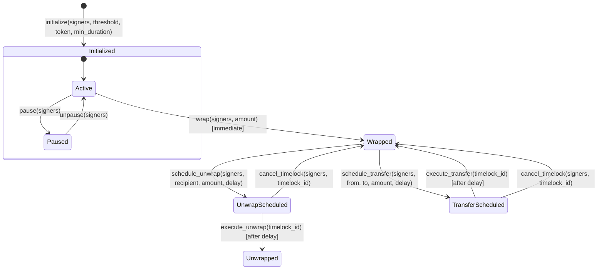
```mermaid
stateDiagram-v2
    [*] --> Initialized : initialize(signers, threshold, token, min_duration)

    state Initialized {
        [*] --> Active
        Active --> Paused : pause(signers)
        Paused --> Active : unpause(signers)
    }

    Active --> Wrapped : wrap(signers, amount) [immediate]

    Wrapped --> UnwrapScheduled : schedule_unwrap(signers, recipient, amount, delay)
    UnwrapScheduled --> Unwrapped : execute_unwrap(timelock_id) [after delay]
    UnwrapScheduled --> Wrapped : cancel_timelock(signers, timelock_id)

    Wrapped --> TransferScheduled : schedule_transfer(signers, from, to, amount, delay)
    TransferScheduled --> Wrapped : execute_transfer(timelock_id) [after delay]
    TransferScheduled --> Wrapped : cancel_timelock(signers, timelock_id)
```

### Contract Functions

**Initialization**: `initialize(signers, threshold, underlying_token, min_lock_duration)` — one-time setup that records the signer set, minimum quorum, the Stellar token address to wrap, and the minimum time delay for locked operations.

**Multisig verification**: Every operation calls `verify_multisig(signers)`, which checks that the number of provided signers meets the threshold and that each signer calls `require_auth()`.

**Token operations**:
- `wrap(signers, amount)` — Immediate. Transfers tokens from the first signer to the contract. Updates per-address balance and total wrapped amount.
- `schedule_unwrap(signers, recipient, amount, delay)` — Creates a `TimeLock` record with `unlock_time = ledger_time + delay`. Returns a `timelock_id`.
- `execute_unwrap(timelock_id)` — Transfers tokens from contract to recipient after `unlock_time` has passed. Marks the timelock as executed to prevent replay.
- `schedule_transfer(signers, from, to, amount, delay)` — Same time-lock pattern for internal balance transfers between wrapped accounts.
- `execute_transfer(timelock_id)` — Adjusts balances (`from -= amount`, `to += amount`) after the delay.
- `cancel_timelock(signers, timelock_id)` — Cancels a pending operation before execution (requires multisig).

**Governance**:
- `pause(signers)` / `unpause(signers)` — Halts or resumes all operations except `cancel_timelock`.
- `rotate_signers(current_signers, new_signers, new_threshold)` — Changes the authorized signer set and threshold.

**Constraints**: threshold must be > 0 and <= signer count; amounts must be > 0; delays capped at 365 days; executed/cancelled timelocks cannot be re-executed. All storage is instance-level for ledger efficiency.

**Events emitted**: `wrap`, `sched_unw`, `exec_unw`, `sched_tx`, `exec_tx`, `cancel`, `pause`, `unpause`, `rotate`.

---

## impala-lib — Android NFC and Geolocation Library

This Android library (package `com.payala.impala`, min SDK 24) provides two communication channels for integrating Impala into Android applications:

**NFC via IsoDep (ISO 14443-4 smartcard interface)**:
- `NfcContactActivity` manages foreground dispatch to intercept NFC tag discoveries
- `IsoDepBibo` adapts Android's `IsoDep` API to the `BIBO` transceive interface expected by the Impala SDK
- Once connected, all 23 APDU commands from the JavaCard applet are available through the SDK's typed methods

**NFC via NDEF (data tags)**:
- `NdefDispatchActivity` handles NDEF message discovery
- `ImpalaNdefHandler` processes NDEF records and dispatches to a registered `NdefListener`

**Geolocation**:
- `GeoUpdateReceiver` is a `BroadcastReceiver` that listens for `ACTION_LOCATION_UPDATE` intents
- `ImpalaGeoHandler` processes location events and dispatches to a registered `GeoUpdateListener`

Both NFC and geolocation handlers use a static listener registration pattern. NFC hardware is declared optional (`android:required="false"`) in the manifest.

---

## impala-android-demo — Reference Android Application

The demo application (package `com.payala.impala.demo`, min SDK 24, target SDK 34) is a full MVVM implementation demonstrating how all Impala components work together. It uses Retrofit and OkHttp for networking, EncryptedSharedPreferences (AES-256-SIV/GCM) for token storage, Jetpack Navigation with bottom tabs, and Firebase Cloud Messaging for push notifications.

### Authentication Flow

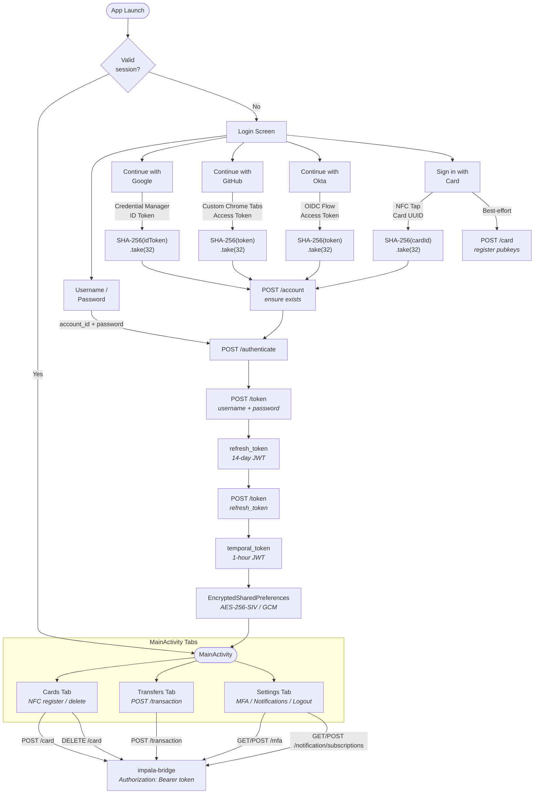
```mermaid
flowchart TB
    Start(["App Launch"]) --> SessionCheck{"Valid<br/>session?"}
    SessionCheck -->|Yes| Main(["MainActivity"])
    SessionCheck -->|No| Login["Login Screen"]

    Login --> PW["Username /<br/>Password"]
    Login --> Google["Continue with<br/>Google"]
    Login --> GitHub["Continue with<br/>GitHub"]
    Login --> Okta["Continue with<br/>Okta"]
    Login --> CardAuth["Sign in with<br/>Card"]

    PW -->|"account_id + password"| AuthFlow
    Google -->|"Credential Manager<br/>ID Token"| DeriveG["SHA-256(idToken)<br/>.take(32)"]
    GitHub -->|"Custom Chrome Tabs<br/>Access Token"| DeriveH["SHA-256(token)<br/>.take(32)"]
    Okta -->|"OIDC Flow<br/>Access Token"| DeriveO["SHA-256(token)<br/>.take(32)"]
    CardAuth -->|"NFC Tap<br/>Card UUID"| DeriveC["SHA-256(cardId)<br/>.take(32)"]

    DeriveG --> EnsureAcct["POST /account<br/><i>ensure exists</i>"]
    DeriveH --> EnsureAcct
    DeriveO --> EnsureAcct
    DeriveC --> EnsureAcct
    EnsureAcct --> AuthFlow

    AuthFlow["POST /authenticate"] --> TokenFlow["POST /token<br/><i>username + password</i>"]
    TokenFlow --> RefreshTok["refresh_token<br/><i>14-day JWT</i>"]
    RefreshTok --> TemporalFlow["POST /token<br/><i>refresh_token</i>"]
    TemporalFlow --> TemporalTok["temporal_token<br/><i>1-hour JWT</i>"]
    TemporalTok --> Store["EncryptedSharedPreferences<br/><i>AES-256-SIV / GCM</i>"]
    Store --> Main

    CardAuth -->|"Best-effort"| RegCard["POST /card<br/><i>register pubkeys</i>"]

    subgraph MainApp["MainActivity Tabs"]
        Main --> Cards["Cards Tab<br/><i>NFC register / delete</i>"]
        Main --> Transfers["Transfers Tab<br/><i>POST /transaction</i>"]
        Main --> Settings["Settings Tab<br/><i>MFA / Notifications / Logout</i>"]
    end

    Cards -->|"POST /card"| BridgeAPI
    Cards -->|"DELETE /card"| BridgeAPI
    Transfers -->|"POST /transaction"| BridgeAPI
    Settings -->|"GET/POST /mfa"| BridgeAPI
    Settings -->|"GET/POST /notification/subscriptions"| BridgeAPI

    BridgeAPI["impala-bridge<br/><i>Authorization: Bearer token</i>"]
```

### NFC Card Communication Stack

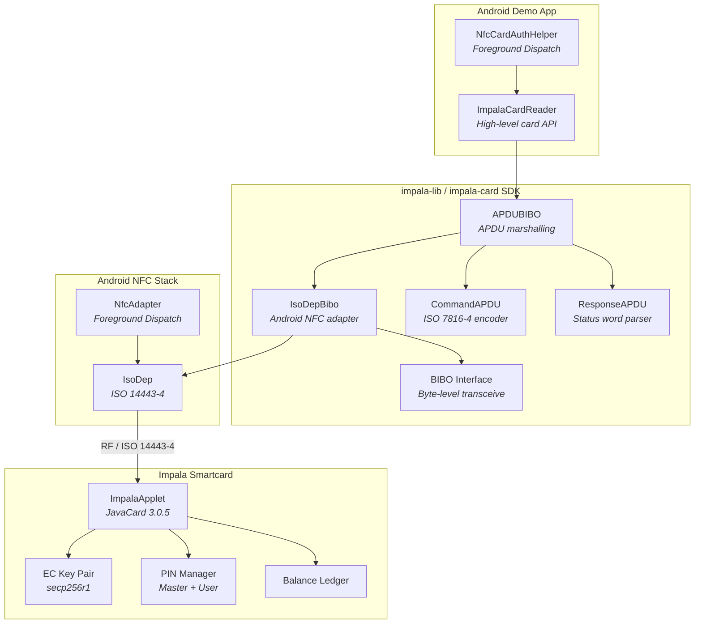
```mermaid
graph TB
    subgraph AndroidApp["Android Demo App"]
        NfcHelper["NfcCardAuthHelper<br/><i>Foreground Dispatch</i>"]
        Reader["ImpalaCardReader<br/><i>High-level card API</i>"]
    end

    subgraph PortedSDK["impala-lib / impala-card SDK"]
        APDUBIBO["APDUBIBO<br/><i>APDU marshalling</i>"]
        IsoDepBibo["IsoDepBibo<br/><i>Android NFC adapter</i>"]
        CmdAPDU["CommandAPDU<br/><i>ISO 7816-4 encoder</i>"]
        RspAPDU["ResponseAPDU<br/><i>Status word parser</i>"]
        BIBO["BIBO Interface<br/><i>Byte-level transceive</i>"]
    end

    subgraph NFC["Android NFC Stack"]
        IsoDep["IsoDep<br/><i>ISO 14443-4</i>"]
        NfcAdapter["NfcAdapter<br/><i>Foreground Dispatch</i>"]
    end

    subgraph Card["Impala Smartcard"]
        Applet["ImpalaApplet<br/><i>JavaCard 3.0.5</i>"]
        ECKey["EC Key Pair<br/><i>secp256r1</i>"]
        PINMgr["PIN Manager<br/><i>Master + User</i>"]
        Balance["Balance Ledger"]
    end

    NfcHelper --> Reader
    Reader --> APDUBIBO
    APDUBIBO --> CmdAPDU
    APDUBIBO --> RspAPDU
    APDUBIBO --> IsoDepBibo
    IsoDepBibo --> BIBO
    IsoDepBibo --> IsoDep
    IsoDep -->|"RF / ISO 14443-4"| Applet
    NfcAdapter --> IsoDep

    Applet --> ECKey
    Applet --> PINMgr
    Applet --> Balance
```

### Push Notifications

`ImpalaPushService` extends `FirebaseMessagingService` to receive push notifications delivered by the bridge's worker process. On app startup, `ImpalaApp` registers the FCM token with the bridge (`POST /device-token`). Incoming messages are displayed via `NotificationCompat` with support for deep-link navigation via `click_action`.

---

## impala-ui — Admin Web Dashboard

A vanilla JavaScript single-page application served by Nginx on port 3000, styled with Foundation 6.8.1. It proxies `/api/*` requests to the bridge and provides an operational interface for account management, card registration, transaction viewing, MFA enrollment, and notification configuration.

### Client-Side RBAC

The dashboard enforces four roles via `[data-permission]` HTML attributes:

| Role | Permissions |
|------|-------------|
| **view-only** | `view_accounts`, `view_mfa`, `view_transactions`, `view_cards` |
| **device** | All view-only permissions + `create_transactions`, `manage_cards` |
| **token** | All device permissions + `manage_accounts`, `manage_mfa` |
| **admin** | All permissions including `manage_roles` |

The first user to log in is automatically bootstrapped as admin. Roles persist in `localStorage` and are enforced by filtering DOM elements based on `data-permission` attributes.

### Core Modules

- **`api.js`** — HTTP client with automatic JWT refresh on 401, concurrent request deduplication during refresh, `X-Request-Nonce` header for CSRF mitigation, error sanitization (strips HTML/SQL, truncates at 200 chars), and retry logic with exponential backoff for GET requests
- **`router.js`** — SPA navigation with toast notifications (Foundation callout styles)
- **`okta-auth.js`** — OIDC authorization code flow with PKCE (RFC 7636) for Okta SSO
- **`session-timer.js`** — 1-hour inactivity timeout matching temporal token TTL

### Pages

Login, Dashboard, Accounts, Cards, Transactions, MFA, Admin (role management), and Okta Callback.

---

## Security Architecture

### Authentication and Token Security

- **Password hashing**: Argon2 via `password-auth` crate (constant-time verification)
- **JWT**: HS256 with minimum 32-character secret, JTI-based revocation via Redis blacklist
- **MFA**: TOTP with auto-provisioned QR URIs, SMS via Twilio, constant-time code comparison for SMS (`subtle::ConstantTimeEq`)
- **Brute force protection**: Rate limiting (10 req/60s per account), account lockout (5 failures, 15-min), MFA lockout (5 attempts per type, 15-min)
- **Redis fail-closed**: All security-critical Redis operations (rate limiting, lockout, token revocation, MFA brute force) return errors when Redis is unavailable rather than silently bypassing

### Input Validation

All user-facing inputs are validated in `src/validate.rs` with dedicated, tested functions:

- **Stellar account IDs** (`validate_stellar_account_id`): 56 characters, starts with 'G', Base32 charset (A-Z, 2-7)
- **Email** (`validate_email`): RFC-compliant format with domain dot requirement, max 254 characters
- **Phone** (`validate_phone_number`): E.164 format (+country code, 8-16 digits)
- **Card IDs** (`validate_card_id`): hex string, 8-32 characters
- **EC public keys** (`validate_ec_pubkey`): hex string, 66 (compressed) or 130 (uncompressed P-256) characters
- **RSA public keys** (`validate_rsa_pubkey`): Base64, 100-2048 characters
- **Callback URLs** (`validate_callback_url`): SSRF prevention — blocks localhost, private IP ranges (10/8, 172.16/12, 192.168/16), IPv6 loopback/link-local, cloud metadata endpoints (169.254.169.254), non-HTTP schemes
- **Transaction IDs** (`validate_transaction_id`): alphanumeric, 1-128 characters
- **Hex hashes** (`validate_hex_hash`): hex-only characters, 1-128 characters (for Stellar transaction hashes)
- **Listen endpoints** (`validate_listen_endpoint`): must be a valid localhost socket address (127.0.0.1 or ::1) with a non-privileged port (>= 1024) — prevents binding on external interfaces
- **LDAP inputs** (`ldap_escape`): RFC 4515 special character escaping
- **Name fields**: maximum 64 characters
- **Memo fields**: maximum 256 characters
- **Request body**: 1 MB global limit

### HTTP Security Headers

| Header | Value |
|--------|-------|
| `X-Content-Type-Options` | `nosniff` |
| `X-Frame-Options` | `DENY` |
| `Referrer-Policy` | `strict-origin-when-cross-origin` |
| `Strict-Transport-Security` | `max-age=31536000; includeSubDomains` |
| `Content-Security-Policy` | `default-src 'none'; frame-ancestors 'none'` |
| `Permissions-Policy` | `camera=(), microphone=(), geolocation=()` |

CORS is configurable via `CORS_ALLOWED_ORIGINS` (warns at startup if set to wildcard `*`).

---

## Data Model

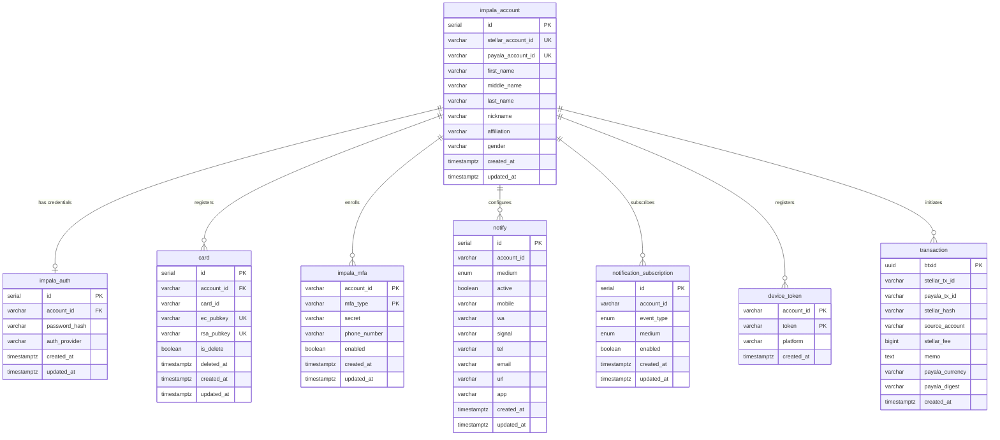
```mermaid
erDiagram
    impala_account {
        serial id PK
        varchar stellar_account_id UK
        varchar payala_account_id UK
        varchar first_name
        varchar middle_name
        varchar last_name
        varchar nickname
        varchar affiliation
        varchar gender
        timestamptz created_at
        timestamptz updated_at
    }

    impala_auth {
        serial id PK
        varchar account_id FK
        varchar password_hash
        varchar auth_provider
        timestamptz created_at
        timestamptz updated_at
    }

    card {
        serial id PK
        varchar account_id FK
        varchar card_id
        varchar ec_pubkey UK
        varchar rsa_pubkey UK
        boolean is_delete
        timestamptz deleted_at
        timestamptz created_at
        timestamptz updated_at
    }

    transaction {
        uuid btxid PK
        varchar stellar_tx_id
        varchar payala_tx_id
        varchar stellar_hash
        varchar source_account
        bigint stellar_fee
        text memo
        varchar payala_currency
        varchar payala_digest
        timestamptz created_at
    }

    impala_mfa {
        varchar account_id PK
        varchar mfa_type PK
        varchar secret
        varchar phone_number
        boolean enabled
        timestamptz created_at
        timestamptz updated_at
    }

    notify {
        serial id PK
        varchar account_id
        enum medium
        boolean active
        varchar mobile
        varchar wa
        varchar signal
        varchar tel
        varchar email
        varchar url
        varchar app
        timestamptz created_at
        timestamptz updated_at
    }

    notification_subscription {
        serial id PK
        varchar account_id
        enum event_type
        enum medium
        boolean enabled
        timestamptz created_at
        timestamptz updated_at
    }

    device_token {
        varchar account_id PK
        varchar token PK
        varchar platform
        timestamptz created_at
    }

    impala_account ||--o| impala_auth : "has credentials"
    impala_account ||--o{ card : "registers"
    impala_account ||--o{ impala_mfa : "enrolls"
    impala_account ||--o{ notify : "configures"
    impala_account ||--o{ notification_subscription : "subscribes"
    impala_account ||--o{ device_token : "registers"
    impala_account ||--o{ transaction : "initiates"
```

The database schema is managed by 17 sequential SQL migrations. Performance indices cover: `card(account_id)` filtered on active cards, `impala_mfa(account_id, mfa_type)`, `notify(account_id)` filtered on active entries, `transaction(created_at)`, and `notification_subscription(account_id, event_type)` filtered on enabled subscriptions.

---

## Bridge Network Integration

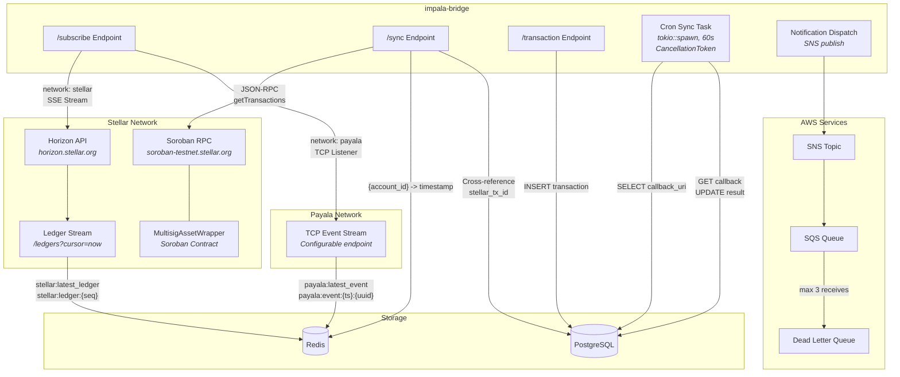
```mermaid
graph TB
    subgraph Bridge["impala-bridge"]
        SubEndpoint["/subscribe Endpoint"]
        SyncEndpoint["/sync Endpoint"]
        TxEndpoint["/transaction Endpoint"]
        CronTask["Cron Sync Task<br/><i>tokio::spawn, 60s<br/>CancellationToken</i>"]
        NotifyDispatch["Notification Dispatch<br/><i>SNS publish</i>"]
    end

    subgraph Stellar["Stellar Network"]
        Horizon["Horizon API<br/><i>horizon.stellar.org</i>"]
        SorobanRPC["Soroban RPC<br/><i>soroban-testnet.stellar.org</i>"]
        Ledgers["Ledger Stream<br/><i>/ledgers?cursor=now</i>"]
        SorobanContract["MultisigAssetWrapper<br/><i>Soroban Contract</i>"]
    end

    subgraph Payala["Payala Network"]
        PayalaTCP["TCP Event Stream<br/><i>Configurable endpoint</i>"]
    end

    subgraph Storage["Storage"]
        Redis[("Redis")]
        Postgres[("PostgreSQL")]
    end

    subgraph AWS["AWS Services"]
        SNS["SNS Topic"]
        SQS["SQS Queue"]
        DLQ["Dead Letter Queue"]
    end

    SubEndpoint -->|"network: stellar<br/>SSE Stream"| Horizon
    Horizon --> Ledgers
    SubEndpoint -->|"network: payala<br/>TCP Listener"| PayalaTCP

    SyncEndpoint -->|"JSON-RPC<br/>getTransactions"| SorobanRPC

    Ledgers -->|"stellar:latest_ledger<br/>stellar:ledger:{seq}"| Redis
    PayalaTCP -->|"payala:latest_event<br/>payala:event:{ts}:{uuid}"| Redis
    SyncEndpoint -->|"{account_id} -> timestamp"| Redis

    TxEndpoint -->|"INSERT transaction"| Postgres
    SyncEndpoint -->|"Cross-reference<br/>stellar_tx_id"| Postgres

    CronTask -->|"SELECT callback_uri"| Postgres
    CronTask -->|"GET callback<br/>UPDATE result"| Postgres

    NotifyDispatch --> SNS
    SNS --> SQS
    SQS -->|"max 3 receives"| DLQ

    SorobanRPC --- SorobanContract
```

---

## JWT Token Lifecycle

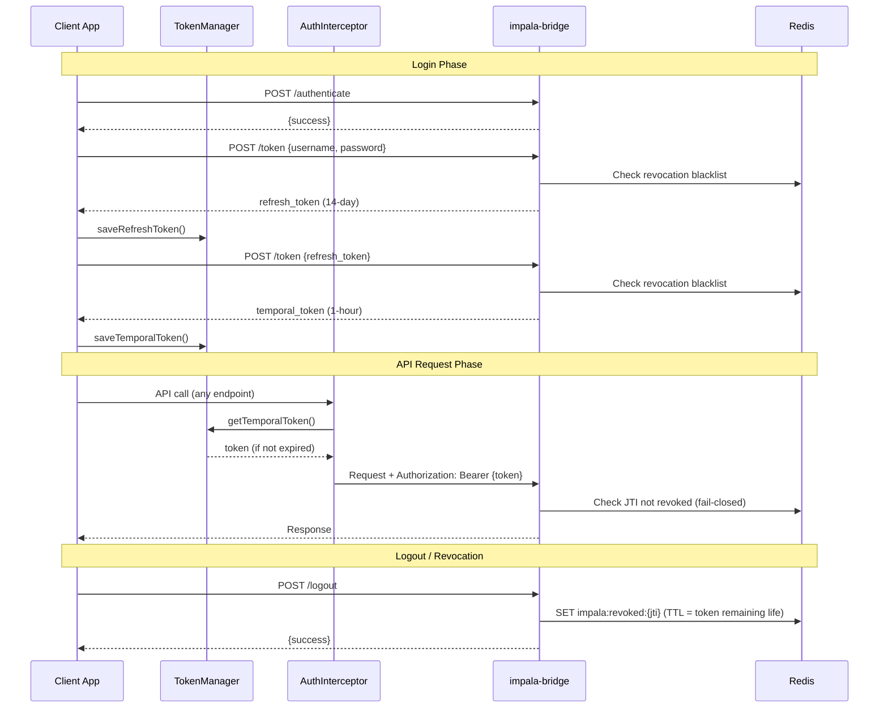
```mermaid
sequenceDiagram
    participant App as Client App
    participant TM as TokenManager
    participant Int as AuthInterceptor
    participant Bridge as impala-bridge
    participant Redis as Redis

    Note over App, Redis: Login Phase
    App->>Bridge: POST /authenticate
    Bridge-->>App: {success}
    App->>Bridge: POST /token {username, password}
    Bridge->>Redis: Check revocation blacklist
    Bridge-->>App: refresh_token (14-day)
    App->>TM: saveRefreshToken()
    App->>Bridge: POST /token {refresh_token}
    Bridge->>Redis: Check revocation blacklist
    Bridge-->>App: temporal_token (1-hour)
    App->>TM: saveTemporalToken()

    Note over App, Redis: API Request Phase
    App->>Int: API call (any endpoint)
    Int->>TM: getTemporalToken()
    TM-->>Int: token (if not expired)
    Int->>Bridge: Request + Authorization: Bearer {token}
    Bridge->>Redis: Check JTI not revoked (fail-closed)
    Bridge-->>App: Response

    Note over App, Redis: Logout / Revocation
    App->>Bridge: POST /logout
    Bridge->>Redis: SET impala:revoked:{jti} (TTL = token remaining life)
    Bridge-->>App: {success}
```

---

## Deployment Architecture

### Local Development (Docker Compose)

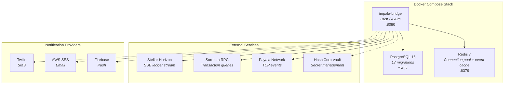
```mermaid
graph TB
    subgraph DockerCompose["Docker Compose Stack"]
        BridgeContainer["impala-bridge<br/><i>Rust / Axum</i><br/>:8080"]
        PGContainer["PostgreSQL 16<br/><i>17 migrations</i><br/>:5432"]
        RedisContainer["Redis 7<br/><i>Connection pool + event cache</i><br/>:6379"]
    end

    subgraph External["External Services"]
        Horizon["Stellar Horizon<br/><i>SSE ledger stream</i>"]
        SorobanRPC["Soroban RPC<br/><i>Transaction queries</i>"]
        PayalaTCP["Payala Network<br/><i>TCP events</i>"]
        VaultServer["HashiCorp Vault<br/><i>Secret management</i>"]
    end

    subgraph Notifications["Notification Providers"]
        Twilio["Twilio<br/><i>SMS</i>"]
        SES["AWS SES<br/><i>Email</i>"]
        FCMSvc["Firebase<br/><i>Push</i>"]
    end

    BridgeContainer --> PGContainer
    BridgeContainer --> RedisContainer
    BridgeContainer --> Horizon
    BridgeContainer --> SorobanRPC
    BridgeContainer --> PayalaTCP
    BridgeContainer -.-> VaultServer
    BridgeContainer -.-> Twilio
    BridgeContainer -.-> SES
    BridgeContainer -.-> FCMSvc
```

### Production (AWS via Terraform)

The Terraform configuration deploys a production-grade infrastructure:

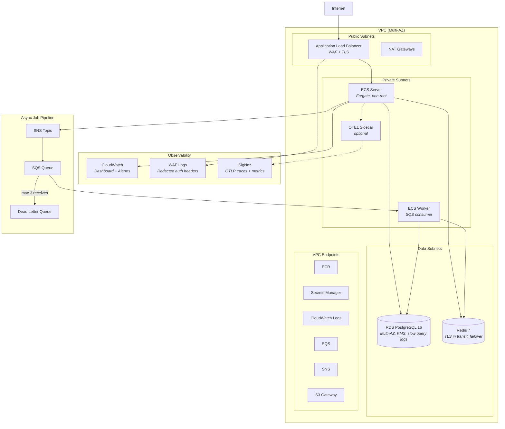
```mermaid
graph TB
    subgraph VPC["VPC (Multi-AZ)"]
        subgraph Public["Public Subnets"]
            ALB["Application Load Balancer<br/><i>WAF + TLS</i>"]
            NAT["NAT Gateways"]
        end

        subgraph Private["Private Subnets"]
            Server["ECS Server<br/><i>Fargate, non-root</i>"]
            Worker["ECS Worker<br/><i>SQS consumer</i>"]
            OTel["OTEL Sidecar<br/><i>optional</i>"]
        end

        subgraph Data["Data Subnets"]
            RDS[("RDS PostgreSQL 16<br/><i>Multi-AZ, KMS, slow query logs</i>")]
            ElastiCache[("Redis 7<br/><i>TLS in transit, failover</i>")]
        end

        subgraph VPCEndpoints["VPC Endpoints"]
            ECR_EP["ECR"]
            SM_EP["Secrets Manager"]
            Logs_EP["CloudWatch Logs"]
            SQS_EP["SQS"]
            SNS_EP["SNS"]
            S3_EP["S3 Gateway"]
        end
    end

    subgraph Monitoring["Observability"]
        CW["CloudWatch<br/><i>Dashboard + Alarms</i>"]
        WAFLogs["WAF Logs<br/><i>Redacted auth headers</i>"]
        SigNoz["SigNoz<br/><i>OTLP traces + metrics</i>"]
    end

    subgraph Jobs["Async Job Pipeline"]
        SNS["SNS Topic"]
        SQS["SQS Queue"]
        DLQ["Dead Letter Queue"]
    end

    Internet["Internet"] --> ALB
    ALB --> Server
    Server --> RDS
    Server --> ElastiCache
    Worker --> RDS
    Worker --> ElastiCache
    Server --> SNS
    SNS --> SQS
    SQS --> Worker
    SQS -->|"max 3 receives"| DLQ
    Server -.-> OTel
    OTel -.-> SigNoz
    Server --> CW
    ALB --> WAFLogs
```

**Compute and networking:**
- **VPC**: Public subnets (ALB, NAT gateways), private subnets (ECS tasks, RDS, ElastiCache)
- **VPC Endpoints**: Interface endpoints for ECR, Secrets Manager, CloudWatch Logs, SQS, and SNS, plus a gateway endpoint for S3. AWS API traffic stays within the VPC — reduces NAT costs and removes a potential data exfiltration vector. Gated by `enable_vpc_endpoints` variable.
- **ECS Fargate**: Server and worker services as separate task definitions (2 vCPU, 4 GB RAM default). Non-root container user (UID 1000), read-only root filesystem. Optional OpenTelemetry Collector sidecar for traces and metrics export to SigNoz
- **ALB**: Public load balancer with HTTP-to-HTTPS redirect, health checks against `/healthz` and `/readyz`

**Data stores:**
- **RDS**: PostgreSQL 16, Multi-AZ, KMS encryption at rest, automated backups (30-day retention). Custom parameter group enables slow query logging (queries > 1s), DDL statement logging, connection/disconnection tracking, and lock wait logging — all exported to CloudWatch Logs. `skip_final_snapshot` defaults to `false` for production safety.
- **ElastiCache**: Redis 7 replication group with automatic failover, at-rest encryption (KMS), and **TLS in transit** (`rediss://` protocol). The bridge application connects via `tokio-rustls` for encrypted Redis communication.

**Security:**
- **WAF**: AWS managed rule groups (Common, Known Bad Inputs, SQLi), IP-based rate limiting (2000 req/5 min). WAF logging enabled to CloudWatch with authorization and cookie headers **redacted** to prevent credential leakage into log storage.
- **Secrets**: JWT secret and database URL stored in AWS Secrets Manager
- **Testnet isolation**: When `testnet_enabled = true`, the testnet JWT secret must be at least 32 characters (enforced by Terraform `check` block)

**Reliability:**
- **SNS/SQS**: Job dispatch pipeline with dead letter queue (3 max receives)
- **Autoscaling**: Target tracking on CPU (85%) and memory (90%), ALB latency step scaling (250ms threshold)
- **Disaster Recovery**: Optional cross-region failover (`dr_enabled = true`) with RDS read replica promotion, Route 53 failover DNS, ElastiCache cross-region replication, and S3 cross-region replication

**Observability:**
- **CloudWatch**: Dashboard with 6 widgets (CPU, memory, request count, error rate, latency, DLQ depth). SNS alerts for CPU/memory thresholds, 5xx spikes, and DLQ accumulation
- **WAF Logs**: All blocked and rate-limited requests logged for forensic analysis
- **PostgreSQL Logs**: Slow queries (> 1s), DDL statements, connections, and lock waits exported to CloudWatch
- **OpenTelemetry**: Optional OTLP traces and metrics export to SigNoz via collector sidecar

---

## Admin Web UI Architecture

```mermaid
graph TB
    subgraph AdminUI["Admin Web UI"]
        Dashboard["Dashboard<br/><i>Account overview</i>"]
        AcctMgmt["Account Management<br/><i>Create / Update / Lookup</i>"]
        CardMgmt["Card Management<br/><i>Register / Revoke</i>"]
        TxView["Transaction Viewer<br/><i>Stellar + Payala ledger</i>"]
        MfaMgmt["MFA Management<br/><i>Enroll / Verify</i>"]
        NotifyMgmt["Notification Config<br/><i>Events + Channels</i>"]
        RoleMgmt["Role Management<br/><i>4-tier RBAC</i>"]
        SysInfo["System Info<br/><i>Version / Health</i>"]
    end

    subgraph BridgeAPI["impala-bridge API"]
        direction LR
        EP_Acc["/account"]
        EP_Card["/card"]
        EP_Tx["/transaction"]
        EP_Mfa["/mfa"]
        EP_Notify["/notify"]
        EP_Subs["/notification/subscriptions"]
        EP_Sub["/subscribe"]
        EP_Sync["/sync"]
        EP_Ver["/version"]
        EP_Health["/health"]
    end

    Dashboard --> EP_Acc
    Dashboard --> EP_Ver
    AcctMgmt --> EP_Acc
    CardMgmt --> EP_Card
    TxView --> EP_Tx
    MfaMgmt --> EP_Mfa
    NotifyMgmt --> EP_Notify
    NotifyMgmt --> EP_Subs
    SysInfo --> EP_Ver
    SysInfo --> EP_Health
```

---

## End-to-End Data Flow: Card Payment to On-Chain Settlement

This sequence diagram traces a complete payment from NFC tap through dual-chain recording and notification delivery, showing how all components interact:

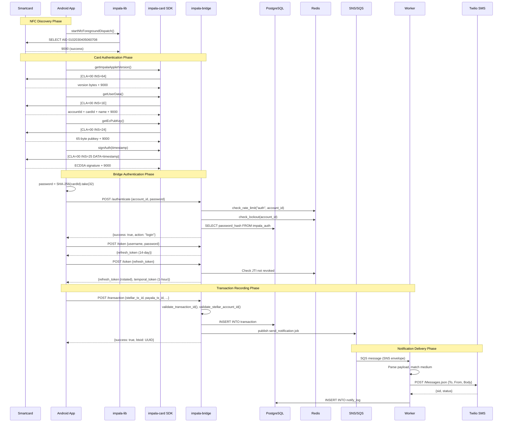
```mermaid
sequenceDiagram
    participant Card as Smartcard
    participant App as Android App
    participant Lib as impala-lib
    participant SDK as impala-card SDK
    participant Bridge as impala-bridge
    participant DB as PostgreSQL
    participant Redis as Redis
    participant SNS as SNS/SQS
    participant Worker as Worker
    participant Twilio as Twilio SMS

    Note over Card, App: NFC Discovery Phase
    App->>Lib: startNfcForegroundDispatch()
    Lib->>Card: SELECT AID 0102030405060708
    Card-->>Lib: 9000 (success)

    Note over Card, Bridge: Card Authentication Phase
    App->>SDK: getImpalaAppletVersion()
    SDK->>Card: [CLA=00 INS=64]
    Card-->>SDK: version bytes + 9000
    App->>SDK: getUserData()
    SDK->>Card: [CLA=00 INS=1E]
    Card-->>SDK: accountId + cardId + name + 9000
    App->>SDK: getEcPubKey()
    SDK->>Card: [CLA=00 INS=24]
    Card-->>SDK: 65-byte pubkey + 9000
    App->>SDK: signAuth(timestamp)
    SDK->>Card: [CLA=00 INS=25 DATA=timestamp]
    Card-->>SDK: ECDSA signature + 9000

    Note over App, Bridge: Bridge Authentication Phase
    App->>App: password = SHA-256(cardId).take(32)
    App->>Bridge: POST /authenticate {account_id, password}
    Bridge->>Redis: check_rate_limit("auth", account_id)
    Bridge->>Redis: check_lockout(account_id)
    Bridge->>DB: SELECT password_hash FROM impala_auth
    Bridge-->>App: {success: true, action: "login"}
    App->>Bridge: POST /token {username, password}
    Bridge-->>App: {refresh_token (14-day)}
    App->>Bridge: POST /token {refresh_token}
    Bridge->>Redis: Check JTI not revoked
    Bridge-->>App: {refresh_token (rotated), temporal_token (1-hour)}

    Note over App, Worker: Transaction Recording Phase
    App->>Bridge: POST /transaction {stellar_tx_id, payala_tx_id, ...}
    Bridge->>Bridge: validate_transaction_id(), validate_stellar_account_id()
    Bridge->>DB: INSERT INTO transaction
    Bridge->>SNS: publish send_notification job
    Bridge-->>App: {success: true, btxid: UUID}

    Note over SNS, Twilio: Notification Delivery Phase
    SNS->>Worker: SQS message (SNS envelope)
    Worker->>Worker: Parse payload, match medium
    Worker->>Twilio: POST /Messages.json {To, From, Body}
    Twilio-->>Worker: {sid, status}
    Worker->>DB: INSERT INTO notify_log
```

---

## CI/CD Pipeline

GitHub Actions (`.github/workflows/ci.yml`) automates testing, building, and deployment:

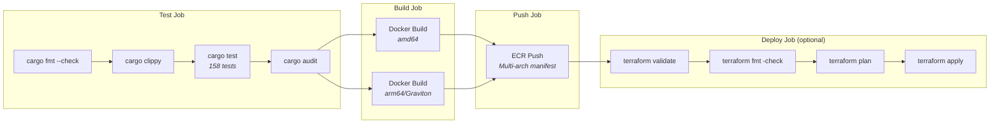
```mermaid
graph LR
    subgraph Test["Test Job"]
        Fmt["cargo fmt --check"]
        Clippy["cargo clippy"]
        Tests["cargo test<br/><i>158 tests</i>"]
        Audit["cargo audit"]
    end

    subgraph Build["Build Job"]
        AMD64["Docker Build<br/><i>amd64</i>"]
        ARM64["Docker Build<br/><i>arm64/Graviton</i>"]
    end

    subgraph Push["Push Job"]
        ECR["ECR Push<br/><i>Multi-arch manifest</i>"]
    end

    subgraph Deploy["Deploy Job (optional)"]
        TFValidate["terraform validate"]
        TFFmt["terraform fmt -check"]
        TFPlan["terraform plan"]
        TFApply["terraform apply"]
    end

    Fmt --> Clippy --> Tests --> Audit
    Audit --> AMD64
    Audit --> ARM64
    AMD64 --> ECR
    ARM64 --> ECR
    ECR --> TFValidate --> TFFmt --> TFPlan --> TFApply
```

**Triggers**: Push to `main`, PR against `main`, manual dispatch. Docker images are built natively on both amd64 and arm64 runners (no QEMU emulation). The Terraform deploy step validates HCL syntax and formatting before planning.

---

## Testing Strategy

The bridge has **158 unit tests** covering:

| Area | Tests | What They Cover |
|------|-------|-----------------|
| Validation | 45+ | All 11 validation functions with valid, boundary, and invalid inputs |
| Handlers | 20+ | Network info (direct call), health probes, MFA TOTP round-trip, subscription constants |
| Models | 16 | Serialization/deserialization for all request/response types, `skip_serializing_if` behavior |
| Auth/JWT | 8 | Token encoding/decoding, expiry, wrong secret, wrong issuer |
| Config | 9 | StellarNetwork parsing, case insensitivity, Config-to-StellarConfig conversion |
| Middleware | 7 | Path normalization for metrics (numeric, UUID, mixed, root) |
| Notifications | 7 | Event type strings, message formatting for all 6 event variants |
| Redis helpers | 7 | Key format consistency for rate limit, lockout, revocation, MFA attempts |
| Worker | 6 | JobMessage/SnsEnvelope deserialization, JobError display |
| Jobs | 12 | Payload deserialization for send_notification (4 mediums), batch_sync, stellar_reconcile |
| Error types | 7 | HTTP status code mapping for all AppError variants |
| Okta | 5 | OIDC discovery, JWKS, claims, JWK key lookup |

Handler tests use a strategy of extracting pure business logic into `pub(crate)` functions that can be tested without database or Redis mocks. Handlers that take only `Extension` layers with no DB dependency (like `network_info` and `liveness`) are tested via direct invocation.

The Soroban contract has **50+ tests** covering initialization, wrap/unwrap/transfer operations, timelock management, multisig verification, pause/unpause, signer rotation, and edge cases (zero amounts, duplicate signers, expired timelocks, insufficient balances, self-transfers).

The JavaCard SDK has **6 test suites** covering APDU encoding/decoding, AES-CMAC with NIST test vectors, response status word mapping, SDK input validation (PIN format, name length, signable data size), and exception mapping for all card error codes.
