# Impala Platform Architecture

## System Overview

The Imapala bridge application provides an integration between Stellar payments
 and Payala offline and online transfers. Support for Anchored payments and smart
contracts for tokenized assets is provided.

The impala-card and library supports compatible javacard authentication for payments
with a hardware root of trust for authentication.

## API Architecture

## Authentication Flow

## NFC Card Communication Stack

## Bridge Network Integration

## Data Model

```mermaid
erDiagram
    impala_account {
        serial id PK
        varchar stellar_account_id UK
        varchar payala_account_id UK
        varchar first_name
        varchar middle_name
        varchar last_name
        varchar nickname
        varchar affiliation
        varchar gender
        timestamptz created_at
        timestamptz updated_at
    }

    impala_auth {
        serial id PK
        varchar account_id FK
        varchar password_hash
        timestamptz created_at
        timestamptz updated_at
    }

    card {
        serial id PK
        varchar account_id
        varchar card_id
        varchar ec_pubkey UK
        varchar rsa_pubkey UK
        boolean is_delete
        timestamptz created_at
        timestamptz updated_at
    }

    transaction {
        uuid btxid PK
        varchar stellar_tx_id
        varchar payala_tx_id
        varchar stellar_hash
        varchar source_account
        bigint stellar_fee
        text memo
        varchar payala_currency
        varchar payala_digest
        timestamptz created_at
    }

    impala_mfa {
        varchar account_id PK
        varchar mfa_type PK
        varchar secret
        varchar phone_number
        boolean enabled
        timestamptz created_at
        timestamptz updated_at
    }

    notify {
        serial id PK
        varchar account_id
        enum medium
        varchar mobile
        varchar wa
        varchar signal
        varchar tel
        varchar email
        varchar url
        varchar app
        timestamptz created_at
        timestamptz updated_at
    }

    impala_account ||--o| impala_auth : "has credentials"
    impala_account ||--o{ card : "registers"
    impala_account ||--o{ impala_mfa : "enrolls"
    impala_account ||--o{ notify : "configures"
    impala_account ||--o{ transaction : "initiates"
```

## Soroban Contract Operations

## Android App Authentication Methods

## Admin Web UI Architecture

## Deployment Architecture

## APDU Command Reference

## JWT Token Lifecycle

