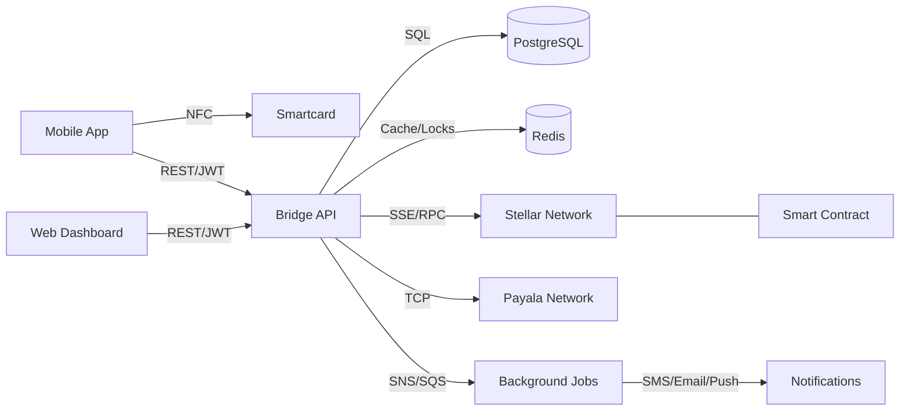

# Payala-Impala

**A secure bridge between offline Payala payments and the Stellar network, using Soroban smart contracts, hardware-protected cryptographic primitives (JavaCard smartcard), and Android bindings.**

## What It Does

Impala connects the Payala offline payment system to Stellar's on-chain infrastructure. Transactions happen offline through Payala's existing network, but those funds need to move on-chain when users want to interact with the broader Stellar ecosystem. Impala makes that crossing seamless — whether a user is wrapping tokens into a Soroban smart contract, transferring value between accounts, or checking their balance from a phone.

### How People Use It

**A cardholder paying at a kiosk** taps their Impala smartcard against an NFC-enabled phone. The card signs the transaction with an ECDSA private key that never leaves the secure element, the phone relays the signed payload to the bridge server, and the bridge records a dual-chain transaction linking the Payala payment to its Stellar counterpart.

**An administrator monitoring the network** opens the web dashboard, reviews recent transactions across both ledgers, checks account health, and configures notification rules so the operations team gets a Slack webhook whenever a high-value transfer clears.

**A mobile app developer integrating Impala** adds the Android library to their project, initializes the NFC adapter, and calls typed SDK methods to read card data, verify PINs, and sign transfers — without touching raw APDU bytes.

**A compliance team auditing token custody** reviews the Soroban smart contract's multisig and timelock requirements: no tokens leave the wrapper without multiple authorized signers and a mandatory time delay, giving the team a window to cancel suspicious operations.

## Architecture at a Glance



Six components span from on-chain smart contracts through a REST API server down to the NFC interface on a mobile device:

| Component | Stack | Role |
|---|---|---|
| **impala-bridge** | Rust / Axum | REST API server — authentication, transactions, notifications, Stellar event streaming, background job processing |
| **impala-card** | Java (JavaCard) + Kotlin Multiplatform | Smartcard applet (23 APDU commands) and cross-platform SDK for NFC card communication |
| **impala-soroban** | Rust / Soroban SDK | `MultisigAssetWrapper` smart contract with time-locked operations and multisig verification |
| **impala-lib** | Kotlin / Android | Android library for NFC (IsoDep + NDEF) and geolocation integration |
| **impala-android-demo** | Kotlin / Android | Demo app with 5 auth methods, card management, transfers, and push notifications |
| **impala-ui** | JavaScript / HTML / CSS | Admin dashboard with client-side RBAC (4 roles), served via Nginx |

## Key Capabilities

- **Hardware root of trust** — every smartcard carries its own EC key pair (secp256r1), PIN management, and on-card balance ledger. Authentication doesn't rely solely on passwords or software tokens.
- **Dual-chain transaction records** — each transaction links its Stellar and Payala identifiers, enabling cross-ledger reconciliation and audit.
- **Time-locked multisig custody** — the Soroban smart contract requires multiple authorized signers and a configurable time delay before tokens can be withdrawn or transferred. Operations can be cancelled during the delay window.
- **Five authentication methods** — username/password (Argon2), Okta SSO (OIDC), NFC smartcard (ECDSA), Google Sign-In, GitHub OAuth.
- **Event-driven notifications** — users subscribe to events (login, transfer, profile changes) and receive alerts via SMS (Twilio), email (SES), push (FCM), or webhook.
- **Fail-closed security** — Redis-backed rate limiting, account lockout, token revocation, and MFA brute-force protection all reject requests when Redis is unavailable, rather than silently bypassing.
- **Production-ready infrastructure** — Terraform provisions ECS Fargate, RDS PostgreSQL, ElastiCache Redis with TLS, ALB with WAF, VPC endpoints, auto-scaling, and optional cross-region disaster recovery.

## Quick Start

```bash
# Start the bridge with PostgreSQL and Redis
cd impala-bridge
docker compose up

# Run bridge tests (158 tests covering handlers, validation, jobs, models)
cargo test

# Run JavaCard SDK tests (JVM, no hardware needed)
cd impala-card
./gradlew :sdk:jvmTest

# Run Soroban contract tests
cd impala-soroban/integration-test
cargo test
```

## Documentation

- **[ARCHITECTURE.md](ARCHITECTURE.md)** — System design, data flows, API reference, APDU command reference, smart contract interface, deployment topology, narrative use cases, and mermaid diagrams
- **[CLAUDE.md](CLAUDE.md)** — Build commands, environment variables, conventions, and gotchas for all sub-projects
- **[CONTRIBUTING.md](CONTRIBUTING.md)** — Local bootstrap, per-sub-project workflows, testing expectations, commit style
- **[CHANGELOG.md](CHANGELOG.md)** — Notable changes (Keep-a-Changelog format)
- **[impala-bridge/openapi.yaml](impala-bridge/openapi.yaml)** — OpenAPI 3.1 spec for all bridge REST endpoints
- **[impala-bridge/SECURITY.md](impala-bridge/SECURITY.md)** — Security architecture: token strategy, brute-force protection, input validation, HTTP headers, infrastructure hardening, disaster recovery
- **[terraform/README.md](terraform/README.md)** — Infrastructure: variables, deploy workflow, migrations, rollback
- **[docs/runbooks/](docs/runbooks/)** — Operational runbooks: [deploy](docs/runbooks/deploy.md), [incident response](docs/runbooks/incident-response.md), [rotate secrets](docs/runbooks/rotate-secrets.md)
- **[impala-card/docs/apdu.md](impala-card/docs/apdu.md)** — Smartcard APDU command reference (INS codes, response formats, auth requirements)

## Typical End-to-End Flows

### Card-Based Payment

1. Cardholder taps phone → NFC discovers Impala applet via AID `0102030405060708`
2. App sends `GET_USER_DATA` (INS 0x1E) → card returns account ID, card ID, cardholder name
3. App sends `GET_EC_PUB_KEY` (INS 0x24) → card returns 65-byte secp256r1 public key
4. App sends `SIGN_AUTH` (INS 0x25) with timestamp → card returns ECDSA-SHA256 signature
5. App derives password from `SHA-256(cardId)` and authenticates with bridge
6. App calls `POST /transaction` with dual-chain identifiers
7. Bridge records transaction, fires `transfer_outgoing` notification to subscriber channels

### Token Wrapping via Smart Contract

1. Authorized signers call `wrap(signers, amount)` → tokens transfer from signer to contract
2. Later, signers call `schedule_unwrap(signers, recipient, amount, delay)` → creates timelock with `unlock_time = now + delay`
3. After the delay expires, anyone calls `execute_unwrap(timelock_id)` → tokens transfer to recipient
4. If suspicious, signers call `cancel_timelock(signers, timelock_id)` during the delay window → operation cancelled, tokens stay wrapped

### Notification Subscription

1. User calls `POST /notification/subscriptions` with `{event_type: "transfer_incoming", medium: "sms"}`
2. User configures SMS destination via `POST /notify` with phone number
3. When an incoming transfer arrives, bridge publishes `send_notification` job to SNS
4. Worker picks up the SQS message and delivers SMS via Twilio API
5. Delivery result logged to `notify_log` table for audit

## License

Apache License 2.0 — see [LICENSE-2.0.txt](LICENSE-2.0.txt).
