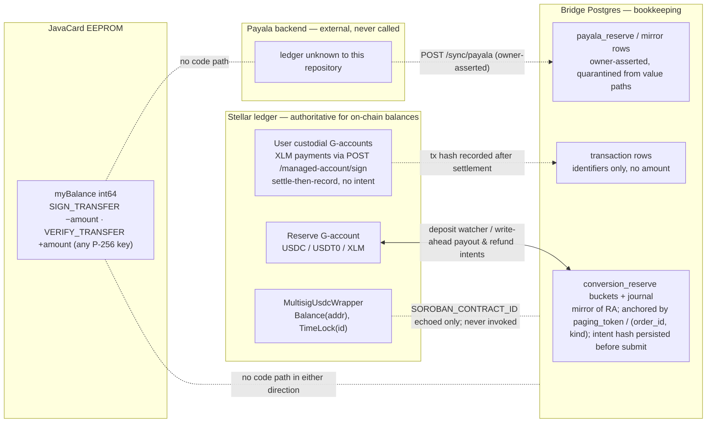

# Documentation architecture — implementation spec

Repo: `/Users/user/sonoranpub/impala` (HEAD `71abed3a Add USDT0 support`; `git tag -l` is empty). Every fact below was re-verified against the working tree on 2026-09-05; where the winning design or a judge note disagreed with the source, the source wins and the correction is stated in §0.2.

## 0. Ground truth the spec depends on

### 0.1 Verified counts and identifiers (cite these, nothing else)
- `ImpalaApplet.process()` (`impala-card/applet/src/jvmMain/java/com/impala/applet/ImpalaApplet.java:324-529`) dispatches **17 application INS at CLA 0x00**: 0x02 0x04 0x06 0x14 0x16 0x18 0x19 0x1E 0x1F 0x20 0x21 0x22 0x24 0x25 0x2C 0x2E 0x64; **2 SCP03 INS at CLA 0x80** as literal `case (byte) 0x50` / `0x82`; **2 SCP03 INS only at CLA 0x84** via `ins == INS_SCP03_PROVISION_PIN` (0x70) / `INS_SCP03_APPLET_UPDATE` (0x71). Both `default:` branches throw `ISO7816.SW_INS_NOT_SUPPORTED`. `Constants.java` declares 22 application INS + 2 `INS_SCP03_*`; **5 are declared but not dispatched**: 0x07 `INS_GET_RSA_PUB_KEY`, 0x23 `INS_GET_CARD_NONCE`, 0x26 `INS_SET_CARD_DATA`, 0x2B `INS_UPDATE_MASTER_PIN`, 0x2D `INS_SUICIDE`. SDK `Constants.kt` (`impala-card/sdk/src/commonMain/kotlin/com/impala/sdk/Constants.kt`) declares the same 22 application INS and **no** `INS_SCP03_*`.
- Status words thrown by the applet (`ImpalaApplet.java`, `SCP03.java`, `CryptoPrimitivesConverter.java`) and **absent from `impala-card/docs/apdu.md` § Common status words**: `0x6227` (`SW_ERROR_INIT_SIGNER`, :1104), `0x6230` (`SW_ERROR_EC_CARD_KEY_MISSING`, :1099), `0x6233` (`SW_ERROR_TRANSFER_COUNTER_INVALID`, :946), `0x6984` (`ISO7816.SW_DATA_INVALID` — :848 negative counter, :1060 balance overflow, `CryptoPrimitivesConverter.java:33,45,53,60` malformed DER), `0x6A80` (`ISO7816.SW_WRONG_DATA`, install parameters :572-622). **`SW_DATA_INVALID` is `0x6984`, not `0x6A80`** (`javap -constants javacard.framework.ISO7816` on jcardsim 3.0.6.0: `SW_DATA_INVALID = 27012 = 0x6984`, `SW_WRONG_DATA = 27264 = 0x6A80`). `SCP03.java:398` throws `0x6688` for C-MAC failure (documented today only as "internal null-pointer"). PIN failures are `(short)(SW_PIN_FAILED + triesRemaining)` = `0x69C0..0x69C9`.
- Migrations: contiguous `001`…`036`; next free number `037`. Workflows: `ci.yml`, `impala-android.yml`, `impala-card.yml`, `impala-soroban.yml`, `impala-ui.yml`, `impalactl.yml`, `lumencli.yml`, `security.yml`. `ci.yml` pins `actions/checkout@34e114876b0b11c390a56381ad16ebd13914f8d5 # v4.3.1`; job `terraform-check` exists. Nine top-level sub-projects: impala-bridge, impala-card, impala-soroban, impala-lib, impala-android-demo, impala-ui, lumencli, impalactl, terraform. No root `scripts/`, `deployments/`, `docs/scf/`, `evidence/` exist yet. `Justfile` has `lint: lint-bridge lint-terraform lint-soroban`.
- iOS: `git ls-files impala-card/sdk/src/iosMain` → `SecureRandomBytes.ios.kt`, `apdu4j/CoreNfcBibo.kt`, `apdu4j/NSDataExt.kt`, `nfc/CoreNfcSessionDriver.kt`; `CoreNfcSessionDriver.kt:18,29` says "EXPERIMENTAL … Treat it as a starting point, not a verified component". No macOS job in `impala-card.yml`. `ARCHITECTURE.md:399,405-409`, `docs/ios-nfc.md:3-4,14`, `impala-lib/README.md:45` still say "no `iosMain` source set / not implemented"; `impala-card/docs/IOS_NFC.md` and `DEVELOPMENT.md:66` describe it as existing.
- Reserve payouts and refunds **do** persist the prepared tx hash on the intent row before submit (`impala-bridge/src/exchange/reserve_watch.rs::record_intent_hash`, :401-445, used at :1472 and :2082: "no hash, no submit"). Replenishment (`impala-bridge/src/exchange/replenish.rs:1013`) uses `sign_and_submit_payment` and records the hash only afterwards. The custodial path (`impala-bridge/src/handlers/managed_seed.rs::sign_and_submit`, :507-588) is settle-then-record with no intent, idempotency key, cap or pause.
- Test names cited anywhere in this spec were resolved mechanically with the checker in §3.2 against the tree (all AppletInteropTest, card_auth.rs, sync.rs, reserve_watch.rs, reserve.rs, replenish.rs, managed_seed.rs, auth.rs, lib.rs, testnet integration.rs, roles.test.js, role-capabilities-contract.test.js names below exist).

### 0.2 Corrections to the winning design (apply these, not the design text)
1. apdu.md gains **five** status-word rows (0x6227, 0x6230, 0x6233, 0x6984, 0x6A80), not two; 0x6A80 is "wrong data (install parameters)", 0x6984 is "data invalid".
2. KL-B9 is reworded: only replenishment lacks pre-submit hash persistence; payouts/refunds have it.
3. The drift test compares SDK `Constants.kt` with applet `Constants.java` **excluding the `INS_SCP03_` prefix** and uses reflection, not source regexes, for constant values.
4. iOS is `in progress (unverified)` everywhere (both iOS docs are kept and cross-linked; neither is reduced to a pointer).
5. Matrix cells are token-first (`YES` / `PARTIAL (…)` / `NO` / `NO EVIDENCE` / `n/a`); Table A (card, reviewer's five columns) and Table B (bridge/contract/infra) are separate tables.
6. `docs/runbooks/deploy-okta-sso-admin-ui-cloudflare.md:78` (`okta.rs::try_validate_with_jwks`) and `docs/runbooks/incident-response.md:174` (`telemetry.rs::AppMetrics`) must become full paths (`impala-bridge/src/okta.rs::…`, `impala-bridge/src/telemetry.rs::…`) or the checker fails on the current tree (verified: these are the only two pre-existing R1 findings).
7. Tagging (`scf-baseline`, `scf-t1`) is Phase E, an owner action, never part of the docs PR.
8. `is_admin` stays in SECURITY.md wherever it describes the session-cookie path (accurate); only `### Admin authorization` (SECURITY.md:336-350) is replaced.

## 1. Conventions (new file `docs/README.md`, ~50 lines) — verbatim rules

```
# Impala documentation

Index: capability-matrix.md · known-limitations.md · threat-model.md · roadmap.md ·
conservation-spec.md (bridge-owned; planned) · deployments.md · scf/ (acceptance-matrix.md,
evidence-checklist.md, evidence/) · ios-nfc.md · runbooks/ (operations).

## Rules every document in this repository follows

1. Two vocabularies, never mixed. Present tense describes only what the code in this tree does.
   Future work carries exactly one label: `aspiration` (no design, no owner), `planned (T1|T2|T3)`
   (design exists, tranche assigned, checklist item in docs/roadmap.md), `in progress` (code in the
   tree, no evidence yet), `decision pending` (named decision in docs/roadmap.md § Decisions), or
   `accepted limitation`. Nothing is called shipped, complete or production until a tagged release
   contains it AND its row in docs/capability-matrix.md shows the evidence.
2. Evidence citation grammar. A claim cites its evidence as `` `repo/relative/path::name` `` (a test
   name for evidence; a fn/struct/const/class name for a code pointer) or a bare `` `repo/relative/path` ``.
   Kotlin backtick test names are written verbatim, spaces included. A file may declare
   `<!-- alias AIT=impala-card/sdk/.../AppletInteropTest.kt -->` and then write `` `AIT::test name` ``.
   scripts/check-doc-claims.py fails CI when a path or name does not resolve.
3. Evidence levels are the only vocabulary for "how proven": every cell of a capability table starts with
   `YES`, `PARTIAL (what is missing)`, `NO`, `NO EVIDENCE` or `n/a`. `NO EVIDENCE` means this repository
   holds no artifact either way; it is mandatory (never `NO`) for every physical-card and
   production-deployed cell until docs/deployments.md or docs/scf/evidence/ records the artifact.
4. No drifting counts in prose. The only counts allowed are those pinned by a machine check: the APDU
   counts carried in a `<!-- claim-count: apdu-app-ins=17 apdu-scp03-ins=4 apdu-undispatched=5 -->`
   marker (checked by ApduDocDriftTest and check-doc-claims.py). Test counts, endpoint counts and
   migration counts are written as "run the command" (`cargo test`, `ls impala-bridge/migrations`).
5. Banned phrases outside docs/roadmap.md, docs/scf/ and CHANGELOG.md (scripts/docs-check/banned-claims.txt):
   prevents double spending · prevent double-spending · double-spend prevention · production-ready ·
   production-grade · offline stellar payment · seamless · hardware root of trust · 23 apdu ·
   secure bridge · battle-tested · end-to-end settlement. A line quoting one to negate it carries
   `<!-- claims-lint: allow -->`.
6. Single source per fact. APDU facts: impala-card/docs/apdu.md. Roles: impala-bridge/src/auth.rs
   role_has_capability + docs/runbooks/accounts-and-roles.md + impala-ui/tests/fixtures/role-capabilities.json.
   Conservation: docs/conservation-spec.md. Limitations: docs/known-limitations.md (KL-ids). Every other
   document links; it does not restate.
7. Every overview document (README.md, ARCHITECTURE.md, impala-card/README.md, impala-soroban/README.md,
   impala-bridge/README.md) carries within its first screen the same four links: capability matrix,
   known limitations, threat model, roadmap.
8. Required shape of any security or money claim (CONTRIBUTING § Claims style):
   "As implemented: <what the code enforces, naming the enforcing function>. Depends on: <assumptions>.
   Not yet: <what is absent>."
9. A capability-matrix cell, a KL entry and a roadmap checkbox change only in the pull request that lands
   the cited test; physical-card and production cells flip only with a path under docs/scf/evidence/ or
   a row in docs/deployments.md.
```

## 2. File inventory

| # | Path | Action | Phase |
|---|---|---|---|
| 1 | `impala-card/docs/apdu.md` | additive edits (§4) | A |
| 2 | `impala-card/sdk/src/jvmTest/kotlin/com/impala/sdk/ApduDocDriftTest.kt` | NEW (§3.1) | A |
| 3 | `impala-card/sdk/build.gradle.kts` | one `systemProperty` line (§3.1) | A |
| 4 | `scripts/check-doc-claims.py`, `scripts/docs-check/banned-claims.txt` | NEW (§3.2) | A |
| 5 | `.github/workflows/docs.yml`, `Justfile` (`lint-docs`), `CLAUDE.md` | NEW / edits (§3.3) | A |
| 6 | `docs/README.md` | NEW (§1) | A |
| 7 | `docs/known-limitations.md` | NEW (§5) | A |
| 8 | `docs/capability-matrix.md` | NEW (§6) | A |
| 9 | `docs/threat-model.md` | NEW (§7) | A |
| 10 | `docs/roadmap.md` | NEW (§8) | A |
| 11 | `docs/deployments.md`, `deployments/README.md` | NEW templates (§9) | A |
| 12 | `docs/scf/acceptance-matrix.md`, `docs/scf/evidence-checklist.md`, `docs/scf/evidence/README.md` | NEW (§10) | A |
| 13 | `README.md` | rewrite (§11) | A |
| 14 | `ARCHITECTURE.md` | corrections + new section + diagrams (§12) | A |
| 15 | `impala-card/README.md` | full rewrite (§13) | A (rows flip in B) |
| 16 | `impala-bridge/SECURITY.md`, `CHANGELOG.md`, `CONTRIBUTING.md`, `impala-soroban/README.md`, `impala-bridge/README.md`, `impala-bridge/openapi.yaml:5`, `docs/ios-nfc.md`, `impala-card/docs/IOS_NFC.md`, `impala-lib/README.md`, `DEVELOPMENT.md`, `docs/runbooks/README.md`, two runbook token fixes | edits (§14) | A |
| 17 | `docs/conservation-spec.md` | bridge area writes it; this spec fixes its anchors (§8.1) | C |

No repo file outside items 2-5 changes code; no test, wire contract, runbook procedure or CI job is removed.

## 3. Drift guards

### 3.1 `ApduDocDriftTest.kt` (runs inside the existing `./gradlew :sdk:jvmTest`, CI job `test` of `impala-card.yml`, path filter `impala-card/**` already covers `impala-card/docs/apdu.md`)

Add to `impala-card/sdk/build.gradle.kts` inside the existing `jvm { testRuns["test"].executionTask.configure { … } }` block (lines 53-62): `systemProperty("impala.card.root", rootProject.projectDir.absolutePath)`.

File content:

```kotlin
package com.impala.sdk

import com.impala.applet.Constants as AppletConstants
import com.impala.applet.ImpalaApplet
import java.io.File
import kotlin.test.Test
import kotlin.test.assertEquals
import kotlin.test.assertTrue
import kotlin.test.fail

/**
 * Docs-drift guard. Pins `docs/apdu.md` (the only APDU command table in the repository) to the
 * applet's dispatch switch, its declared constants, the SDK's constants and the status words the
 * applet actually throws. Two oracles: a regex parse of ImpalaApplet.java and a behavioural sweep
 * of every INS against jcardsim. No hardware, no network; < 1 s.
 */
class ApduDocDriftTest {
    private val root: File = resolveRoot()
    private val appletDir = File(root, "applet/src/jvmMain/java/com/impala/applet")
    private val appletSrc = File(appletDir, "ImpalaApplet.java").readText()
    private val docLines = File(root, "docs/apdu.md").readLines()

    private fun resolveRoot(): File {
        System.getProperty("impala.card.root")?.let { return File(it) }
        var dir: File? = File(System.getProperty("user.dir")).absoluteFile
        var hops = 0
        while (dir != null && hops < 4) {
            if (File(dir, "docs/apdu.md").isFile && File(dir, "settings.gradle.kts").isFile) return dir
            dir = dir.parentFile; hops++
        }
        fail("cannot locate impala-card root (docs/apdu.md + settings.gradle.kts) from ${System.getProperty("user.dir")}")
    }

    // --- constants by reflection (values never re-parsed from source) ---
    private fun byteFields(c: Class<*>): Map<String, Int> = c.fields
        .filter { it.name.startsWith("INS_") && it.type == java.lang.Byte.TYPE }
        .associate { it.name to (it.getByte(null).toInt() and 0xFF) }
    private fun shortField(c: Class<*>, name: String): Int? = c.fields
        .firstOrNull { it.name == name && it.type == java.lang.Short.TYPE }?.getShort(null)?.toInt()?.and(0xFFFF)

    private val appletIns = byteFields(AppletConstants::class.java)
    private val sdkIns = byteFields(Constants::class.java)

    // --- dispatch parse (oracle 1) ---
    private val dispatchedNames = Regex("""case\s+(INS_[A-Z0-9_]+)\s*:""").findAll(appletSrc).map { it.groupValues[1] }.toSet()
    private val scp03Names = Regex("""ins\s*==\s*(INS_SCP03_[A-Z_]+)""").findAll(appletSrc).map { it.groupValues[1] }.toSet()
    private val cla80Literals = Regex("""case\s*\(byte\)\s*0x([0-9A-Fa-f]{2})\s*:""").findAll(appletSrc).map { it.groupValues[1].toInt(16) }.toSet()
    private val defaultBranches = Regex("""default:\s*\{?\s*ISOException\.throwIt\(ISO7816\.SW_INS_NOT_SUPPORTED\)""").findAll(appletSrc).count()
    private val dispatched: Set<Int> = dispatchedNames.map { appletIns[it] ?: fail("dispatch case $it has no constant") }.toSet()
    private val scp03Secured: Set<Int> = scp03Names.map { appletIns[it] ?: fail("$it has no constant") }.toSet()

    // --- doc parse ---
    private data class Doc(val app: Map<Int, String>, val undispatched: Map<Int, String>, val scp03: Map<Int, String>, val sw: Set<Int>, val claimCount: Map<String, Int>)
    private val rowRe = Regex("""^\|\s*`0x([0-9A-Fa-f]{2})`\s*\|\s*([^|]+?)\s*\|""")
    private val rangeRe = Regex("""`?(0x[0-9A-Fa-f]{4})`?\s*[–-]\s*`?(0x[0-9A-Fa-f]{4})`?""")
    private val swRe = Regex("""0x[0-9A-Fa-f]{4}""")
    private val countRe = Regex("""<!--\s*claim-count:\s*([^>]*?)\s*-->""")
    private val doc: Doc = run {
        var section = ""
        val app = LinkedHashMap<Int, String>(); val und = LinkedHashMap<Int, String>(); val scp = LinkedHashMap<Int, String>()
        val sw = HashSet<Int>(); val counts = HashMap<String, Int>()
        for (line in docLines) {
            countRe.find(line)?.groupValues?.get(1)?.split(Regex("\\s+"))?.forEach { kv ->
                val (k, v) = kv.split("="); counts[k] = v.toInt()
            }
            if (line.startsWith("#")) { section = line.trim(); continue }
            val m = rowRe.find(line)
            when (section) {
                "## Application commands (CLA 0x00)" -> m?.let { app[it.groupValues[1].toInt(16)] = it.groupValues[2].trim() }
                "### Declared but not dispatched" -> m?.let { und[it.groupValues[1].toInt(16)] = it.groupValues[2].trim() }
                "## SCP03 secure channel" -> m?.let { scp[it.groupValues[1].toInt(16)] = it.groupValues[2].trim() }
                "## Common status words" -> if (line.startsWith("|")) {
                    rangeRe.findAll(line).forEach { r -> (r.groupValues[1].drop(2).toInt(16)..r.groupValues[2].drop(2).toInt(16)).forEach { sw += it } }
                    swRe.findAll(line).forEach { sw += it.value.drop(2).toInt(16) }
                }
            }
        }
        Doc(app, und, scp, sw, counts)
    }

    // --- status words thrown (every *.java in the applet package) ---
    private val throwRe = Regex("""ISOException\.throwIt\(\s*([^;]+?)\s*\)\s*;""")
    private fun resolveThrown(arg: String, file: String): Set<Int> {
        Regex("""^ISO7816\.(SW_[A-Z0-9_]+)$""").find(arg)?.let { return setOf(shortField(javacard.framework.ISO7816::class.java, it.groupValues[1]) ?: fail("$file: unknown ISO7816.${it.groupValues[1]}")) }
        Regex("""^Constants\.(SW_[A-Z0-9_]+)$""").find(arg)?.let { return setOf(shortField(AppletConstants::class.java, it.groupValues[1]) ?: fail("$file: unknown Constants.${it.groupValues[1]}")) }
        Regex("""^\(short\)\s*0x([0-9A-Fa-f]{4})$""").find(arg)?.let { return setOf(it.groupValues[1].toInt(16)) }
        Regex("""^\(short\)\s*\(\s*(SW_[A-Z0-9_]+)\s*\+\s*\w+\s*\)$""").find(arg)?.let { m ->
            val base = shortField(ImpalaApplet::class.java, m.groupValues[1]) ?: shortField(AppletConstants::class.java, m.groupValues[1]) ?: fail("$file: unknown ${m.groupValues[1]}")
            return (base..base + 9).toSet() // PIN retry counters: at most 10 tries
        }
        Regex("""^(SW_[A-Z0-9_]+)$""").find(arg)?.let { m ->
            return setOf(shortField(ImpalaApplet::class.java, m.groupValues[1]) ?: shortField(AppletConstants::class.java, m.groupValues[1]) ?: fail("$file: unknown ${m.groupValues[1]}"))
        }
        fail("$file: unrecognised throwIt argument '$arg' — extend resolveThrown")
    }
    private val thrown: Set<Int> = appletDir.listFiles { f -> f.name.endsWith(".java") }!!.flatMap { f ->
        throwRe.findAll(f.readText()).flatMap { resolveThrown(it.groupValues[1].trim(), f.name).asSequence() }.toList()
    }.toSet()

    // --- behavioural sweep (oracle 2): dispatched <=> SW != 6D00 on a fresh simulator per CLA ---
    private fun probe(cla: Int): Set<Int> {
        val bibo = SimulatorBibo()
        val hit = HashSet<Int>()
        for (ins in 0..255) {
            if (ins == 0xA4 || ins == 0xC0) continue // SELECT / GET RESPONSE are consumed by the JCRE, never by process()
            val resp = bibo.transceive(byteArrayOf(cla.toByte(), ins.toByte(), 0, 0))
            val sw = ((resp[resp.size - 2].toInt() and 0xFF) shl 8) or (resp[resp.size - 1].toInt() and 0xFF)
            if (sw != 0x6D00) hit += ins
        }
        return hit
    }

    private fun hex(s: Set<Int>) = s.sorted().joinToString { "0x%02X".format(it) }

    @Test
    fun `apdu.md application table lists exactly the INS dispatched at CLA 00`() {
        assertTrue(dispatched.isNotEmpty(), "dispatch parse found nothing — regex drift")
        assertEquals(dispatched, doc.app.keys, "doc − code: ${hex(doc.app.keys - dispatched)}; code − doc: ${hex(dispatched - doc.app.keys)}")
        doc.app.forEach { (ins, name) -> assertEquals(ins, appletIns["INS_$name"], "row 0x%02X names $name but INS_$name is ${appletIns["INS_$name"]}".format(ins)) }
    }

    @Test
    fun `apdu.md declared-but-not-dispatched table is exactly the undispatched INS constants`() {
        val expected = appletIns.filterKeys { !it.startsWith("INS_SCP03_") }.filterValues { it !in dispatched }
        assertEquals(expected.values.toSet(), doc.undispatched.keys, "expected ${hex(expected.values.toSet())}, doc ${hex(doc.undispatched.keys)}")
        doc.undispatched.forEach { (ins, constant) -> assertEquals(ins, appletIns[constant], "row 0x%02X names $constant".format(ins)) }
    }

    @Test
    fun `apdu.md SCP03 table is exactly the four secure-channel INS and the dispatch pins them`() {
        assertEquals(setOf(0x50, 0x82), cla80Literals, "CLA 0x80 literal cases")
        assertEquals(setOf(0x70, 0x71), scp03Secured, "CLA 0x84 secured INS")
        assertEquals(setOf(0x50, 0x82, 0x70, 0x71), doc.scp03.keys, "doc SCP03 rows ${hex(doc.scp03.keys)}")
        assertTrue(defaultBranches >= 2, "both switch defaults must throw SW_INS_NOT_SUPPORTED (found $defaultBranches)")
    }

    @Test
    fun `every status word the applet throws is in the apdu.md status-word table`() {
        assertTrue(thrown.size > 20, "thrown-SW parse found only ${thrown.size} values — regex drift")
        val missing = thrown - doc.sw
        assertTrue(missing.isEmpty(), "thrown but undocumented: " + missing.sorted().joinToString { "0x%04X".format(it) })
    }

    @Test
    fun `SDK Constants kt and applet Constants java agree on every application INS`() {
        assertEquals(appletIns.filterKeys { !it.startsWith("INS_SCP03_") }, sdkIns)
    }

    @Test
    fun `the simulated applet answers 6D00 for exactly the INS the doc says are not dispatched`() {
        assertEquals(doc.app.keys, probe(0x00), "CLA 00 sweep")
        assertEquals(setOf(0x50, 0x82), probe(0x80), "CLA 80 sweep")
    }

    @Test
    fun `apdu.md claim-count marker matches the tables and the dispatch switch`() {
        assertEquals(mapOf("apdu-app-ins" to doc.app.size, "apdu-scp03-ins" to doc.scp03.size, "apdu-undispatched" to doc.undispatched.size), doc.claimCount)
        assertEquals(dispatched.size, doc.claimCount["apdu-app-ins"])
    }
}
```

Expected values on the current tree after §4 lands: app = 17, undispatched = 5, scp03 = 4, thrown = 35 distinct values with 0 missing. Without §4 test 4 fails listing `0x6227 0x6230 0x6233 0x6984 0x6A80` — land them together.

### 3.2 `scripts/check-doc-claims.py` (stdlib only, ~0.05 s on the tree) and `scripts/docs-check/banned-claims.txt`

`banned-claims.txt` (one lowercase phrase per line, `#` comments allowed):
```
prevents double spending
prevent double-spending
double-spend prevention
production-ready
production-grade
offline stellar payment
seamless
hardware root of trust
23 apdu
secure bridge
battle-tested
end-to-end settlement
```

Script (verbatim; `--self-test` passes 10/10 and every token cited in §5-§14 resolves on the current tree — verified):

```python
#!/usr/bin/env python3
"""Documentation claims guard (stdlib only; < 2 s).

Rules (each finding is printed as `path:line: RULE: message`; exit 1 on any finding):
  R1 evidence/code tokens `path::name` resolve to an existing file and a definition in it
  R2 capability-matrix rows tested in simulator/unit cite at least one real TEST
  R3 banned unscoped claim phrases (scripts/docs-check/banned-claims.txt)
  R4 relative markdown links resolve
  R5 `status: implemented` needs an evidence token; `status: planned` must not carry one
  R6 `<!-- claim-count: ... -->` markers match the row counts of impala-card/docs/apdu.md
  R7 capability-matrix cells are token-first and README/matrix cells agree
  R8 deployments/*.json carry the required keys with plausible shapes

Usage: check-doc-claims.py [--root DIR] [--files F ...] [--self-test]
"""
import argparse
import glob
import json
import os
import re
import sys
import tempfile

SCAN_GLOBS = [
    "README.md", "ARCHITECTURE.md", "CONTRIBUTING.md", "DEVELOPMENT.md",
    "docs/**/*.md", "impala-*/README.md", "impala-card/docs/*.md",
    "impala-bridge/SECURITY.md", "terraform/README.md", "lumencli/README.md",
    "impalactl/README.md",
]
BANNED_EXEMPT = ["docs/roadmap.md", "docs/scf/", "CHANGELOG.md"]
MATRIX_FILES = ["docs/capability-matrix.md", "README.md"]
APDU_DOC = "impala-card/docs/apdu.md"
BANNED_FILE = "scripts/docs-check/banned-claims.txt"
LEVEL_HEADERS = ("implemented", "simulator", "physical", "without-network", "production", "unit", "testnet")
LEVEL_TOKENS = ("NO EVIDENCE", "YES", "PARTIAL", "NO", "n/a")

TOKEN_RE = re.compile(
    r"`((?:[A-Za-z0-9_.-]+/)*[A-Za-z0-9_.-]+\.(?:kt|rs|go|js|java|sql|ya?ml|md|sh|py)|[A-Z][A-Z0-9]{1,7})::([^`]+)`")
ALIAS_RE = re.compile(r"<!--\s*alias\s+([A-Z][A-Z0-9]{1,7})=([^\s>]+)\s*-->")
LINK_RE = re.compile(r"\]\(([^)\s#]+)(#[^)]*)?\)")
STATUS_RE = re.compile(r"(?i)\bstatus\b[^a-z\n]{0,6}(implemented|planned)\b")
COUNT_RE = re.compile(r"<!--\s*claim-count:\s*([^>]*?)\s*-->")
ROW_RE = re.compile(r"^\|\s*`0x([0-9A-Fa-f]{2})`\s*\|\s*([^|]+?)\s*\|")


def rel(root, path):
    return os.path.relpath(path, root).replace(os.sep, "/")


def scan_files(root, explicit):
    if explicit:
        return [os.path.join(root, f) for f in explicit]
    out = []
    for g in SCAN_GLOBS:
        out.extend(glob.glob(os.path.join(root, g), recursive=True))
    return sorted(set(p for p in out if os.path.isfile(p)))


def definition_hit(path, name):
    """Return (defined, is_test) for `name` in `path`."""
    ext = path.rsplit(".", 1)[-1]
    try:
        with open(path, encoding="utf-8", errors="replace") as fh:
            lines = fh.read().split("\n")
    except OSError:
        return False, False
    esc = re.escape(name)
    base = os.path.basename(path)
    if ext == "kt":
        tpat = re.compile(r"fun\s+(?:`" + esc + r"`|" + esc + r")\s*\(")
        dpat = re.compile(r"\b(?:class|object|interface|val|var)\s+" + esc + r"\b")
        for ln in lines:
            if tpat.search(ln):
                return True, base.endswith("Test.kt")
            if dpat.search(ln):
                return True, False
        return False, False
    if ext == "rs":
        tpat = re.compile(r"(?:async\s+)?fn\s+" + esc + r"\s*[(<]")
        dpat = re.compile(r"\b(?:struct|enum|const|static|trait|type|mod|union)\s+" + esc + r"\b")
        for i, ln in enumerate(lines):
            if tpat.search(ln):
                window = "\n".join(lines[max(0, i - 3):i])
                return True, bool(re.search(r"#\[(?:tokio::)?test", window))
            if dpat.search(ln):
                return True, False
        return False, False
    if ext == "go":
        tpat = re.compile(r"func\s+(?:\([^)]*\)\s*)?" + esc + r"\s*\(")
        dpat = re.compile(r"\b(?:type|const|var)\s+" + esc + r"\b")
        for ln in lines:
            if tpat.search(ln):
                return True, base.endswith("_test.go") and name.startswith("Test")
            if dpat.search(ln):
                return True, False
        return False, False
    if ext == "js":
        tpat = re.compile(r"(?:test|it)\(\s*['\"]" + esc + r"['\"]")
        dpat = re.compile(r"(?:describe\(\s*['\"]" + esc + r"['\"]|function\s+" + esc + r"\s*\(|(?:const|let|var)\s+" + esc + r"\b)")
        for ln in lines:
            if tpat.search(ln):
                return True, base.endswith(".test.js")
            if dpat.search(ln):
                return True, False
        return False, False
    if ext == "java":
        pat = re.compile(r"\b" + esc + r"\s*[(=]")
        return any(pat.search(ln) for ln in lines), False
    # sql / yml / yaml / md / sh / py: literal substring
    hit = any(name in ln for ln in lines)
    is_ci = ext in ("yml", "yaml") and "/.github/workflows/" in path.replace(os.sep, "/")
    return hit, hit and is_ci


def parse_tables(lines):
    """Yield (header_cells, [(line_no, cells)]) for every pipe table."""
    i = 0
    while i < len(lines):
        if lines[i].lstrip().startswith("|") and i + 1 < len(lines) and re.match(r"^\s*\|[\s:|-]+\|\s*$", lines[i + 1]):
            header = [c.strip() for c in lines[i].strip().strip("|").split("|")]
            rows = []
            j = i + 2
            while j < len(lines) and lines[j].lstrip().startswith("|"):
                rows.append((j + 1, [c.strip() for c in lines[j].strip().strip("|").split("|")]))
                j += 1
            yield header, rows
            i = j
        else:
            i += 1


def apdu_counts(root):
    path = os.path.join(root, APDU_DOC)
    if not os.path.isfile(path):
        return None
    sec, app, und, scp = None, 0, 0, 0
    for ln in open(path, encoding="utf-8").read().split("\n"):
        if ln.startswith("#"):
            sec = ln.strip()
            continue
        if not ROW_RE.match(ln):
            continue
        if sec == "## Application commands (CLA 0x00)":
            app += 1
        elif sec == "### Declared but not dispatched":
            und += 1
        elif sec == "## SCP03 secure channel":
            scp += 1
    return {"apdu-app-ins": app, "apdu-undispatched": und, "apdu-scp03-ins": scp}


def check_file(root, path, banned, counts, findings, matrix_cells):
    r = rel(root, path)
    text = open(path, encoding="utf-8", errors="replace").read()
    lines = text.split("\n")
    aliases = dict(ALIAS_RE.findall(text))
    docdir = os.path.dirname(path)
    exempt = any(r == e or r.startswith(e) for e in BANNED_EXEMPT)

    def resolve(tok_path):
        p = aliases.get(tok_path, tok_path)
        return p, os.path.join(root, p)

    for n, ln in enumerate(lines, 1):
        # R1
        for tok_path, name in TOKEN_RE.findall(ln):
            p, full = resolve(tok_path)
            if not os.path.isfile(full):
                findings.append(f"{r}:{n}: R1: `{tok_path}` does not exist under the repo root (aliases: {sorted(aliases)})")
                continue
            defined, _ = definition_hit(full, name.strip())
            if not defined:
                findings.append(f"{r}:{n}: R1: `{p}` has no definition named `{name.strip()}`")
        # R3
        if not exempt and "claims-lint: allow" not in ln:
            low = ln.lower()
            for phrase in banned:
                if phrase in low:
                    findings.append(f"{r}:{n}: R3: banned unscoped claim phrase '{phrase}' (scope it to the threat model or add <!-- claims-lint: allow -->)")
        # R4
        for target, _anchor in LINK_RE.findall(ln):
            if re.match(r"^[a-z][a-z0-9+.-]*:", target):
                continue
            if not os.path.exists(os.path.normpath(os.path.join(docdir, target))):
                findings.append(f"{r}:{n}: R4: relative link target '{target}' does not exist")
        # R5
        m = STATUS_RE.search(ln)
        if m:
            has_tok = bool(TOKEN_RE.search(ln))
            word = m.group(1).lower()
            if word == "implemented" and not has_tok:
                findings.append(f"{r}:{n}: R5: 'status: implemented' without an evidence token `path::test`")
            if word == "planned" and has_tok:
                findings.append(f"{r}:{n}: R5: 'status: planned' must not carry an evidence token")
        # R6
        for m in COUNT_RE.finditer(ln):
            for kv in m.group(1).split():
                k, _, v = kv.partition("=")
                if counts is None:
                    findings.append(f"{r}:{n}: R6: claim-count marker but {APDU_DOC} is missing")
                elif k not in counts:
                    findings.append(f"{r}:{n}: R6: unknown claim-count key '{k}'")
                elif str(counts[k]) != v:
                    findings.append(f"{r}:{n}: R6: {k}={v} but {APDU_DOC} has {counts[k]} rows")

    # R2 / R7 (matrix files only)
    if r in MATRIX_FILES:
        for header, rows in parse_tables(lines):
            hl = [h.lower() for h in header]
            if "implemented" not in hl or "capability" not in hl:
                continue
            cap_i = hl.index("capability")
            ev_i = hl.index("evidence") if "evidence" in hl else None
            level_is = [i for i, h in enumerate(hl) if any(k in h for k in LEVEL_HEADERS)]
            for n, cells in rows:
                if len(cells) != len(header):
                    findings.append(f"{r}:{n}: R7: row has {len(cells)} cells, header has {len(header)}")
                    continue
                cap = re.sub(r"\s+", " ", cells[cap_i]).strip()
                toks = {}
                for i in level_is:
                    cell = cells[i]
                    tok = next((t for t in LEVEL_TOKENS if cell.startswith(t)), None)
                    if tok is None:
                        findings.append(f"{r}:{n}: R7: cell '{cell[:40]}' under '{header[i]}' must start with one of {LEVEL_TOKENS}")
                        continue
                    if tok == "PARTIAL" and not cell.startswith("PARTIAL ("):
                        findings.append(f"{r}:{n}: R7: PARTIAL under '{header[i]}' must say what is missing in parentheses")
                    toks[hl[i]] = tok
                matrix_cells.setdefault(cap, {})[r] = toks
                if ev_i is not None:
                    tested = any(toks.get(hl[i]) in ("YES", "PARTIAL") for i in level_is
                                 if "simulator" in hl[i] or "unit" in hl[i])
                    if tested:
                        ok = False
                        for tok_path, name in TOKEN_RE.findall(cells[ev_i]):
                            p, full = resolve(tok_path)
                            if os.path.isfile(full) and definition_hit(full, name.strip())[1]:
                                ok = True
                                break
                        if not ok:
                            findings.append(f"{r}:{n}: R2: row '{cap}' is marked tested but cites no resolvable test (a `path::test` whose definition is a test)")


def check_consistency(matrix_cells, findings):
    for cap, per_file in matrix_cells.items():
        if len(per_file) < 2:
            continue
        files = sorted(per_file)
        a, b = per_file[files[0]], per_file[files[1]]
        for col in sorted(set(a) & set(b)):
            if a[col] != b[col]:
                findings.append(f"{files[1]}:0: R7: '{cap}' column '{col}' is {b[col]} here but {a[col]} in {files[0]}")


def check_deployments(root, findings):
    req = {
        "network": r".+", "git_tag": r"^scf-[a-z0-9.-]+$", "commit": r"^[0-9a-f]{40}$",
        "contract.id": r"^C[A-Z2-7]{55}$", "contract.wasm_sha256": r"^[0-9a-f]{64}$",
        "contract.usdc_issuer": r"^G[A-Z2-7]{55}$",
        "bridge.image_digest": r"^sha256:[0-9a-f]{64}$", "bridge.migration_head": r"^\d{3}_[a-z0-9_]+\.sql$",
        "bridge.reserve_account": r"^G[A-Z2-7]{55}$",
        "card.cap_sha256": r"^[0-9a-f]{64}$", "card.package_aid": r"^[0-9A-Fa-f]{16}$", "card.instance_aid": r"^[0-9A-Fa-f]{20}$",
    }
    for path in sorted(glob.glob(os.path.join(root, "deployments", "*.json"))):
        r = rel(root, path)
        try:
            data = json.load(open(path, encoding="utf-8"))
        except ValueError as e:
            findings.append(f"{r}:0: R8: invalid JSON ({e})")
            continue
        for key, pat in req.items():
            cur = data
            for part in key.split("."):
                cur = cur.get(part) if isinstance(cur, dict) else None
            if cur is None:
                findings.append(f"{r}:0: R8: missing required key '{key}'")
            elif not re.match(pat, str(cur)):
                findings.append(f"{r}:0: R8: '{key}' = '{cur}' does not match {pat}")


def run(root, files=None):
    findings, matrix_cells = [], {}
    banned_path = os.path.join(root, BANNED_FILE)
    if os.path.isfile(banned_path):
        banned = [ln.strip().lower() for ln in open(banned_path, encoding="utf-8") if ln.strip() and not ln.startswith("#")]
    else:
        findings.append(f"{BANNED_FILE}:0: R3: banned-claims list missing")
        banned = []
    counts = apdu_counts(root)
    for path in scan_files(root, files):
        check_file(root, path, banned, counts, findings, matrix_cells)
    check_consistency(matrix_cells, findings)
    check_deployments(root, findings)
    return findings


def self_test():
    """Inline fixtures: one passing and one failing case per rule."""
    cases = []
    with tempfile.TemporaryDirectory() as d:
        os.makedirs(os.path.join(d, "scripts/docs-check"))
        os.makedirs(os.path.join(d, "impala-card/docs"))
        os.makedirs(os.path.join(d, "docs"))
        os.makedirs(os.path.join(d, "deployments"))
        open(os.path.join(d, BANNED_FILE), "w").write("production-ready\n")
        open(os.path.join(d, "t.rs"), "w").write("#[test]\nfn good_test() {}\nfn helper() {}\n")
        open(os.path.join(d, "T.kt"), "w").write("class T { @Test fun `kt test`() {} }\n")
        open(os.path.join(d, "docs/ok.md"), "w").write("x\n")
        open(os.path.join(d, APDU_DOC), "w").write(
            "## Application commands (CLA 0x00)\n| INS | Name |\n|---|---|\n| `0x02` | NOP |\n"
            "### Declared but not dispatched\n| INS | Constant |\n|---|---|\n| `0x07` | INS_X |\n"
            "## SCP03 secure channel\n| INS | Name |\n|---|---|\n| `0x50` | INIT |\n| `0x82` | EXT |\n")
        good = ("`t.rs::good_test` `t.rs::helper` [l](ok.md) Status: implemented `t.rs::good_test`\n"
                "Status: planned\n<!-- claim-count: apdu-app-ins=1 apdu-undispatched=1 apdu-scp03-ins=2 -->\n"
                "| Capability | Implemented | Unit-tested | Evidence |\n|---|---|---|---|\n"
                "| Thing | YES | PARTIAL (no DB) | `t.rs::good_test` |\n")
        bad = ("`t.rs::nope` [l](missing.md) production-ready\nStatus: implemented\nStatus: planned `t.rs::good_test`\n"
               "<!-- claim-count: apdu-app-ins=23 -->\n"
               "| Capability | Implemented | Unit-tested | Evidence |\n|---|---|---|---|\n"
               "| Thing | NO | YES | `t.rs::helper` |\n| Other | maybe | PARTIAL | |\n")
        open(os.path.join(d, "docs/capability-matrix.md"), "w").write(good)
        open(os.path.join(d, "README.md"), "w").write(
            "| Capability | Implemented | Unit-tested |\n|---|---|---|\n| Thing | NO | PARTIAL (x) |\n")
        f = run(d, ["docs/capability-matrix.md"])
        cases.append(("good matrix passes", f == [], f))
        f = run(d, ["docs/capability-matrix.md", "README.md"])
        cases.append(("R7 consistency fails", any("R7" in x and "Implemented" in x.lower() or "implemented" in x for x in f), f))
        open(os.path.join(d, "docs/capability-matrix.md"), "w").write(bad)
        f = run(d, ["docs/capability-matrix.md"])
        for rule in ("R1", "R2", "R3", "R4", "R5", "R6", "R7"):
            cases.append((f"{rule} fires", any(x.split(": ")[1] == rule for x in f), f))
        open(os.path.join(d, "deployments/testnet.json"), "w").write('{"network": "testnet"}')
        f = run(d, ["docs/ok.md"])
        cases.append(("R8 fires", any(": R8:" in x for x in f), f))
    failed = [c for c in cases if not c[1]]
    for name, ok, out in cases:
        print(("PASS " if ok else "FAIL ") + name)
        if not ok:
            for x in out:
                print("    " + x)
    return 1 if failed else 0


def main():
    ap = argparse.ArgumentParser()
    ap.add_argument("--root", default=os.path.dirname(os.path.dirname(os.path.abspath(__file__))))
    ap.add_argument("--files", nargs="*")
    ap.add_argument("--self-test", action="store_true")
    a = ap.parse_args()
    if a.self_test:
        sys.exit(self_test())
    findings = run(a.root, a.files)
    for f in findings:
        print(f)
    print(f"{len(findings)} finding(s)")
    sys.exit(1 if findings else 0)


if __name__ == "__main__":
    main()
```

Table-header contract the checker relies on (use these header strings exactly): Table A `# | Capability | Implemented | Simulator-tested | Physical-card-tested | Tested-without-network | Production-deployed | Evidence | Limitations`; Table B `# | Capability | Implemented | Unit-tested without DB/network | Testnet-tested (recorded artifact) | Production-deployed | Evidence | Limitations`. README excerpts use the same headers minus `Evidence` and `Limitations`, plus a final `Matrix row` column; the `Capability` cell text must be byte-identical between README and matrix (R7 consistency keys on it).

### 3.3 Wiring
- `.github/workflows/docs.yml`:
```yaml
name: docs
on:
  push:
    branches: [main]
    paths: &paths
      - '**.md'
      - 'docs/**'
      - 'deployments/**'
      - 'scripts/check-doc-claims.py'
      - 'scripts/docs-check/**'
      - '.github/workflows/docs.yml'
      - '.github/workflows/ci.yml'
      - 'impala-card/sdk/src/jvmTest/**'
      - 'impala-bridge/src/**'
      - 'impala-soroban/integration-test/src/**'
      - 'impala-soroban/testnet-tests/tests/**'
      - 'impala-ui/tests/**'
  pull_request:
    branches: [main]
    paths: *paths
  workflow_dispatch:
permissions:
  contents: read
jobs:
  claims:
    name: docs claims guard
    runs-on: ubuntu-latest
    steps:
      - uses: actions/checkout@34e114876b0b11c390a56381ad16ebd13914f8d5 # v4.3.1
        with:
          persist-credentials: false
      - run: python3 scripts/check-doc-claims.py --self-test
      - run: python3 scripts/check-doc-claims.py
```
  (No `setup-python`; ubuntu-latest ships python3. If YAML anchors are rejected by Actions, duplicate the `paths` list literally.)
- `Justfile`: add `lint-docs:` / `    python3 scripts/check-doc-claims.py` and change `lint:` to `lint: lint-bridge lint-terraform lint-soroban lint-docs`.
- `CLAUDE.md` § Commands › Others: append `python3 scripts/check-doc-claims.py   # docs guard: evidence tokens, links, banned claims, matrix cells` and `cd impala-card && ./gradlew :sdk:jvmTest --tests '*ApduDocDriftTest*'   # apdu.md vs dispatch switch`. § Gotchas: append "Docs are contracts: `impala-card/docs/apdu.md` is pinned to the applet dispatch switch by `ApduDocDriftTest`, and every `` `path::name` `` token in docs must resolve (`scripts/check-doc-claims.py`, CI `docs` workflow). A capability is 'implemented' only in the PR that lands its tests; flip `docs/capability-matrix.md` and `docs/known-limitations.md` in that same PR, and never write a test count, endpoint count or migration count in prose."

## 4. `impala-card/docs/apdu.md` deltas (docs-only; describe existing behaviour)
1. After the intro paragraph (line 11) insert: `<!-- claim-count: apdu-app-ins=17 apdu-scp03-ins=4 apdu-undispatched=5 -->`.
2. `VERIFY_TRANSFER` row, Data column: append " — P1=0x01: counter must be > 0 and strictly greater than the last accepted receive counter (gaps allowed), else `0x6233`; the credit and the stored counter update are one JavaCard transaction; `pubKeySig` is **not** verified".
3. New note under the Notes list: "**Sender-key trust.** `VERIFY_TRANSFER` verifies the transfer signature against the public key carried in the tail; the `pubKeySig` slot is never read and no issuer key is stored on the card, so any secp256r1 key is accepted (`impala-card/sdk/src/jvmTest/kotlin/com/impala/sdk/AppletInteropTest.kt::verifyTransfer credits and signTransfer debits with a JCA-verifiable signature` funds a card from an ad-hoc host key with an all-zero `pubKeySig`). `SW_ERROR_KEY_VERIFICATION_FAILED` (`0x0022`) is declared and never thrown. See `../../docs/known-limitations.md` KL-C2."
4. New subsection `### Transfer counter` after the Notes: "One strictly increasing counter stream per **receiving** card, allocated off-card by the transfer coordinator; the sender persists no counter. Gaps are accepted, repeats and lower values are rejected (`0x6233`), zero is never accepted, the maximum is `0x7FFFFFFF`, and there is no command to read the current value (KL-C3)."
5. Status-word table: add rows `| \`0x6227\` | Signer initialization failed (SIGN_TRANSFER / SIGN_AUTH: the ECDSA engine refused the card key) |`, `| \`0x6230\` | Card EC key missing (SIGN_TRANSFER / SIGN_AUTH before INITIALIZE) |`, `| \`0x6233\` | Transfer counter invalid (VERIFY_TRANSFER phase 2: zero, negative, or not strictly greater than the last accepted receive counter) |`, `| \`0x6984\` | Data invalid (SIGN_TRANSFER: negative counter; VERIFY_TRANSFER: malformed DER signature, or a credit that would overflow the 8-byte balance) |`, `| \`0x6A80\` | Wrong data (install parameters: unknown flag bits, wrong TLV shape or a bad key/PIN block — the install fails) |`; change the `0x6688 / 0x6689` row meaning to "Internal null-pointer / bounds error; `0x6688` is also the SCP03 C-MAC verification failure on a secured (CLA 0x84) command".
6. "Writing new APDUs" step 5 → "Add a row to this document and bump the `claim-count` marker — `ApduDocDriftTest` (`sdk/src/jvmTest`) fails until this table, `Constants.java`, `Constants.kt` and the dispatch switch agree, and `scripts/check-doc-claims.py` checks the marker."
Do not add any command the dispatch switch lacks; the INS tables are unchanged.

## 5. `docs/known-limitations.md`

Header (verbatim): "Every entry is a fact about this tree with the code that proves it and the tranche that closes it. Closing an entry means moving it to § Closed with the commit hash, flipping its matrix cell, and ticking its roadmap box in one change. Entries marked *accepted limitation* are design trade-offs that stay. Labels follow docs/README.md."

Entry format: `**KL-xx — title.** What. *Consequence.* Where: `path::name` / `path:line`. Closes: <tranche | accepted limitation | decision pending DEC-n>.`

Card
- KL-C1 No personalization command. `accountId` and `currency` are allocated all-zero in the constructor and never written; `INS_SET_CARD_DATA` (0x26) is declared but not dispatched. Consequence: every card reports the nil UUID; `SIGN_AUTH` signs it, so bridge card login cannot complete end to end; `SIGN_TRANSFER`'s sender check passes only for a nil sender; one signable naming the nil recipient credits every card. Where: `impala-card/applet/src/jvmMain/java/com/impala/applet/ImpalaApplet.java::accountId`, `impala-card/docs/apdu.md` § Known gap. Closes: T1 — resolve (card-area `SET_CARD_DATA` over SCP03 CLA 0x84) or a written SCF-approved exclusion.
- KL-C2 `VERIFY_TRANSFER` trusts the public key in the message tail; `pubKeySig` (tail bytes 137..208) is never read; no issuer/program key exists on the card; `0x0022` is never thrown. Consequence: anyone with a self-generated P-256 key can credit any card. Where: `ImpalaApplet.java` verifyTransfer doc comment; pinned by `AIT::verifyTransfer credits and signTransfer debits with a JCA-verifiable signature` passing `ByteArray(72)`. Closes: T2.
- KL-C3 The receive counter is unreadable and jam-able: one self-signed amount-0 transfer with counter `0x7FFFFFFF` blocks all future credits; `0x6233` is applet-local (not in `Constants.kt` or the SDK exception map). Closes: T2 (`GET_RECEIVE_COUNTER`, documented allocation/recovery).
- KL-C4 The sender persists no outgoing counter or receipt; the 252-byte hashable is computed and discarded. Consequence: the same signable can be signed again (a second real debit) and one signature can be presented to N recipients with fresh counters. Closes: T2.
- KL-C5 The 60-byte signable is untagged, unversioned, carries no protocol, network, issuer, type or expiry; `dateTime`/`phoneId` are never inspected; the card has no clock. Frozen for flashed cards. Closes: T2 (v2 format under new INS numbers).
- KL-C6 SCP03 static keys default to the GlobalPlatform test keys `0x40..0x4F`; nothing records whether defaults are in use; the provisioning gate can be lifted over a default-key channel; C-DEC is optional. Closes: T2 (keyed-at-install flag, SEC_CDEC requirement, diversification evidence).
- KL-C7 `INITIALIZE` is unauthenticated (one-shot); `SET_FULL_NAME`/`SET_GENDER` need no PIN; `VERIFY_TRANSFER` needs no PIN. Closes: T2/T3 (accepted for T1, documented).
- KL-C8 The applet has no RSA key, yet `POST /card` requires `rsa_pubkey` (`impala-bridge/migrations/008_create_card.sql::rsa_pubkey` NOT NULL UNIQUE; `impala-bridge/src/handlers/card.rs::create_card`). Consequence: real-card registration fails independently of KL-C1; clients fabricate a placeholder and only one card can register per placeholder. Closes: T1 (bridge: optional `rsa_pubkey`, partial unique index).
- KL-C9 `terminated` is never set; `INS_SUICIDE` undispatched; `APPLET_UPDATE` handles only seq `0x0001` (other sequences answer `0x9000` silently); no revocation, lost-card or replacement procedure. Closes: T3.
- KL-C10 jcardsim (`impala-card/sdk/src/jvmTest/kotlin/com/impala/sdk/SimulatorBibo.kt`) is the only applet execution oracle; CAPRunner cannot execute ECDSA/secp256r1 APDUs and its CI job is non-blocking; no physical-card run is recorded in this repository. Closes: T1 (evidence under `docs/scf/evidence/t1/`).
- KL-C11 Amount is a 4-byte field (max 4,294,967,295 minor units per transfer) against an 8-byte balance. *Accepted limitation.*
- KL-C12 The SDK exposes `impala-card/sdk/src/commonMain/kotlin/com/impala/sdk/ImpalaSDK.kt::setCardData` and `::updateMasterPin`, which answer `0x6D00` on the current applet. Closes: T1 (card change lands) or removal.

Bridge
- KL-B1 The bridge never sees or verifies a card transfer signature and stores no per-card balance, counter or issuer key (`card` table holds keys only). Closes: T2.
- KL-B2 `POST /sync/payala` is owner-asserted: no signature over items, no counterparty netting; `payala_reserve.balance` may go negative; results are quarantined from every value path (`impala-bridge/SECURITY.md` § Payala Sync). Closes: T2.
- KL-B3 No load (chain → card) and no redemption (card → chain) path exists anywhere. Closes: T2.
- KL-B4 `POST /managed-account/sign` (`impala-bridge/src/handlers/managed_seed.rs::sign_and_submit`) submits then records; no write-ahead intent, no idempotency key, no per-transaction or daily cap, no pause; a client retry after a timeout or 5xx pays twice. Closes: T2 (intent + idempotency), T3 (caps, pause).
- KL-B5 `impala-bridge/src/jobs/stellar_reconcile.rs` and `POST /sync` compare RPC transaction ids to local rows only; no Soroban event decoding; `SOROBAN_CONTRACT_ID` is echoed by `GET /network` and never used. Closes: decision pending DEC-1.
- KL-B6 The Payala TCP listener (`impala-bridge/src/streams.rs::payala_stream`) is unauthenticated and schema-less, and its Redis keys have no consumer. Closes: decision pending DEC-2.
- KL-B7 Manual reserve entries (topup/withdrawal/adjustment/held_adjustment) and disbursements carry no on-chain or bank anchor; a topup after a watched inflow double-books (`docs/runbooks/conversion-reserve.md` warns). Closes: T3.
- KL-B8 No liabilities-vs-reserves report; custodial positions are not enumerable; `transaction` rows carry no Stellar amount. Closes: T3.
- KL-B9 Replenishment cycles submit through `sign_and_submit_payment` and record the hash only after a definitive result (`impala-bridge/src/exchange/replenish.rs:1013`), so an ambiguous send freezes the cycle and is resolved by memo/arrival matching; payouts and refunds already persist the prepared hash on the intent row before submit (`impala-bridge/src/exchange/reserve_watch.rs::record_intent_hash`). Closes: T3.
- KL-B10 Signing is in-process (seed decrypted into zeroizing memory); no HSM signer. Closes: T3.
- KL-B11 Auth epochs, lockouts and challenges live in Redis: a Redis rebuild is a secret-rotation event; the `(identity, source)` lockout trades NAT collateral for unlockable accounts. *Accepted limitation* (`impala-bridge/SECURITY.md`).
- KL-B12 `ADMIN_ACCOUNT_IDS` overrides the stored role at issuance (break-glass, surfaced as "effective admin"). *Accepted limitation.*

Contract
- KL-S1 `initialize` is unauthenticated and front-runnable (no `__constructor`). T3.
- KL-S2 Issuer not pinned: only `symbol()=="USDC"` and `decimals()==7` are checked, and decimals is 7 for every SAC; a look-alike passes. T3 (pin `name()=="USDC:<issuer>"`).
- KL-S3 All state in one instance-storage entry with one shared TTL. T3.
- KL-S4 Scheduling does not reserve balance; over-scheduled timelocks fail at execution. T3.
- KL-S5 `execute_*` re-authorizes the stored signer vector against the current config: rotation strands pending timelocks; no execution window; no threshold floor. T3.
- KL-S6 `soroban-sdk` pinned 23.5.3 (26.x needs `wasm32v1-none`); deprecated event API kept so topics stay stable. T3 (migration or written compatibility argument).
- KL-S7 No property/invariant tests; CI uploads an unhashed WASM (`.github/workflows/impala-soroban.yml`); no deployment manifest. T2.

Mobile
- KL-M1 The Android demo and `impala-lib` never call `GET_BALANCE`, `SIGN_TRANSFER` or `VERIFY_TRANSFER`; `impala-lib`'s IsoDep activity transmits the NFC tag UID as an APDU. T2.
- KL-M2 iOS: an experimental CoreNFC transport (`impala-card/sdk/src/iosMain/kotlin/com/impala/sdk/apdu4j/CoreNfcBibo.kt`, `impala-card/sdk/src/iosMain/kotlin/com/impala/sdk/nfc/CoreNfcSessionDriver.kt`) exists; no CI job builds it (Linux runners), no device run is recorded. *In progress (unverified)*; docs reconciled in this change; code unscheduled.

Process
- KL-P1 Zero git tags or releases; CHANGELOG has only `[Unreleased]`; versions 0.0.0 / 0.0.1. T1 (`scf-baseline`, `scf-t1`).
- KL-P2 No deployment manifest, published contract id, WASM hash or image digest. T2.
- KL-P3 No independent security review recorded. T3.
- KL-P4 One predominant author across nine sub-projects (key-person risk). T3.
- KL-P5 USDT0 support is shipped code whose place in the SCF #41 scope is unconfirmed. T1 (list under "Outside accepted scope" until confirmed).

Final section `## Closed` — empty in Phase A ("nothing closed yet"); entries move here with `closed in <commit>`.

## 6. `docs/capability-matrix.md`

Top: `<!-- alias AIT=impala-card/sdk/src/jvmTest/kotlin/com/impala/sdk/AppletInteropTest.kt -->`, `<!-- alias CA=impala-bridge/src/handlers/card_auth.rs -->`, `<!-- alias RW=impala-bridge/src/exchange/reserve_watch.rs -->`, `<!-- alias RS=impala-bridge/src/exchange/reserve.rs -->`, `<!-- alias RP=impala-bridge/src/exchange/replenish.rs -->`, `<!-- alias MS=impala-bridge/src/handlers/managed_seed.rs -->`, `<!-- alias SY=impala-bridge/src/handlers/sync.rs -->`, `<!-- alias AU=impala-bridge/src/auth.rs -->`, `<!-- alias SO=impala-soroban/integration-test/src/lib.rs -->`, `<!-- alias TN=impala-soroban/testnet-tests/tests/integration.rs -->`.

Header (verbatim): "This matrix is the only place a capability may be called implemented. Cells start with `YES`, `PARTIAL (what is missing)`, `NO`, `NO EVIDENCE` or `n/a`; `NO EVIDENCE` means nothing in this repository proves it — it does not mean it never happened; if it did, record the artifact under `docs/scf/evidence/` or in `docs/deployments.md` and flip the cell in the same change. Evidence cells cite tests as `` `path::test name` `` (aliases above); `scripts/check-doc-claims.py` fails CI if a citation does not resolve or a tested row cites no real test. Table A carries the reviewer's five columns for card capabilities; Table B uses unit / testnet / production columns because 'physical card' is meaningless for bridge, contract and infrastructure rows."

### Table A — card (header exactly as §3.2)
| # | Capability | Implemented | Simulator-tested | Physical-card-tested | Tested-without-network | Production-deployed | Evidence | Limitations |
|---|---|---|---|---|---|---|---|---|
| A1 | Card issuance / personalization | PARTIAL (INITIALIZE generates cardId and the P-256 key pair; install parameters inject SCP03 keys, PINs and the enforce flag; SCP03 PROVISION_PIN; no command writes accountId or currency) | YES | NO EVIDENCE | n/a (card-local) | NO EVIDENCE | `AIT::initialize generates an exportable EC public key`, `AIT::install-time key and PIN injection takes effect`, `AIT::provisioning enforcement gates signing until a user PIN is provisioned`, `AIT::install-time PIN injection satisfies provisioning enforcement`, `AIT::malformed install parameters fail the install cleanly`, `AIT::user PIN provisioned over the secure channel takes effect`, `AIT::master PIN provisioned over the secure channel takes effect` | KL-C1, KL-C6, KL-C10 |
| A2 | Offline debit (`SIGN_TRANSFER`) | YES | YES | NO EVIDENCE | YES (jcardsim in-process; no bridge, no network) | NO EVIDENCE | `AIT::verifyTransfer credits and signTransfer debits with a JCA-verifiable signature`, `AIT::failed PIN-less transfers do not burn the PIN-less budget` | KL-C4, KL-C5 |
| A3 | Offline credit (`VERIFY_TRANSFER`) | YES | YES | NO EVIDENCE | YES (jcardsim in-process) | NO EVIDENCE | `AIT::verifyTransfer rejects replays and stale counters but allows counter gaps`, `AIT::verifyTransfer never accepts a zero or negative counter` | KL-C2, KL-C3 |
| A4 | Issuer-key verification of the sender key | NO (pubKeySig is never read; no issuer key on the card; `0x0022` is never thrown) | NO (the funding test passes an all-zero pubKeySig and is accepted — it pins the absence) | NO EVIDENCE | n/a | NO EVIDENCE | `AIT::verifyTransfer credits and signTransfer debits with a JCA-verifiable signature` | KL-C2 |
| A5 | Multi-hop onward spending | PARTIAL (a credit raises myBalance and SIGN_TRANSFER spends it; no provenance is kept) | PARTIAL (one simulated card is credited 1000 by a host key and spends 250; no two-card chain test exists) | NO EVIDENCE | YES (single card) | NO EVIDENCE | `AIT::verifyTransfer credits and signTransfer debits with a JCA-verifiable signature` | KL-C4 |
| A6 | SCP03 provisioning channel | YES (GlobalPlatform test keys by default) | YES | NO EVIDENCE | YES (jcardsim in-process) | NO EVIDENCE | `AIT::scp03 channel opens with default static keys`, `AIT::external authenticate without C-MAC in the security level is refused`, `AIT::secured CLA without an open session is rejected`, `AIT::unwrapped CLA 80 provision and update commands are no longer dispatched`, `AIT::wrapped command with response data round-trips`, `AIT::sequential secured commands stay in sync`, `impala-card/sdk/src/jvmTest/kotlin/com/impala/sdk/SCP03ChannelTest.kt`, `impala-card/sdk/src/jvmTest/kotlin/com/impala/sdk/Scp03CounterIcvTest.kt`, `impala-card/sdk/src/jvmTest/kotlin/com/impala/sdk/AESCMACTest.kt` | KL-C6 |
| A7 | Card login to the bridge (challenge-response) | YES (both halves exist; end to end is blocked by KL-C1) | YES (card half on jcardsim; the bridge half is pure-function unit tests; no simulator-to-handler test) | NO EVIDENCE | PARTIAL (the card signs offline on jcardsim and the bridge half runs without Redis or Postgres; nothing exercises the two together) | NO EVIDENCE | `AIT::sign auth signature verifies host-side over the pinned domain-tagged message`, `AIT::sign auth accepts 8 to 64 byte challenges and rejects lengths outside that range`, `CA::golden_domain_prefix_bytes`, `CA::golden_message_layout`, `CA::round_trip_signature_verifies`, `CA::untagged_message_fails`, `CA::live_challenges_filters_expired_and_orders_newest_first`, `CA::signature_matches_exactly_one_live_challenge`, `CA::challenge_length_bounds_enforced` | KL-C1, KL-C8 |
| A8 | Reconciliation of offline transfers | PARTIAL (bridge-only bookkeeping: `POST /sync/payala` is owner-asserted, `POST /transaction` stores ids only, `stellar_reconcile` compares RPC transaction ids; no card-balance or transfer-signature reconciliation) | n/a (bridge-side) | n/a | PARTIAL (validator and SQL-pin unit tests run without a database; nothing exercises the DB path) | NO EVIDENCE | `SY::test_validate_batch_ok`, `SY::test_validate_batch_duplicate_tx_id_rejected`, `SY::test_aggregate_mixed_currencies`, `SY::test_valid_sync_modes_match_ddl`, `SY::known_tx_query_is_batched` | KL-B1, KL-B2, KL-B5 |
| A9 | Stellar redemption of a card balance | NO | NO | NO | NO | NO | — | KL-B3 |
| A10 | Card load (issuance) from chain or bridge | NO | NO | NO | NO | NO | — | KL-B3 |
| A11 | Mobile client performing a card-to-card transfer | NO (demo and impala-lib never call the transfer INS) | NO | NO EVIDENCE | NO | NO EVIDENCE | — | KL-M1 |
| A12 | iOS NFC transport | PARTIAL (experimental `CoreNfcBibo` and `CoreNfcSessionDriver` in `iosMain`; compiles only on macOS/Xcode; not built in CI) | NO (no simulator; not built in CI) | NO EVIDENCE | n/a | NO EVIDENCE | `impala-card/sdk/src/iosMain/kotlin/com/impala/sdk/nfc/CoreNfcSessionDriver.kt::CoreNfcSessionDriver` | KL-M2 |

R2 note: A12 has Simulator-tested = NO so no test is required; A8's Tested-without-network header is not a simulator/unit column, so R2 does not apply — but its Evidence still cites real tests.

### Table B — bridge, contract, infrastructure
| # | Capability | Implemented | Unit-tested without DB/network | Testnet-tested (recorded artifact) | Production-deployed | Evidence | Limitations |
|---|---|---|---|---|---|---|---|
| B1 | Conversion reserve order lifecycle (quote → order → deposit match → payout intent → settle / freeze / resolve) | YES | YES (SQL string pins and classifier tests; no DB-executing tests) | NO EVIDENCE | NO EVIDENCE | `RW::exact_and_over_payment_match`, `RW::late_deposit_after_expiry_is_recorded_not_credited_to_order`, `RW::only_horizon_400_with_result_codes_is_definitive`, `RW::presubmit_retryable_is_transient_rejection_not_ambiguous`, `RW::stale_intent_sql_only_covers_unrecorded_outcomes`, `RW::refund_sql_guards_every_transition`, `RW::expiry_sql_only_touches_awaiting_deposit`, `RS::hold_sql_guards_balance_and_fraction`, `RS::bucket_apply_sql_guards_both_columns`, `RS::entry_insert_covers_all_journal_columns` | KL-B7, KL-B9 |
| B2 | Automated replenishment under caps | YES | YES | NO EVIDENCE | NO EVIDENCE | `RP::unconfigured_caps_refuse_rather_than_meaning_unlimited`, `RP::an_unreadable_chain_skips_rather_than_spends`, `RP::float_guard_reads_the_lower_of_ledger_and_chain`, `RP::abort_covers_every_pre_send_state`, `RP::cycle_sql_guards_every_transition` | KL-B7, KL-B9 |
| B3 | Issuer-pinned stablecoins (USDC, USDT0) | YES | YES | NO EVIDENCE | NO EVIDENCE | `RS::bucket_for_asset_pins_code_and_issuer`, `RS::asset_for_bucket_never_substitutes_an_asset`, `RS::usdt0_config_pins_a_checksummed_issuer`, `RS::issuer_burn_guard_covers_every_configured_issuer`, `RW::usdt0_from_the_wrong_issuer_is_not_money` | KL-P5 |
| B4 | Custodial XLM payment (`POST /managed-account/sign`) | PARTIAL (owner-scoped, rate-limited, sealed seed bound to its address; settle-then-record, no idempotency key, no write-ahead intent, no caps, no pause) | PARTIAL (seal, binding and quarantine tests only; no test for duplicate or ambiguous submits) | NO EVIDENCE | NO EVIDENCE | `MS::a_sealed_seed_round_trips_under_its_own_account`, `MS::a_sealed_seed_does_not_open_under_another_account`, `MS::a_binding_failure_never_echoes_seed_material`, `MS::the_reserve_quarantine_is_armed_without_a_live_reserve` | KL-B4, KL-B10 |
| B5 | Key custody (credential import, generate-only reserve seed, envelope protection) | YES | YES | NO EVIDENCE | NO EVIDENCE | `MS::seed_and_credential_headers_are_distinct`, `MS::a_sealed_seed_does_not_open_under_another_account`, `MS::no_reserve_configured_quarantines_nothing` | KL-B10 |
| B6 | Payala sync ingest (`POST /sync/payala`) | YES (bookkeeping only; quarantined from value) | YES (validators; no DB) | n/a | NO EVIDENCE | `SY::test_validate_batch_ok`, `SY::test_payala_sync_request_rejects_float_amount`, `SY::test_aggregate_overflow_is_error` | KL-B2 |
| B7 | Payala TCP event listener | YES (unauthenticated, schema-less, unconsumed) | NO | n/a | NO EVIDENCE | `impala-bridge/src/streams.rs::payala_stream` | KL-B6 |
| B8 | Seven-role RBAC (capability matrix, typed extractors, tripwires) | YES | YES | n/a | NO EVIDENCE | `AU::capability_matrix_matches_shared_fixture`, `AU::migration_035_matches_all_roles`, `AU::extractor_swap_is_complete_per_module`, `AU::every_privileged_handler_takes_its_exact_capability`, `impala-ui/tests/roles.test.js::defines the seven roles`, `impala-ui/tests/role-capabilities-contract.test.js::agree as sets` | KL-B12 |
| B9 | Soroban wrapper (wrap / schedule / execute / cancel / pause / rotate) | YES | YES (in-process, soroban-sdk testutils with a mock USDC token) | NO EVIDENCE (`testnet-tests` run only by manual dispatch; no contract id, WASM hash or run log is recorded) | NO EVIDENCE | `SO::test_wrap_unwrap_roundtrip_usdc`, `SO::test_cancel_prevents_execution`, `SO::test_rotate_signers_old_signers_rejected`, `SO::test_wrap_requires_signer_auth`, `SO::test_double_execute_transfer_panics`, `SO::test_initialize_rejects_non_usdc_token`; manual: `TN::test_deploy_and_initialize` | KL-S1, KL-S2, KL-S3, KL-S4, KL-S5, KL-S6, KL-S7 |
| B10 | Bridge ↔ Soroban integration | NO (`SOROBAN_CONTRACT_ID` is echoed by `GET /network` only) | NO | NO | NO | `impala-bridge/src/handlers/network.rs::test_network_info_returns_config` | KL-B5 |
| B11 | Terraform stack | YES (validated) | YES (`terraform fmt`/`validate` in CI; no apply in CI) | NO EVIDENCE | NO EVIDENCE | `.github/workflows/ci.yml::terraform-check` | KL-P2 |
| B12 | Release discipline (tags, hashes, manifest) | NO | n/a | NO | NO | — | KL-P1, KL-P2 |

Footer "How to flip a cell": add the test, cite it, update the linked KL entry and the roadmap checkbox in the same PR; physical-card and production cells flip only with an artifact path under `docs/scf/evidence/` or a row in `docs/deployments.md`; never edit the README excerpt without the matrix (R7 fails).

## 7. `docs/threat-model.md`

Outline and verbatim anchors:
1. **Scope and method** — adversary-centred; the control inventory stays in `impala-bridge/SECURITY.md`; card commands in `impala-card/docs/apdu.md`; contract limits in `impala-soroban/README.md`; every "Enforced" sentence links its matrix row; every gap links a KL id.
2. **Assets** (table: asset | where it lives | who can move it today | protection): card `myBalance` (8 EEPROM bytes; any P-256 key holder can raise it — KL-C2); card P-256 private key (never exported; regenerated by INITIALIZE — KL-C7); SCP03 static keys and PINs (GP test keys / `1111` / `14117298` unless injected — KL-C6); `JWT_SECRET` + auth epochs (Redis, fail-closed); custodial `managed_seed` rows (KMS/Vault/OpenBao envelope, account-bound header, derived-address assertion; reserve seed generate-only); reserve pool funds (XLM/USDC/USDT0 on one account + USD float with no chain leg); `conversion_reserve` ledger (Postgres mirror, drift visible only in `GET /admin/exchange-reserve`); wrapper USDC and signer set (instance storage); provider credentials (fingerprints only in responses); PII in `impala_account`; `payala_reserve` (bookkeeping, no value); the claims in this repository (an over-claim is itself a risk to funders and users).
3. **Trust boundaries** (table): card ↔ terminal/phone (NFC; unauthenticated except PIN and SCP03 C-MAC; the terminal composes every signable); phone ↔ bridge (TLS; JWT or `__Host-` cookie; granular roles ride the bearer path); bridge ↔ Postgres/Redis (Redis fail-closed for auth and rate limits, never authority for money; Postgres authoritative for bookkeeping); bridge ↔ Horizon/RPC (network-passphrase check at startup; only HTTP 400 with result codes is definitive; everything else is ambiguous and freezes); bridge ↔ KMS/Vault/OpenBao (envelope; bound headers); bridge ↔ exchange providers (HMAC/RSA-verified webhooks over the raw body); deployer ↔ contract (unauthenticated `initialize`); Payala backend ↔ bridge (**unmodelled**: owner-asserted batches and raw TCP JSON only).
4. **Adversaries** — eight subsections, fixed headings *Capability · Enforced today · Assumed (not enforced) · Out of scope / accepted · Closes in*:
   - ADV-1 Malicious terminal / phone. Enforced: sender == accountId, recipient != self, currency, amount <= balance, PIN or bounded PIN-less (<= 200 minor, 4 consecutive) before signing (`impala-card/applet/src/jvmMain/java/com/impala/applet/ImpalaApplet.java::signTransfer`); debit and credit are single JavaCard transactions; the key is non-exportable; `SIGN_AUTH` signs only under `"IMPALA-AUTH:"` so a login signature is never a transfer signature (`CA::golden_domain_prefix_bytes`); PROVISION_PIN/APPLET_UPDATE only with a per-command C-MAC at CLA 0x84 (`AIT::unwrapped CLA 80 provision and update commands are no longer dispatched`). Assumed: the terminal shows the cardholder what the card signs (no on-card display); counters are allocated honestly (a terminal can burn counter space — KL-C3); the terminal does not fan one signature out to N recipients (KL-C4), rewrite name/gender or INITIALIZE an unissued card (KL-C7), or run PROVISION_PIN with the GP test keys (KL-C6). Out of scope: NFC relay, chip side-channel and fault injection. Closes: T1 (KL-C1), T2 (KL-C3/C4/C5/C6).
   - ADV-2 Cloned or emulated card. Enforced: nothing — a clone that signs without debiting is accepted by any receiving card because the sender key is not issuer-certified (KL-C2) and nothing reconciles afterwards (KL-B1). Assumed: JavaCard secure-element non-extractability; this repository makes no tamper-resistance claim and holds no evidence for one. Closes: T2 (issuer chain) + reconciliation.
   - ADV-3 Uncertified / attacker-generated key. Enforced on card: the signature must verify with the key in the tail; at the bridge: login needs a registered `card` row. Assumed: an off-card layer checks `pubKeySig` — none exists in this repository. Verbatim: "A valid transfer signature proves control of the included private key. It does not prove that the key belongs to an authorized, funded Payala card." Closure item: the offline-verifiable chain Payala issuer root → card issuance certificate → (card public key, account, currency, program, expiry) → verified by the receiving card. Closes: T2.
   - ADV-4 Compromised bridge process or database writer. Enforced: seed ciphertexts sealed under an account-bound header and the derived address asserted against the row (`MS::a_sealed_seed_does_not_open_under_another_account`); reserve seed generate-only and quarantined from `/managed-account/*` (`MS::the_reserve_quarantine_is_armed_without_a_live_reserve`); write-ahead intents with the prepared hash persisted before submit for payouts and refunds (`impala-bridge/src/exchange/reserve_watch.rs::record_intent_hash`); replenishment and refunds under caps that refuse when unconfigured (`RP::unconfigured_caps_refuse_rather_than_meaning_unlimited`); ambiguous submits never resubmitted; admin resolution verifies chain state fail-closed (`impala-bridge/src/handlers/admin_reserve.rs::refuse_if_payout_may_exist`). Assumed: process memory is trusted while a seed is decrypted (KL-B10); KMS/Vault access is separate from DB access. Not enforced: custodial path intent/caps/pause (KL-B4). Out of scope: KMS/Vault compromise. Closes: T2, T3.
   - ADV-5 Malicious deployer (Soroban). Enforced: token must report `USDC`/7 decimals; signer set bounded (<= 20, no duplicates); pause and cancel remain available (`SO::test_initialize_rejects_non_usdc_token`, `SO::test_cancel_prevents_execution`). Assumed: the operator initializes before anyone else (KL-S1) and verifies `usdc_token()` and signers off-chain before funding (KL-S2); no bridge value depends on the contract today (KL-B5). Closes: T3.
   - ADV-6 Lagging or lying Horizon / RPC. Enforced: deposit cursor advances only after a page commits and only forward (`impala-bridge/src/exchange/reserve_watch.rs::advance_cursor`); per-payment `paging_token` uniqueness makes replayed pages no-ops (`impala-bridge/src/exchange/reserve_watch.rs::process_payment`); actual on-chain amounts credited (`RW::exact_and_over_payment_match`); float guard against `min(ledger, on-chain)` (`RP::float_guard_reads_the_lower_of_ledger_and_chain`); startup network-passphrase check; `verify_settlement_hash` requires `transaction_successful` (`impala-bridge/src/handlers/admin_reserve.rs::verify_settlement_hash`); admin resolve refuses on Inconclusive. Assumed: TLS; Horizon's default exclusion of failed transactions is acceptable for deposit classification; a lying Horizon could credit a phantom deposit — only the informational drift snapshot would show it. Accepted: trustline audit is warn-only when Horizon is unreachable. Residual: custodial sign is settle-then-record (KL-B4).
   - ADV-7 Insider admin / operator. Enforced: seven-role capability matrix, `Privileged<Capability>` extractors and tripwires (`AU::every_privileged_handler_takes_its_exact_capability`); typed confirmation phrases for key replacement; audit outbox event in the same transaction as every state change; 600 s minimum age before reversing a refund; disbursement capped at 2× hold; value-moving admin calls rate limited 5/min. Assumed: manual reserve entries are honest (KL-B7); `ADMIN_ACCOUNT_IDS` holders are trusted absolutely (KL-B12); no operation requires two people. Closes: T3 (anchors, liabilities report, dual control).
   - ADV-8 Compromised owner token (bearer JWT or session cookie). Enforced: <= 1 h temporal tokens; refresh reuse revokes the family; auth-epoch bump on role change/deletion, fail-closed on Redis; CSRF on cookies; `require_owner` scoping; reserve-account quarantine; <= 3 open reserve orders; 5/min on `/managed-account/sign`. Not enforced: value per request and per day (no per-tx cap, daily cap or pause — a stolen token drains the custodial XLM balance at 5 payments/min, KL-B4); `POST /sync/payala` content is honest (quarantined, KL-B2). Note: real cards authenticate only as the nil UUID today (KL-C1), so token theft is currently via password/SSO paths. Out of scope: device compromise beyond token theft.
5. **Cross-domain conservation** — one paragraph: no transition crosses a domain boundary today, so conservation is *vacuously unenforced*, not enforced; links `docs/conservation-spec.md#invariants` S1–S6 (planned; link text carries "(planned — T2)" until the file exists).
6. **Claims this model does NOT support** — each line ends with `<!-- claims-lint: allow -->`: "prevents double spending" without the five dependencies stated in README § Card-held keys; "offline Stellar payment"; "hardware root of trust" for credits; "production-ready" anything.
7. **Claims register** (table: claim sentence (file:section) | adversary | matrix row | depends on) — one row per security sentence in README, ARCHITECTURE, impala-card/README, impala-soroban/README, impala-bridge/README; the reviewer's seven dependencies quoted once verbatim above the table: "issuer-key verification; terminal integrity; card anti-cloning assumptions; reserve accounting; reconciliation; backend integrity; bridge custody."

## 8. `docs/roadmap.md`

Header (verbatim): "Everything in this file is future work. Labels: `aspiration` = no design or owner; `planned (Tn)` = designed, tranche assigned, checklist below; `in progress` = code in the tree without evidence; `decision pending` = a DEC-n item below. An item leaves this file only when its capability-matrix cell shows evidence in a tagged release. Nothing here is shipped, and nothing here is a commitment to a funder or a promise to a user."

1. **Target state machine** (mermaid `stateDiagram-v2`, verbatim):

```mermaid
stateDiagram-v2
  [*] --> ONCHAIN_AVAILABLE
  ONCHAIN_AVAILABLE --> RESERVED_FOR_OFFLINE_ISSUANCE : lock — guarded hold + write-ahead issuance intent (planned T2)
  RESERVED_FOR_OFFLINE_ISSUANCE --> OFFLINE_SPENDABLE : issue — issuer-signed credit to a personalized card (planned T2)
  OFFLINE_SPENDABLE --> OFFLINE_TRANSFERRED_UNRECONCILED : card-to-card transfer — v2 signed, counter-bound (partial on-card today)
  OFFLINE_TRANSFERRED_UNRECONCILED --> RECONCILED_OFFLINE_BALANCE : synchronize — signature-verified, counterparty-netted (partial, unverified today)
  RECONCILED_OFFLINE_BALANCE --> PENDING_ONCHAIN_RELEASE : redeem — card debit proof consumed, write-ahead release intent (planned T2)
  PENDING_ONCHAIN_RELEASE --> ONCHAIN_AVAILABLE : settle — Horizon-confirmed; ambiguous outcomes freeze (pattern exists for the reserve only)
```

   Then "Every transition must have" (reviewer's seven, verbatim: a unique transaction identifier; an authoritative state owner; idempotent retry behavior; crash recovery; rejection of duplicated or conflicting transitions; accounting entries that preserve total liabilities; a documented exception procedure) and the transition table:

| Transition | Owner | Unique id | Idempotency anchor | Crash recovery | Journal | Nearest existing primitive | Status | Tranche | Spec |
|---|---|---|---|---|---|---|---|---|---|
| lock | bridge (`offline_issuance` intent) | `issuance_id` | `UNIQUE(card_id, counter)` + guarded hold on a chain-mirrored bucket | stale sweep → frozen | `issuance_hold` | `RESERVE_HOLD_SQL` + `hold` entry (reserve-only) | ABSENT | T2 | conservation-spec S6 |
| issue | bridge issuer key + card `VERIFY_TRANSFER` | `issuance_id` | same + card counter | card `0x6233` on replay | `issuance_ack` | `VERIFY_TRANSFER` (no issuer key, no personalization, no coordinator) | ABSENT bridge-side / PARTIAL card-side | T1 (personalization) + T2 | S4, S6 |
| card-to-card transfer | card | (sender, sender counter) — needs sender counter | receive counter | JavaCard transaction atomicity (exists) | none on card | `SIGN_TRANSFER`/`VERIFY_TRANSFER` (no client invokes them) | PARTIAL | T2 | S4 |
| synchronize | bridge (`payala_transfer`, two legs) | `payala_tx_id` | `(card, counter)` both legs | one DB transaction | `payala_sync_batch` | `POST /sync/payala` (owner-asserted) | PARTIAL unverified | T2 | S3 |
| redeem | bridge redemption intent | `redemption_id` | `UNIQUE(card_id, sender_counter)` | stale sweep | `redemption_intent` | none | ABSENT | T2 | S6 |
| settle | bridge (reuse payout driver: intent → hash persisted → submit → classify → freeze/resolve) | tx hash | intent row | admin chain-verified resolve (exists for the reserve) | `fulfillment` | `drive_one_payout` | PARTIAL (reserve only) | T2 | S1 |

2. **Tranche path** — three checklists (`- [ ]`), each item labelled `planned (Tn)` unless stated:
   - T1 acceptance engineering: tag `scf-baseline` (award freeze) and `scf-t1`; `docs/scf/acceptance-matrix.md` filled with exact SCF wording; clean automated test output from a fresh environment (`just test` transcript attached to the release); one-command demonstration script (`scripts/demo-t1.sh`: compose up → create account → card login on jcardsim → record transaction) — `aspiration` until written; recorded evaluator walkthrough; physical-card evidence where card functionality is promised (gp.jar install log, `GET_VERSION` hex, CAP sha256, one SIGN_TRANSFER/VERIFY_TRANSFER pair captured from a real card — KL-C10); personalization gap resolved (`SET_CARD_DATA` over SCP03) **or** written SCF-approved exclusion (KL-C1); `POST /card` `rsa_pubkey` optional (KL-C8); no undocumented manual steps; `docs/known-limitations.md` with tranche assignments (this change); WASM sha256 emitted by CI next to the artifact (KL-S7); USDT0 marked outside scope or deferred behind T1 acceptance (DEC-3).
   - T2 closure items: card personalization on a physical card; card-key trust chain (program public key on card, issuer-signed `cardKeyCert` in the third response slot, `pubKeySig` verified on card — KL-C2); versioned, domain-separated transfer messages (`"IMPALA-XFER:"` ‖ version ‖ instance AID ‖ signable under new INS numbers; v1 kept one release — KL-C5); production-like SCP03 keys with injection evidence (fingerprints, never key bytes — KL-C6); counter allocation and delayed-message recovery model, `GET_RECEIVE_COUNTER` (KL-C3, KL-C4); bridge `037_custodial_payment_intent` + idempotency key (KL-B4), issuance/redemption tables and endpoints (KL-B1, KL-B3), verified sync items (KL-B2), a client that invokes the transfer INS (KL-M1), authenticate or retire the TCP listener (DEC-2); `docs/conservation-spec.md` published with cross-ledger conservation tests; failure injection (duplicate bridge requests, repeated Stellar events, delayed sync, crash between debit and settlement, queue redelivery, reconciliation exceptions); persistent evaluator environment with contract id + WASM hash + `scf-t2` tag; monitoring/alerting demonstration; failure-recovery exercise; threat model (this change) updated; fixed release + deployment manifest. Hard gate verbatim: "No T2 submission until an evaluator can perform one physical offline transaction, synchronize it, observe the corresponding Stellar testnet state and verify that replaying any step does not duplicate value." Evidence package sequence and the eight outputs copied from `docs/scf/evidence-checklist.md`.
   - T3 mainnet readiness (`aspiration` until T2 is accepted): atomic `__constructor` with adversarial seizure test (KL-S1); issuer binding published and machine-verifiable (KL-S2); persistent storage for per-user entries (KL-S3); reserved balances (KL-S4); signer-rotation and execution-window semantics (KL-S5); supported toolchain or written compatibility argument (KL-S6); property/fuzz tests; production card personalization and key injection (KL-C6, KL-C9); revocation/lost-card procedures; independent security review with critical/high resolved (KL-P3); HSM or equivalent custody (KL-B10); withdrawal and transaction limits + pause (KL-B4); daily liabilities-vs-reserves reconciliation (KL-B8) and anchored manual entries (KL-B7); replenishment pre-submit hash (KL-B9); incident-response and rollback runbooks exercised; bounded mainnet pilot with exposure caps; live contract ids, tx hashes and metrics.
3. **Decisions**: DEC-1 Soroban wrapper in the value path (either wire `schedule_*/execute_*` as the RESERVED/PENDING legs with an event consumer keyed on `(contract, timelock_id)` and UNIQUE anchors, or keep `SOROBAN_CONTRACT_ID` informational; until decided every document describes the wrapper as a standalone custody primitive and ARCHITECTURE Use Case 2 steps 3-4 are marked not implemented) — `decision pending`, before Phase C; DEC-2 Payala TCP listener (telemetry-only or HMAC-verified ingest) — `decision pending`; DEC-3 USDT0 scope (outside SCF #41 unless the accepted wording covers it) — `decision pending`, T1.
4. **Deferred items already in the repository**: iOS NFC transport — `in progress (unverified)`; soroban-sdk 26.x / `wasm32v1-none` — `planned (T3)`; `#[contractevent]` migration — `aspiration` (blocked on frozen event topics); Terraform deferred hardening (secrets-rotation lambdas, IAM database auth, image signing — `terraform/README.md` § Deferred hardening items) — `aspiration` (each needs bridge work); Terraform module refactor (`modules/ecs-stack`, `modules/impala-stack`, `terraform/README.md` § Planned refactor) — `planned (no tranche)`; CAPRunner JavaCard-version mismatch — `accepted limitation`; Payala backend contract (transfer record, counter allocation, authenticated event feed) — `aspiration` (external dependency, unverifiable here); Android minSdk alignment (impala-lib 30 vs demo 24) — `planned (no tranche)`.
5. **Pilot metrics to report** — the reviewer's Priority-5 list verbatim, unchecked.
6. **What this roadmap does not promise** — a pilot date, mainnet, audit funding (SCF Build budgets exclude audits).

### 8.1 `docs/conservation-spec.md` interface (bridge-owned, Phase C)
Headings the other docs link to: `## Domains and owners`, `## Units`, `## As-is state machines`, `## Target state machine`, `## Invariants` with anchors S1 (chain authoritative; `available+held == on-chain` per bucket except USD and manual entries), S2 (wrapper is a separate ledger with no bridge mirror), S3 (`payala_reserve`, mirror rows and `POST /transaction` are unverified and gate nothing), S4 (card balance unbacked; mintable by any key), S5 (no state exists in two domains because no transition crosses one — conservation vacuously unenforced), S6 (future issuance/redemption rules). Until it exists, links point at `docs/roadmap.md#target-state-machine` with the suffix "(conservation spec planned — T2)" so R4 passes.

## 9. `docs/deployments.md` + `deployments/README.md`

Header (verbatim): "One block per network. Every field is either a value that the verification command beside it re-derives, or `not deployed`. A field never contains a value copied from a chat, a ticket, or memory, and never a seed, SCP03 key, JWT secret or provider credential — hashes, ids, addresses and fingerprints only. An empty block means *no deployment is recorded*; do not delete empty blocks. A block is complete only when every verification command has been run and its output attached under `docs/scf/evidence/<network>/`. The machine-readable twin is `deployments/<network>.json` (shape checked by `scripts/check-doc-claims.py` R8)."

Per-network table (Field | Value | How to verify):
- Network passphrase · Horizon URL · Soroban RPC URL — `curl -s $BRIDGE/network` (paste the JSON verbatim)
- Release tag (`scf-*`) + commit — `git rev-parse <tag>`
- Bridge image digest — `docker buildx imagetools inspect <image>`; migration head — `SELECT version FROM _sqlx_migrations ORDER BY version DESC LIMIT 1` (expect `NNN_name.sql`); `RUN_MODE` per task; `ADMIN_ACCOUNT_IDS` count (not ids); `KEY_IMPORT_ENABLED`
- Reserve: `RESERVE_ACCOUNT_ID`, USDC issuer, USDT0 issuer/code/tickers or `unset`, trustline tx hashes, seed backend + key id/version (no material), caps in force
- Soroban: contract id; WASM sha256 — `sha256sum soroban_impala_integration_test.wasm` from the tagged CI run and `stellar contract fetch --id <C…> --network <net> | sha256sum` (must match); soroban-sdk version; deploy tx hash; initialize/constructor tx hash; signer set + threshold + `min_lock_duration`; `usdc_token()` SAC — `stellar contract invoke --id <C…> --network <net> -- usdc_token`; asset issuer — `stellar contract id asset --asset USDC:<issuer> --network <net>` must equal the previous output; `usdc_issuer()` once KL-S2 lands
- Card: applet CAP sha256 (from the release `SHA256SUMS`, `sha256sum ImpalaApplet.cap`); package AID; instance AID; `applet.version` / `GET_VERSION` output; JavaCard target; install-parameter flags used; SCP03 key policy (`GP test keys` | `diversified (procedure ref)` — never bytes); issuance batch id and card count; `gp -l` output redacted to AIDs
- Evidence: release URL, CI run URL, walkthrough recording, acceptance-matrix rows satisfied

Pre-created sections: `## testnet — not deployed`, `## pubnet — not deployed`. Planned (bridge-owned, append-only, optional `skip_serializing_if` fields, not part of this docs PR): `GET /network` / `NetworkInfoResponse` (`impala-bridge/openapi.yaml:3250`) gains `soroban_wasm_sha256`, `usdc_sac_address`, `usdc_issuer`, `usdt0_issuer`, `reserve_account_id`, `bridge_image_digest`, `migration_head`; CI follow-up: `impala-soroban.yml` writes `wasm.sha256` beside the artifact. `deployments/README.md` documents the JSON shape: required keys `network`, `git_tag`, `commit`, `contract{id, wasm_sha256, sdk_version, deploy_tx, init_tx, usdc_sac, usdc_issuer, signers[], threshold, min_lock_duration}`, `bridge{image_digest, migration_head, reserve_account, reserve_usdc_issuer, reserve_usdt0_issuer?}`, `card{cap_sha256, package_aid, instance_aid, applet_version, install_flags}`; no JSON file is created until a deployment exists.

## 10. `docs/scf/`

### 10.1 `acceptance-matrix.md` (template)
Columns exactly: `Accepted criterion | Exact wording | Code/release | Verification command | Live evidence | Status | Blocker`. Rules (verbatim): "Do not paraphrase an SCF criterion — paste its exact accepted wording. `Code/release` is always a tag (`scf-t1`, `scf-t2`, `scf-t3`) plus the sub-project path, never a branch. `Verification command` runs from a fresh clone of that tag with no undocumented step. `Live evidence` is a path under `docs/scf/evidence/` or an identifier that exists outside this repository (release asset, contract id, tx hash, CI run). `Status` ∈ {not started, in progress, evidence attached, accepted, waived (link to SCF approval)}. `Blocker` links a KL id." Three tables (T1/T2/T3), T1 pre-filled with one row per reviewer capability (card issuance, offline debit, offline credit, issuer-key verification, multi-hop onward spending, reconciliation, Stellar redemption) whose `Exact wording` reads `<paste from SCF #41 acceptance text>` and whose `Blocker` links KL-C1/KL-C2/KL-C4/KL-B1/KL-B3 as applicable. Sections left for the owner: "Disbursement status", "Changed or waived criteria", "Outside accepted scope" (pre-filled: USDT0 reserve support, admin-UI SSO providers, exchange providers — "listed so they cannot be mistaken for deliverables; DEC-3"). Tag policy (verbatim): `scf-baseline` = award-baseline freeze (work before it is pre-award); `scf-t1`/`scf-t2`/`scf-t3` = annotated tags on `main` at submission, immutable (a correction gets `scf-t1.1`), each with a CHANGELOG section and a GitHub Release carrying `SHA256SUMS`, the bridge image digest, WASM + sha256, CAPs + sha256 (the `impala-card-v*` job already bundles CAPs; a root `release.yml` on `scf-*` tags collecting all three is `planned (T1)`), the `just test` transcript, and this matrix rendered from the tag; per-sub-project release tags continue for artifacts.

### 10.2 `evidence-checklist.md`
Three tables `Requirement (reviewer wording, verbatim) | Evidence artifact (concrete type) | Where it lives | Owner | Done` for "Before submitting T1/T2/T3" (rows copied verbatim from the reviewer's lists). Artifact types: physical-card run = `docs/scf/evidence/t1/card-run-<YYYY-MM-DD>.md` with gp.jar install log, `GET_VERSION` hex, CAP sha256, recording link; T2 demonstration = `docs/scf/evidence/t2/e2e-<YYYY-MM-DD>.md` carrying the eight outputs (card ids + applet version; bridge tx id; Payala before/after balances; Stellar tx hash; contract id + WASM hash; reserve/liability before/after; reconciliation result; replay-rejection transcript) for the sequence personalize physical card → associate with account and issuer → offline transfer → reconnect and synchronize → bridge validates and records → Stellar testnet operation → records reconcile → replay rejected; the T2 hard gate repeated; the T3 pilot metrics list. Rule: an item is ☑ only with a link to an evidence file, a release or a CI run.

### 10.3 `evidence/README.md`
"Append-only. Files are `docs/scf/evidence/t<n>/<topic>-<YYYY-MM-DD>.md`; every file opens with the commit hash and tag it evidences; never key bytes, seeds or credentials (gitleaks in `security.yml` scans this tree too)."

## 11. `README.md` rewrite (~140 lines)

Outline: 1 title + status banner; 2 What it does today; 3 The vision (aspiration); 4 Capabilities and evidence (README excerpt tables); 5 How people use it today; 6 Architecture at a glance (mermaid, two edges relabelled); 7 Components (nine rows + `Role in the value path`); 8 Key capabilities (kept bullets); 9 Quick start; 10 Documentation; 11 Typical flows; 12 License.

Verbatim text:

Line 3 → "**Impala is an offline Payala stored-value transfer system with subsequent Stellar interoperability and settlement — in development.** What this repository contains today: a JavaCard applet with a card-local balance and card-to-card debit/credit commands that work without a network; a custodial bridge (Rust/Axum) that verifies smartcard login challenges, records client-asserted Payala and Stellar transaction identifiers side by side, holds custodial Stellar seeds under envelope protection, and operates an issuer-pinned USDC/USDT0 conversion reserve; a multisig, time-locked USDC wrapper contract for Soroban; an Android NFC library and demo app; an admin dashboard; two CLIs; and Terraform for AWS. The bridge does **not** yet verify card transfer signatures, load or redeem card balances on-chain, or reconcile card, Payala and Stellar balances against each other. Read [docs/capability-matrix.md](docs/capability-matrix.md) and [docs/known-limitations.md](docs/known-limitations.md) before relying on any sentence in this file; the target design is [docs/roadmap.md](docs/roadmap.md) and the adversary model is [docs/threat-model.md](docs/threat-model.md)."

§2 "## What it does today" — five bullets: card-local value transfer (SIGN_TRANSFER checks sender, recipient, currency, balance and PIN, signs a 60-byte transfer message and debits the on-card balance in one JavaCard transaction before the signature leaves the card; VERIFY_TRANSFER verifies the signature, checks the recipient and credits under a strictly increasing per-recipient receive counter, atomically — evidence `impala-card/sdk/src/jvmTest/kotlin/com/impala/sdk/AppletInteropTest.kt::verifyTransfer credits and signTransfer debits with a JCA-verifiable signature`; jcardsim; no physical-card run is recorded); card-backed login (`SIGN_AUTH` over a bridge-issued single-use challenge, domain-tagged `"IMPALA-AUTH:"`, verified by `impala-bridge/src/handlers/card_auth.rs::round_trip_signature_verifies`; cannot complete end to end on a card provisioned through the documented APDUs until a personalization command exists — KL-C1); bookkeeping of Payala and Stellar identifiers (`POST /transaction` stores two caller-supplied ids; `POST /sync/payala` ingests owner-asserted batches idempotently; neither verifies the other ledger and nothing recorded is submitted on-chain); custodial Stellar accounts and an issuer-pinned conversion reserve with write-ahead intents, guarded single-statement ledger updates and an append-only journal; a multisig, time-locked USDC wrapper contract that the bridge does not call (`SOROBAN_CONTRACT_ID` is informational).

§3 "## The vision (aspiration — not implemented)" → "The target is the six-transition conservation loop in [docs/roadmap.md](docs/roadmap.md): on-chain USDC is locked, issued to a personalized card as offline value, spent card-to-card, synchronized, reconciled, redeemed and settled back on Stellar, with one economic unit never spendable in two domains at once. Of those six transitions, two exist partially on isolated components and four do not exist; see the status table in the roadmap."

§4 "## Capabilities and evidence" — one sentence ("Cells and capability names are copied from `docs/capability-matrix.md`; `scripts/check-doc-claims.py` fails if they diverge.") then Table A rows A1, A2, A3, A4, A5, A7, A8, A9 and Table B rows B1, B4, B9, B10, B11 with identical `Capability` text and level cells, columns `# | Capability | <level columns> | Matrix row` (no Evidence/Limitations columns). Place the marker `<!-- claim-count: apdu-app-ins=17 apdu-scp03-ins=4 apdu-undispatched=5 -->` directly under the components table.

§5 personas: line 11 → "**A cardholder logging in** taps their Impala smartcard against an NFC-enabled phone. The card signs a bridge-issued single-use challenge with an ECDSA key that never leaves the card; the bridge verifies the signature against the registered key and issues a session. If the app then records a payment (`POST /transaction`), the bridge stores the Payala and Stellar identifiers it is given — it does not verify that either exists, and no value moves. Paying with the card's offline balance is a card-to-card operation (`SIGN_TRANSFER` / `VERIFY_TRANSFER`) that no shipped app, library or bridge endpoint currently invokes." Line 13 unchanged. Line 15: replace "and sign transfers" with "and — against jcardsim, since no shipped client wires it — sign and verify card-to-card transfers". Line 17: append "Scheduling does not reserve balance and `initialize` is not deployer-authenticated; see KL-S1 and KL-S4 before relying on the timelock as a commitment."

§6 mermaid: `Bridge -.->|"TCP listener: raw JSON to Redis, unauthenticated, unconsumed"| Payala["Payala Network"]`; `Stellar --- Soroban["MultisigUsdcWrapper (not called by the bridge)"]`.

§7 line 35 → "Nine top-level sub-projects (eight code, one infrastructure) span from an on-chain smart contract through a REST API server down to the NFC interface on a mobile device:"; table gains column `Role in the value path` (bridge: server of record for bookkeeping and the reserve; card: card-local balance; soroban: standalone custody primitive, not connected to the bridge; lib: NFC transport only; android-demo: login + record only, never calls SIGN/VERIFY_TRANSFER; ui: display only; impalactl: client of `POST /sync/payala` and `/managed-account/sign`; lumencli: Horizon-only wallet, no bridge; terraform: none) and rows for `lumencli` (Go / Horizon-only wallet CLI), `impalactl` (Go / operator CLI), `terraform` (AWS ECS/RDS/ElastiCache; validated in CI). Line 40 → "Smartcard applet — 21 dispatched APDU commands (17 application + 4 SCP03; 5 legacy INS declared but not dispatched — [apdu.md](impala-card/docs/apdu.md) is authoritative) — and a Kotlin Multiplatform SDK (Android transport shipped; iOS CoreNFC transport in source, unverified)".

§8 Key capabilities: keep lines 50-54 verbatim; replace 48 with "- **Card-held keys and a card-local balance.** Each card generates its own secp256r1 key pair on `INITIALIZE`, holds two PINs with retry lockout, and keeps an 8-byte balance in EEPROM. **Double-spend resistance, as implemented:** a correctly personalized, non-compromised card atomically debits its local balance before releasing a transfer signature, and a receiving card rejects repeated or non-increasing receive counters, crediting and advancing the counter in one JavaCard transaction (`impala-card/sdk/src/jvmTest/kotlin/com/impala/sdk/AppletInteropTest.kt::verifyTransfer rejects replays and stale counters but allows counter gaps`). **This property depends on** (1) the card's account id being personalized — no command sets it today (KL-C1); (2) the sender's public key being trustworthy — the receiving card does not verify the issuer signature over that key, so any self-generated key is accepted (KL-C2); (3) the sending card being genuine — a cloned or emulated card can sign without debiting (threat model ADV-2); (4) an off-card coordinator allocating strictly increasing counters per recipient — the sender persists no counter (KL-C4); (5) reconciliation, which does not exist yet, so a violated assumption is not detected afterwards (KL-B1)."; replace 49 with "- **Dual-identifier transaction records** — `POST /transaction` stores a Stellar and a Payala transaction identifier side by side as an unverified record; cross-ledger reconciliation of value is not implemented (KL-B1, KL-B5)."; replace 55 with "- **Infrastructure as code** — Terraform provisions ECS Fargate, RDS PostgreSQL, ElastiCache Redis with TLS, ALB with WAF, VPC endpoints, auto-scaling and optional cross-region DR. It is validated (`fmt`/`validate`) in CI; **no production deployment is recorded in this repository** — [docs/deployments.md](docs/deployments.md) is the template a deployment must fill."

§9 line 64 → `# Run bridge tests (no Postgres/Redis needed; SQL is pinned by string tests; the command prints the count)`. §10 documentation list: existing entries plus `docs/README.md`, the four new docs, `docs/deployments.md`, `docs/scf/`. §11 flows: retitle "### Card login and transaction record (no settlement)"; step 6 → "App records two identifiers via `POST /transaction` (JWT-only; no card signature, no amount, no verification)"; add closing line "No value moves in this flow."; add "### Card-to-card offline transfer (card only, no bridge)" with the APDU sequence from apdu.md (SIGN_TRANSFER on the sender → VERIFY_TRANSFER P1=0x00 then P1=0x01 on the recipient) and the sentence "There is no client in this repository that performs this sequence against two cards; the only executor is `impala-card/sdk/src/jvmTest/kotlin/com/impala/sdk/AppletInteropTest.kt::verifyTransfer credits and signTransfer debits with a JCA-verifiable signature` on jcardsim with a host-side key standing in for the sender."; Soroban flow gains "The bridge does not observe these operations."; notification flow unchanged.

## 12. `ARCHITECTURE.md`

### 12.1 New section `## Capabilities vs aspirations` inserted after line 11 (end of Introduction, before the `---`)
(a) "This document describes the system as built and as intended. Wherever the two differ, the as-built statement wins and the intention carries a label from docs/README.md. The authoritative status of every capability is docs/capability-matrix.md; the plan is docs/roadmap.md; the gap register is docs/known-limitations.md; adversaries and assumptions are docs/threat-model.md; money-conservation rules are docs/conservation-spec.md (planned — T2)." (b) Diagram A, as-is islands (verbatim):

Caption: "Solid edges are code paths with an idempotency anchor. Dashed edges are code paths without verification or anchor, or no code path at all. No edge crosses a domain boundary, so cross-domain conservation is unenforced rather than enforced." (c) Diagram B = the roadmap target state machine (§8, verbatim). (d) The transition status table from §8 (columns Transition | Status | Nearest existing primitive | Tranche). (e) The four links. Also: `## Narrative Use Cases` gains the sub-line "Use cases are written as implemented today; target behaviour is in docs/roadmap.md." and each use case gains a first line: UC1 `**Status:** login and record shipped (simulator + unit evidence); no value moves on-chain.`; UC2 `**Status:** contract shipped (in-process tests); steps 3-4 are not implemented — the bridge does not observe the contract (DEC-1).`; UC3 `**Status:** shipped (unit evidence).`; UC4 `**Status:** shipped; no deployment is recorded in this repository.`

### 12.2 In-place corrections
| Line | Replacement |
|---|---|
| 5 | "Impala is a custodial bridge between a Payala stored-value program and the Stellar network — offline Payala stored-value transfer with subsequent Stellar interoperability and settlement. Value moves offline inside Payala (on smartcards, between cards) and should later become visible, reconciled and settled on Stellar. Today the repository contains the three ends of that path — a card applet with an offline balance, a bridge with identity, bookkeeping and a chain-mirrored conversion reserve, and a Soroban USDC wrapper — but not the transitions that connect them (load, verified reconciliation, redemption). 'Capabilities vs aspirations' below is the authoritative map of which is which." + the four links |
| 7 | "What distinguishes the design is where secrets live. Every Impala card holds its own secp256r1 key pair, two PINs and an 8-byte balance; the private key never leaves the card. Today the bridge verifies exactly one card signature: the login challenge (`SIGN_AUTH`, domain-tagged `IMPALA-AUTH:`). It never sees or verifies transfer signatures, and the card's balance never reaches it. The card is therefore a possession factor for login and a local ledger for offline value — not, yet, a root of trust the bridge relies on for money movement." |
| 9 | "nine sub-projects"; "21 dispatched APDU commands (17 application + 4 SCP03; see impala-card/docs/apdu.md)"; "records client-asserted identifiers and matches Stellar RPC transaction ids against locally recorded rows (no cross-ledger reconciliation of value exists)" |
| 26 | "The app requests a single-use 32-byte challenge from the bridge (`POST /auth/card/challenge`) and sends `SIGN_AUTH` with the raw challenge bytes — the card signs `\"IMPALA-AUTH:\" ‖ accountId(16) ‖ challenge` with its secp256r1 private key" |
| 29-32 | "5. The bridge stores both identifiers as an unverified record; no Stellar transaction is created by this flow and nothing checks that either identifier exists. 6. Subscribers to `transfer_outgoing` are notified that a record was created. Only the login step is card-backed; `POST /transaction` is JWT-only. **This use case describes login plus bookkeeping, not a value transfer.**" |
| 40-41 | "3-4. **Not implemented**: no bridge component observes contract events; `stellar_reconcile` only compares RPC transaction ids to local rows (KL-B5, DEC-1)." (renumber 5-6) |
| 230 | append "(the current applet has no RSA key; clients must supply a placeholder — KL-C8)" |
| 253 | append "(the Payala listener is unauthenticated, schema-less, and its Redis keys have no consumer — KL-B6)" |
| 254 | "Compare Soroban RPC `getTransactions` ids with locally recorded `transaction` rows (id match only; no contract read)" |
| 282 | "`stellar_reconcile` (RPC transaction-id matching against local rows, summary in Redis)" |
| 289 | append "No reader consumes these keys (KL-B6)." |
| 313 | "The smartcard system holds the card-local balance and the card's signing key. …" |
| 317 | "The applet (package AID `0102030405060708`, instance AID `01020304050607080102` by default) dispatches 21 APDU commands: 17 application commands at CLA 0x00 and 4 SCP03 commands (channel setup at CLA 0x80; `PROVISION_PIN`/`APPLET_UPDATE` only at CLA 0x84 after C-MAC unwrap); five legacy INS are declared but not dispatched. It manages an on-card identity (account id — never written by any dispatched command today, KL-C1 — card id, cardholder name), one secp256r1 key pair used for both login and transfer signing, an int64 balance, a per-recipient receive counter, and two PINs with retry-limited lockout. There is no RSA key." |
| 319-356 | delete the mermaid command diagram; replace with "The authoritative command table is `impala-card/docs/apdu.md`, pinned to the dispatch switch by `ApduDocDriftTest` (`impala-card/sdk/src/jvmTest`); a second copy is what drifted." |
| 358-371 | add rows `lastReceiveCounter` (4 bytes; strictly increasing receive stream), `howManyPINless` (consecutive PIN-less budget), `provisioningEnforced` / `pinProvisioned` (install-time policy flags); `accountId` and `currency` rows gain "no write path exists (KL-C1)"; `terminated` row → "never set by any dispatched command (KL-C9)" |
| 384 | "Default static keys are the GlobalPlatform **test** keys `0x40..0x4F` for ENC, MAC and DEK unless install parameters (`FLAG_INSTALL_KEYS`) override them; nothing on the card records whether defaults are in use (KL-C6)." |
| 391 | delete "and nonce generation (4 bytes)" (GET_CARD_NONCE is not dispatched); "card RNG for card-id generation (16 bytes) and SCP03 card challenges" |
| 399 | "- **iOS**: an experimental CoreNFC transport (`CoreNfcBibo`, `CoreNfcSessionDriver`) exists in `sdk/src/iosMain`; not built in CI, no device run recorded — **in progress (unverified)**. See [iOS NFC support (in progress, unverified)](#ios-nfc-support-in-progress-unverified) and [`docs/ios-nfc.md`](docs/ios-nfc.md)." |
| 405-409 | heading `### iOS NFC support (in progress, unverified)`; body: "A CoreNFC transport exists in `sdk/src/iosMain` (`CoreNfcBibo` bridging `NFCISO7816Tag` to the synchronous `BIBO`, plus the experimental `CoreNfcSessionDriver`, which its own header calls 'a starting point, not a verified component'). It compiles only on macOS/Xcode, is not built in CI (Linux runners), and no recorded run has exercised it on a device (KL-M2). Apple's entitlement and NFC & SE Platform constraints (unchanged) and the external-reader alternative: `docs/ios-nfc.md`; integration notes: `impala-card/docs/IOS_NFC.md`." |
| 458 (after Constraints) | append "**Bridge integration: none.** The bridge never calls or observes this contract (`SOROBAN_CONTRACT_ID` is echoed by `GET /network`). Known limitations KL-S1–KL-S7 and the T3 plan: `docs/known-limitations.md`, `docs/roadmap.md`." |
| 471 | "every dispatched APDU command (see `impala-card/docs/apdu.md`) is available through the SDK's typed methods; the SDK also still exposes `setCardData`/`updateMasterPin`, which answer `0x6D00` on the current applet (KL-C12)" |
| 598-605 | replace with the seven-role capability grid rendered from `impala-ui/tests/fixtures/role-capabilities.json` (rows ManageReserve, ReadReserve, ManageKeys, ReadKeys, ReadAccounts, ReadTransactions, ReadEvents; columns view-only, device, token, treasurer, key-custodian, auditor, admin) plus the ladder sentence "view-only ⊂ device ⊂ token ⊂ admin is the self-service ladder; treasurer, key-custodian and auditor are lateral and include no other role; admin is the superset and the only governance role." |
| 805 | "(numbered sequentially; `ls impala-bridge/migrations` is the source of truth)" |
| 944 | "The Terraform configuration defines the following infrastructure (validated in CI; applied only by operator dispatch; no deployment is recorded in this repository — see `docs/deployments.md`):" |
| 1042 | "7-role RBAC (capability matrix)" |
| 1074-1076 | heading `## End-to-End Data Flow: Card Login and Transaction Record`; lead: "…from NFC tap through dual-identifier recording and notification delivery. No on-chain settlement occurs in this flow; the diagram ends at a bookkeeping insert by design." |
| 1115 | "`LRANGE impala:card_challenges:{card_id}` (≤5 live, 60 s TTL each) → verify newest-first → `LREM` the matched entry (single-use)" |
| 1142 | "GitHub Actions automates testing, building and deployment. Workflows: `ci.yml` (bridge test/build/push/deploy + `terraform-check`), `impala-android.yml`, `impala-card.yml` (SDK tests incl. `ApduDocDriftTest`, CAP builds, non-blocking CAPRunner, release on `impala-card-v*`), `impala-soroban.yml`, `impala-ui.yml`, `impalactl.yml`, `lumencli.yml`, `security.yml`, and `docs.yml` (claims guard):" |
| 1149 | `Tests["cargo test"]` (drop the number) |
| 1183 | "The bridge's unit tests run without Postgres or Redis; `cargo test` in `impala-bridge/` prints the current count (no number is maintained here). The per-area table below is a historical snapshot…" |
| 1206 | "The Soroban contract's in-process tests (`cargo test` in `integration-test/` prints the count) cover …; `testnet-tests/` holds manual-dispatch tests that are not run in CI." |
| 1208 | "The JavaCard SDK's test classes under `sdk/src/jvmTest` (run `./gradlew :sdk:jvmTest` for the inventory) cover APDU encoding/decoding, AES-CMAC with NIST vectors, status-word mapping, SDK input validation and exception mapping; `AppletInteropTest` is the only test that executes the applet (jcardsim); `ApduDocDriftTest` pins `docs/apdu.md` to the dispatch switch." |

## 13. `impala-card/README.md` full rewrite (~100 lines; lines 26-276 deleted, not patched)
1. `# Impala card` + four links, then verbatim: "The Impala applet keeps a card-local balance and moves value **card-to-card without a network**: `SIGN_TRANSFER` debits the on-card balance atomically before returning a signature; `VERIFY_TRANSFER` credits atomically under a strictly increasing per-recipient receive counter. What it does **not** implement today: a personalization command for account id and currency (KL-C1); issuer-certified (limited-use, "LUK") sender keys — `VERIFY_TRANSFER` does not verify the issuer signature (`pubKeySig`) over the sender's key, so key trust must be established off-card (KL-C2); any RSA key (KL-C8); a sender-side counter or receipt (KL-C4); any path from a card balance to Stellar (KL-B3). The authoritative command table is [docs/apdu.md](docs/apdu.md); this README does not restate it. Evidence for every claim: [../docs/capability-matrix.md](../docs/capability-matrix.md)."
2. **Definitions**: LUK = issuer-certified limited-use key that would let a receiving card verify the sender key offline; today the response slot that would carry its certificate is a fixed 8-byte DER zero placeholder in a 72-byte field.
3. **Toolchain: JDK 17** — existing lines 9-24 verbatim.
4. **Build, test, evidence**: `./gradlew :sdk:jvmTest` (jcardsim is the only execution oracle; `ApduDocDriftTest` runs here), `./gradlew :applet:buildJavacard`, CAP artifacts and `SHA256SUMS` from CI; the gp.jar targets (`install`/`delete-applet`/`list`/`info`/`reinstall` in `applet/build.xml`) run against a physical card from an operator workstation, never in CI; "No physical-card run is recorded in this repository (KL-C10)."; CAPRunner targets JavaCard ≤3.0.1, cannot execute ECDSA and is non-blocking.
5. **Provisioning as it exists**: `install(params)` TLV `[0x01][flags][keys48?][masterPIN8 userPIN4?]` (flags 0x01 enforce / 0x02 keys / 0x04 PINs) → `INITIALIZE` (one-shot, unauthenticated) → PIN over SCP03 (`PROVISION_PIN`) — and the gap that stops it at personalization; factory defaults (user PIN `1111`, master `14117298`, GP test SCP03 keys) with the sentence "These defaults are a development posture, not a key-management policy; production issuance (diversified keys, HSM-backed issuer root, dual control, batch separation) is planned (T2/T3) in ../docs/roadmap.md."; `APPLET_UPDATE` handles seq `0x0001` only.
6. **Transfer protocol (v1, frozen for flashed cards)**: signable layout from `applet/src/jvmMain/java/com/impala/applet/TransactionParser.java` (dateTime 8 @0 · sender 16 @8 · recipient 16 @24 · currency 4 @40 · amount 4 @44 · phoneId 8 @48 · counter 4 @56); response `sig(72) ‖ pubkey(65) ‖ pubKeySig(72)` = 209 bytes; receive-counter rule; status words `0x6224 0x6229 0x6231 0x6232 0x6233 0x0023 0x6984`; not domain-tagged (KL-C5).
7. **Planned changes** — rule above the table: "A row changes to `Status: implemented` only in the pull request that adds its dispatch case, its `docs/apdu.md` row (the drift test fails otherwise) and its interop test, citing that test — `scripts/check-doc-claims.py` refuses `implemented` without a `path::test` token." Table `Change | Status | Closes | Roadmap`: `SET_CARD_DATA` (0x26) over SCP03 CLA 0x84, write-once account id + currency — `Status: planned (T1)` — KL-C1; program public key + `cardKeyCert` in the third response slot, `pubKeySig` verified on card — `Status: planned (T2)` — KL-C2; `SIGN_TRANSFER_V2` / `VERIFY_TRANSFER_V2` under new INS in 0x30-0x4F with `"IMPALA-XFER:"` ‖ version ‖ instance AID prefix — `Status: planned (T2)` — KL-C5; `GET_RECEIVE_COUNTER` — `Status: planned (T2)` — KL-C3; sender counter + receipt — `Status: planned (T2)` — KL-C4; `scp03KeysDefault` flag + SEC_CDEC requirement — `Status: planned (T2)` — KL-C6; revocation / replacement — `Status: planned (T3)` — KL-C9.
8. **SDK**: methods that exist (`getBalance`, `signTransfer`, `verifyTransfer`, `signAuthChallenge`, PIN methods, SCP03 channel); `setCardData()` / `updateMasterPin()` answer `0x6D00` (KL-C12); Android transport shipped (`impala-lib`); iOS transport in source, unverified (KL-M2, `docs/IOS_NFC.md`).
9. Links: apdu.md, IOS_NFC.md, matrix, limitations, threat model (ADV-1..3), roadmap.

## 14. Other edits (Phase A)

- **`impala-bridge/SECURITY.md`**: after the title insert "> This file catalogues the bridge's concrete controls. The system-wide threat model (assets, trust boundaries, adversaries, enforced vs assumed) is `docs/threat-model.md`; capabilities and their evidence are `docs/capability-matrix.md`." Replace lines 336-350 (`### Admin authorization` … "cannot accidentally omit the check.") with `### Privileged authorization (seven roles, one capability matrix)` and: "Privilege is carried by a `role` claim on bearer temporal JWTs, stamped **server-side at issuance** from `impala_account.role` (migration `035_add_privileged_roles.sql` widens the CHECK to the seven roles in `impala-bridge/src/constants.rs::ALL_ROLES`: `view-only`, `device`, `token`, `admin`, plus the lateral `treasurer` (reserve money operations), `key-custodian` (provider credentials and custodial seeds) and `auditor` (read-only oversight)). No lateral role includes another; `admin` is the superset and the only governance role (role grants, account deletion, directory sync, webhook registration, transaction review, `/sync`, `/subscribe`). Accounts in `ADMIN_ACCOUNT_IDS` are stamped `admin` regardless of the stored role (break-glass; the accounts API marks them `allowlisted`). `__Host-` session cookies carry only admin-or-view-only (`is_admin`, re-derived per request); granular roles ride the bearer path. A token without a `role` claim, an unknown role, or a DB error at refresh resolves to `view-only`.\n\nAuthorization is one table, `impala-bridge/src/auth.rs::role_has_capability` over `impala-bridge/src/auth.rs::Capability` (`ManageReserve`, `ReadReserve`, `ManageKeys`, `ReadKeys`, `ReadAccounts`, `ReadTransactions`, `ReadEvents`), mirrored for UI gating in `impala-ui/html/js/roles.js`; both are asserted against `impala-ui/tests/fixtures/role-capabilities.json` (`impala-bridge/src/auth.rs::capability_matrix_matches_shared_fixture`). Routes are gated at the type level by `Privileged<Capability>` extractors and the legacy `AdminUser` extractor for governance. Tripwire tests `include_str!` the migration and every privileged handler (`impala-bridge/src/auth.rs::migration_035_matches_all_roles`, `::extractor_swap_is_complete_per_module`, `::every_privileged_handler_takes_its_exact_capability`).\n\nRevocation is an auth-epoch bump in Redis checked fail-closed on every request: a role grant or account deletion revokes the target's tokens and sessions immediately; the new role applies at the next sign-in. Residual risk: `ADMIN_ACCOUNT_IDS` bypasses granular scoping; no operation requires two people (`docs/threat-model.md` ADV-7). Operator view: `docs/runbooks/accounts-and-roles.md`." Append to § Payala Sync: "Adversary analysis: `docs/threat-model.md` ADV-8; conservation status: `docs/conservation-spec.md` S3 (planned)." Everything else in SECURITY.md (including `is_admin` on the session path) stays.
- **`CHANGELOG.md`**: line 35 `023_add_payala_sync.sql` → `027_add_payala_sync.sql`; line 36 `019_add_account_role.sql`/`020_add_profile_source.sql`/`021_create_transaction_review.sql` → `023_…`/`024_…`/`025_…` and append "(the four-role `require_admin` model described here was superseded by the seven-role capability matrix, migration `035`)"; line 39 `018_create_managed_seed.sql` → `022_create_managed_seed.sql`; line 45 → "CI workflows for every sub-project (`impala-card.yml`, `impala-android.yml`, `impala-soroban.yml`, `impala-ui.yml`, `impalactl.yml`, `lumencli.yml`; the original `ci-*.yml` files were renamed). Previously only `impala-bridge` was built and tested in CI."; under `[Unreleased] › Changed` add "**Documentation reframed to threat-model-scoped claims.** README/ARCHITECTURE no longer describe an 'offline payment → Stellar' bridge; they describe offline Payala stored-value transfer with subsequent Stellar interoperability and settlement and separate implemented capabilities (with evidence, `docs/capability-matrix.md`) from aspirations (`docs/roadmap.md`). New: `docs/README.md`, `docs/known-limitations.md`, `docs/threat-model.md`, `docs/deployments.md`, `docs/scf/`. `impala-card/README.md` rewritten against `docs/apdu.md`. Guards: `ApduDocDriftTest` pins `impala-card/docs/apdu.md` to the applet dispatch switch; `scripts/check-doc-claims.py` (CI `docs.yml`) verifies evidence tokens, links, matrix cells and banned unscoped claims."; under `Fixed` add "CHANGELOG migration numbers (019/020/021 → 023/024/025; 023 → 027 for Payala sync; 018 → 022 for managed seeds) and workflow file names; stale ARCHITECTURE/SECURITY statements (23 APDUs, RSA key, timestamp SIGN_AUTH, CLA 0x80 provisioning, KEK, 4 roles, GETDEL, test counts, 'no iosMain'); `apdu.md` status-word table gains 0x6227, 0x6230, 0x6233, 0x6984, 0x6A80."
- **`CONTRIBUTING.md`**: line 3 "seven independently-built sub-projects" → "eight independently built sub-projects plus `terraform/`"; checks table gains `impalactl` (`go test ./...` · `go build ./...`) and `docs` (`python3 scripts/check-doc-claims.py --self-test && python3 scripts/check-doc-claims.py`); lines 44-45 → "The system threat model — assets, trust boundaries, adversaries and what is enforced versus assumed — lives in [`docs/threat-model.md`](docs/threat-model.md); the bridge's concrete controls are catalogued in [`impala-bridge/SECURITY.md`](impala-bridge/SECURITY.md). Read both before changing auth, rate limiting, MFA, any Redis-backed check, the applet's transfer or provisioning paths, or the contract."; new section `## Claims style` = docs/README.md rules 1-5, 8, 9 plus the required shape verbatim ("As implemented: <what the code enforces, with the enforcing function>. Depends on: <assumptions>. Not yet: <what is absent>.") with the reviewer's model sentence as the template, and "A PR that flips a capability-matrix cell lands the test it cites in the same PR. A PR that adds an INS constant adds its `apdu.md` row (`ApduDocDriftTest` enforces it)."
- **`impala-soroban/README.md`**: line 3 → "A multisig, time-locked USDC wrapper contract for Soroban (`MultisigUsdcWrapper`): `wrap` moves USDC into the contract against a per-address wrapped balance; `schedule_unwrap` / `schedule_transfer` create timelocks that `execute_*` complete after the delay and `cancel_timelock` aborts; `pause`, `unpause` and `rotate_signers` are governance. It does not implement bulk payments or escrow, and no bridge component calls or observes it today. Known limitations KL-S1–KL-S7: [../docs/known-limitations.md](../docs/known-limitations.md); mainnet plan: [../docs/roadmap.md](../docs/roadmap.md)."; line 28 "Rust 1.89.0+" → "Rust 1.91+ (`rust-version` in `integration-test/Cargo.toml`)".
- **`impala-bridge/README.md`** lines 9-10 → "The bridge has no outbound Payala API client and no `PAYALA_*` configuration. Its Payala-facing surface is inbound only: `POST /sync/payala` accepts owner-asserted batches of offline transaction identifiers and amounts (idempotent per `(account, payala_tx_id)`, unverified, quarantined from anything that moves value — `SECURITY.md` § Payala Sync), and an optional TCP listener (`POST /subscribe {\"network\":\"payala\"}`) caches raw, unauthenticated JSON events in Redis that nothing consumes." + the four links.
- **`impala-bridge/openapi.yaml:5`** `summary` → "REST server of record for the Impala bridge: authentication, custodial accounts, conversion reserve, client-asserted transaction records." (an `info` field, not a schema — not an append-only violation).
- **`docs/ios-nfc.md`** lines 3-6 → "> **Status: in progress, unverified.** An experimental CoreNFC transport (`CoreNfcBibo`, `CoreNfcSessionDriver`) exists in `impala-card/sdk/src/iosMain`. It compiles only on macOS/Xcode, is not built in CI, and has no recorded device run — its own header says 'Treat it as a starting point, not a verified component'. This document keeps the rationale and Apple constraints; integration notes are in [`../impala-card/docs/IOS_NFC.md`](../impala-card/docs/IOS_NFC.md)."; line 14 → "iOS has `CoreNfcBibo` in an `iosMain` source set that is not built in CI and not verified on a device"; headings unchanged (anchors preserved). **`impala-card/docs/IOS_NFC.md`**: after line 1 insert "> **Status: in progress, unverified** — not built in CI, no device run recorded (KL-M2). Rationale and Apple constraints: [`../../docs/ios-nfc.md`](../../docs/ios-nfc.md)." **`impala-lib/README.md:45`** → "> **Platform note:** this IsoDep/NDEF NFC transport is **Android-only**. An experimental iOS CoreNFC transport exists in the SDK's `iosMain` (in progress, not built in CI, no device run recorded). See [`docs/ios-nfc.md`](../docs/ios-nfc.md)." **`DEVELOPMENT.md:66-67`** → "iOS NFC (in progress, unverified): see [`impala-card/docs/IOS_NFC.md`](impala-card/docs/IOS_NFC.md) (macOS/Xcode + a physical device; not built in CI)."
- **`docs/runbooks/README.md`**: new block "## Understanding the system" before "## I need to…" linking the four docs, `deployments.md`, `scf/` and `conservation-spec.md (planned — T2)`.
- **Runbook token fixes** (checker R1): `docs/runbooks/deploy-okta-sso-admin-ui-cloudflare.md:78` `` `okta.rs::try_validate_with_jwks` `` → `` `impala-bridge/src/okta.rs::try_validate_with_jwks` ``; `docs/runbooks/incident-response.md:174` `` `telemetry.rs::AppMetrics` `` → `` `impala-bridge/src/telemetry.rs::AppMetrics` ``.

## 15. Order of work

**Phase A — docs baseline + both guards (one PR; merges before any card/soroban/bridge PR):**
1. `impala-card/docs/apdu.md` deltas (§4) + `ApduDocDriftTest.kt` + gradle line — land together (test 4 is red without the rows).
2. `scripts/check-doc-claims.py`, `scripts/docs-check/banned-claims.txt`, `docs.yml`, `Justfile lint-docs`, `CLAUDE.md`, `docs/README.md`.
3. `docs/known-limitations.md` (KL ids are referenced by everything else).
4. `docs/capability-matrix.md`.
5. `docs/threat-model.md`.
6. `docs/roadmap.md`, `docs/deployments.md`, `deployments/README.md`, `docs/scf/*`.
7. README.md; ARCHITECTURE.md; impala-card/README.md; SECURITY.md; CHANGELOG; CONTRIBUTING; soroban/bridge READMEs; openapi summary; iOS docs; runbooks index; runbook token fixes.
8. Run both guards; both green on this tree.

**Phase B — with the card change** (personalization, program key/cert, v2 INS, `GET_RECEIVE_COUNTER`, key flags): apdu.md rows + marker bump (drift test forces it); impala-card/README § Planned rows flip to `Status: implemented` with tokens; matrix A1/A3/A4 change (physical column stays `NO EVIDENCE` until an artifact exists); KL-C1/C2/C3/C4/C5/C6/C12 moved to Closed or narrowed; roadmap T1/T2 boxes ticked; ARCHITECTURE card-state table; threat-model ADV-1..3 Enforced lists; CHANGELOG.

**Phase C — with the bridge changes** (`037_custodial_payment_intent`, optional `rsa_pubkey`, verified sync items, issuance/redemption, positions report, `docs/conservation-spec.md` written by the bridge area with its code; DEC-1 decided before this phase): matrix A7/A8/A9/A10, B4, B6, B10 flip; KL-C8/B1-B4/B8 closed or narrowed; threat-model ADV-4/6/7/8; Diagram A gains solid edges as they become code; roadmap statuses; planned `GET /network` fields land here; CHANGELOG cites migration numbers verified by `ls impala-bridge/migrations`.

**Phase D — with the Soroban change** (`__constructor` + issuer pin, persistent storage, reservation, rotation semantics, `wasm.sha256` in CI): soroban README operations + limitations; ARCHITECTURE contract prose and state diagram; KL-S1-S5/S7; deployments template gains `usdc_issuer()`; threat-model ADV-5; CHANGELOG.

**Phase E — release engineering (owner actions):** tag `scf-baseline` and `scf-t1`; fill `docs/deployments.md#testnet` + `deployments/testnet.json`; populate the acceptance matrix `Code/release` and `Live evidence`; add `docs/scf/evidence/t1/*`; CHANGELOG `[scf-t1]`; physical/production cells flip only with those artifacts.

Rule across phases: a sentence "X is implemented" merges only in the PR that makes it true; the drift test, R2 and R5 make the first half mechanical, the PR review checklist (§16.4) holds the second half.

## 16. Test plan and acceptance checks

1. `cd impala-card && ./gradlew :sdk:jvmTest` — `ApduDocDriftTest` seven tests green; expected parsed sets: app {02 04 06 14 16 18 19 1E 1F 20 21 22 24 25 2C 2E 64}, undispatched {07 23 26 2B 2D}, SCP03 {50 82 70 71}, thrown ⊆ documented. Negative checks on a scratch copy outside the repo (never committed): remove the `0x6233` row → test 4 fails naming `0x6233`; add `| \`0x30\` | FOO |` → tests 1 and 7 fail; change `INS_NOP` in `Constants.kt` → test 5 fails; set marker `apdu-app-ins=23` → test 7 fails.
2. `python3 scripts/check-doc-claims.py --self-test` prints 10 × PASS, exit 0; `python3 scripts/check-doc-claims.py` prints `0 finding(s)`, exit 0 after Phase A. Negative checks: misspell one test name in the matrix → R1; point CONTRIBUTING at a missing file → R4; write `production-ready` in README → R3; change a README level cell without the matrix → R7; write `Status: implemented` without a token in impala-card/README → R5.
3. `grep -rniE 'prevents double spend|production-ready|production-grade|offline stellar payment|23 APDU|hardware root of trust|seamless|secure bridge' README.md ARCHITECTURE.md CONTRIBUTING.md DEVELOPMENT.md impala-*/README.md impala-bridge/SECURITY.md docs --include='*.md'` returns only lines under `docs/roadmap.md`, `docs/scf/` or carrying `claims-lint: allow`.
4. PR review checklist: every replaced line (README.md 3,7,11,15,17,29,32,35,40,48,49,55,64,90-100; ARCHITECTURE.md 5,7,9,26,29-32,40-41,230,253,254,282,289,313,317,319-356,358-371,384,391,399,405-409,458,471,598-605,805,944,1042,1074-1076,1115,1142,1149,1183,1206,1208; impala-card/README.md 3-7,26-276; impala-soroban/README.md 3,28; impala-bridge/README.md 9-10; openapi.yaml 5; CONTRIBUTING.md 3,19-28,44-45; SECURITY.md 1,336-350,244; CHANGELOG.md 35,36,39,45; docs/ios-nfc.md 3-6,14; impala-lib/README.md 45; DEVELOPMENT.md 66-67; runbooks 78/174) is ticked with its replacement; every `KL-` id cited anywhere exists in `docs/known-limitations.md`; every `ADV-`/`DEC-` id exists; mermaid diagrams render in GitHub preview; `grep -rE 'S[A-Z2-7]{55}' docs` returns nothing.
5. Existing suites untouched and green: `cargo test` (bridge), `npm test` (ui), `go test ./...` (impalactl, lumencli), soroban `cargo test`, `terraform validate` — no source file outside `impala-card/sdk/src/jvmTest`, `impala-card/sdk/build.gradle.kts`, `scripts/`, `.github/workflows/docs.yml`, `Justfile` changes in Phase A.
6. CI: `impala-card.yml` `test` job and the new `docs.yml` job both pass on the Phase A PR; `docs.yml` runs on a docs-only change (no other workflow does).